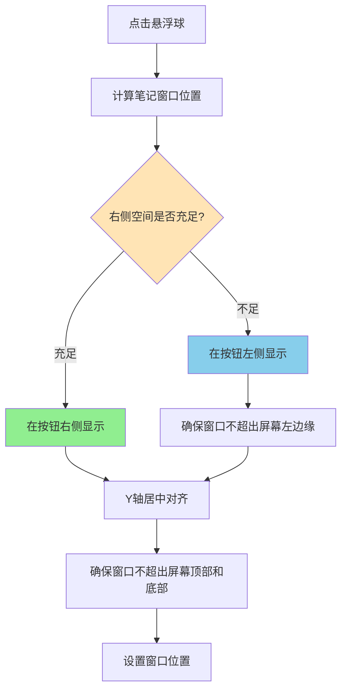

# 笔记窗口位置优化

## 概述
优化笔记窗口的显示位置逻辑：
1. 优先在悬浮按钮右侧显示笔记窗口
2. 如果右侧空间不足，则在悬浮按钮左侧显示
3. 移除当前在下方显示的逻辑，简化位置计算

## 流程图


## 方案

### 方案1：简化位置逻辑（推荐）
移除下方显示逻辑，只保留左右侧显示逻辑。

**优点**：
- 代码更简洁，逻辑更清晰
- 用户体验更一致，不会出现位置跳跃
- 减少边界条件判断

**缺点**：
- 当左右两侧空间都不足时，窗口可能会超出屏幕边界

**实施步骤**：
1. 修改`updateNoteWindowPosition()`函数
2. 移除下方空间检查逻辑
3. 右侧空间不足时直接切换到左侧显示
4. 确保左侧显示时不超出屏幕左边缘

### 方案2：保留下方显示逻辑（不推荐）
保持当前的逻辑，只优化边界判断。

**优点**：
- 在极端情况下有更多显示位置选择

**缺点**：
- 代码复杂度高
- 用户体验不一致
- 位置跳跃可能造成困惑

## 相关代码位置
[updateNoteWindowPosition函数位置](vscode://file/Volumes/Cache/X/Sources/App/AppDelegate.swift:379)

## 代码错误测试
代码修改完成后，必须使用以下命令检查代码错误：
```bash
swift build
```

## 验证流程
1. 将悬浮球移动到屏幕最右侧
2. 点击悬浮球打开笔记窗口
3. 观察笔记窗口是否在左侧显示
4. 将悬浮球移动到屏幕中间
5. 点击悬浮球打开笔记窗口
6. 观察笔记窗口是否在右侧显示
7. 将悬浮球移动到屏幕最左侧
8. 点击悬浮球打开笔记窗口
9. 观察笔记窗口是否在右侧显示

## 任务总结与结论
通过简化笔记窗口位置计算逻辑，移除不必要的下方显示处理，实现笔记窗口始终在左右两侧显示的需求。当右侧空间不足时，笔记窗口将自动切换到左侧显示，提供更一致的用户体验。

## 任务耗时
- 任务开始时间：1054
- 任务结束时间：
- 任务总耗时：