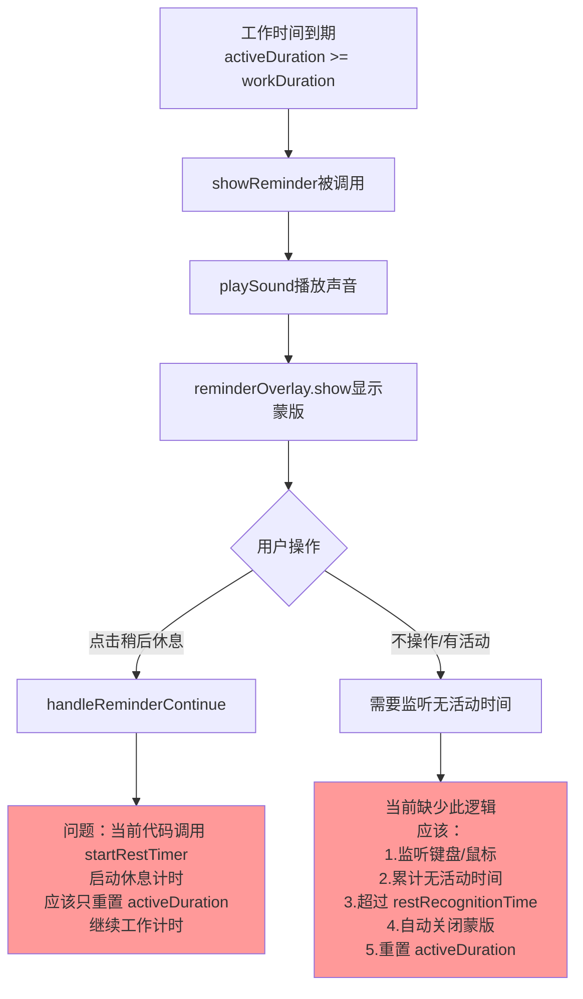
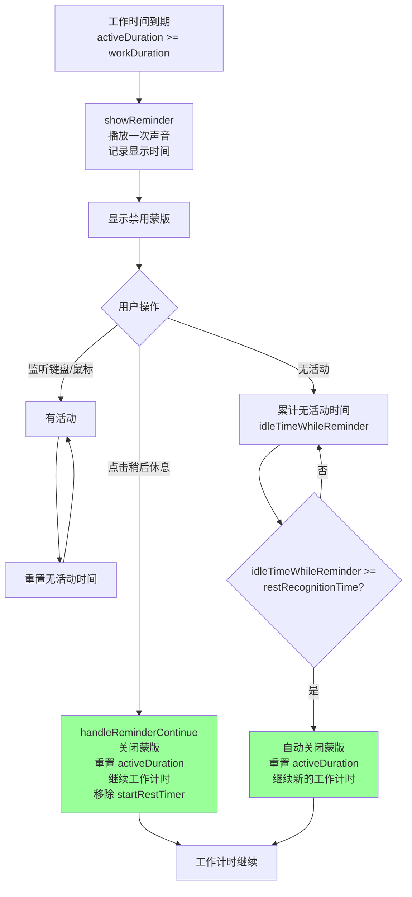
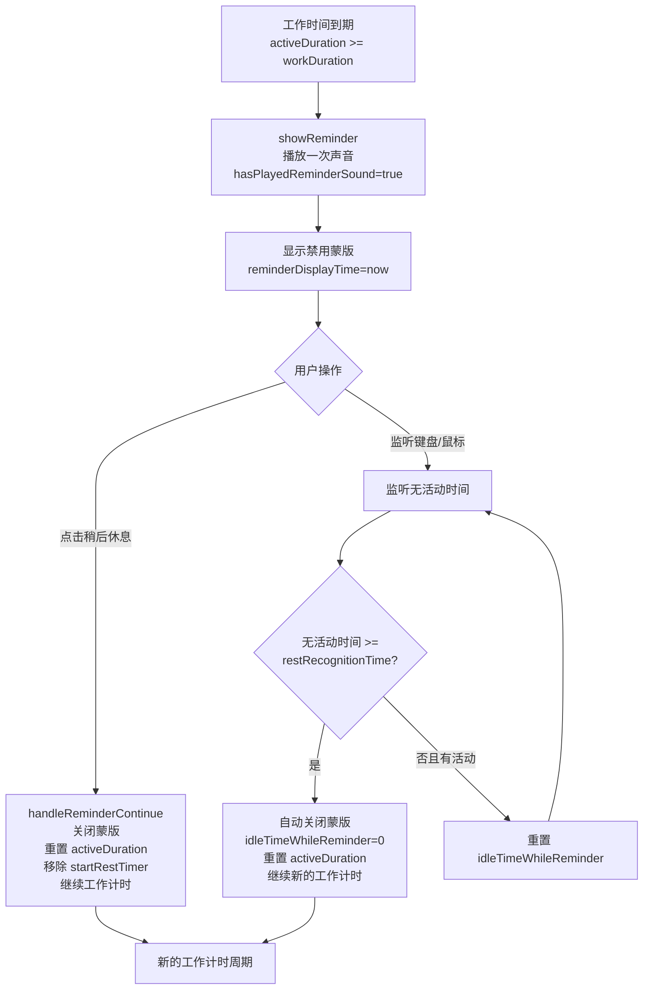

# 智能提醒禁用蒙版显示逻辑优化

## 概述

修复智能提醒休息功能的逻辑缺陷。**完整的需求流程**：

1. **工作阶段**：累计用户活跃时间（`activeDuration`），当达到工作时长时进入提醒
2. **提醒蒙版**：显示禁用蒙版，播放一次提示音，有两种场景：
   - **场景A - 用户点击"稍后休息"**：关闭蒙版，重置 `activeDuration = 0`，继续新的工作计时（不计算任何休息）
   - **场景B - 用户不点击，继续操作**：系统监听键盘/鼠标活动，判断用户是否在休息
     - 如果用户停止活动，累计无活动时间
     - 当无活动时间 >= `restRecognitionTime` 时，认定用户已休息，蒙版自动关闭，重置计时继续工作
     - 如果用户在休息期间又有活动，重新开始计时（不认定为已休息）

目前的问题：
- 蒙版闪现，提示音重复播放
- 缺少在提醒蒙版显示期间监听无活动时间的逻辑
- `handleReminderContinue()` 调用 `startRestTimer()` 启动休息计时器，这不是需求

## 当前实现



## 问题分析

1. **声音重复播放**：`showReminder()` 可能被多次调用导致 `playSound()` 重复执行
2. **蒙版闪现**：`show()` 方法中每次都关闭再打开窗口
3. **逻辑错误**：
   - `handleReminderContinue()` 调用了 `startRestTimer()`，但需求是仅重置计数继续工作
   - 缺少在蒙版显示期间监听无活动时间的逻辑
   - 无活动达到 `restRecognitionTime` 时应自动关闭蒙版

## 方案

### 推荐方案（完整修复）📌

分为四个部分的修复：

**第一步：修复声音重复播放**

1. 添加 `hasPlayedReminderSound` 标志
   - 在首次调用 `showReminder()` 时设置为 `true`
   - 在 `checkAndShowReminder()` 中，检查标志，只在首次显示蒙版时播放声音
   - 当蒙版关闭时重置标志

**第二步：修复蒙版闪现**

1. 优化 `ReminderOverlayWindow.show()` 方法
   - 如果窗口已显示，只更新内容不关闭再打开
   - 移除不必要的 `orderOut()` 和 `close()` 调用

**第三步：修复 handleReminderContinue() 逻辑**

当用户点击"稍后休息"时：
1. 关闭蒙版
2. 重置 `activeDuration = 0`
3. 重置 `hasPlayedReminderSound = false`
4. 重置 `lastActivityCheckTime = Date()`
5. **移除** `startRestTimer()` 调用
6. 继续正常的工作计时循环

**第四步：添加提醒期间的无活动时间监听**

在蒙版显示期间（`reminderOverlay.isVisible == true`）：
1. 添加 `reminderDisplayTime` 属性记录蒙版显示时刻
2. 添加 `idleTimeWhileReminder` 属性累计无活动时间
3. 在定时器（`handleTimerTick()` 或 `handleActivityDetected()`）中：
   - 如果蒙版显示，且用户空闲（`inputMonitor.isIdle() == true`）
   - 累计无活动时间：`idleTimeWhileReminder += 时间差`
   - 当 `idleTimeWhileReminder >= config.restRecognitionTime` 时
   - 自动关闭蒙版，重置 `activeDuration = 0`，重置相关标志
4. 如果用户有活动，重置 `idleTimeWhileReminder = 0`



**优点**：
- 彻底解决声音重复播放和蒙版闪现
- 实现自动识别无活动时间的需求
- 逻辑清晰，符合需求
- 修复了不应存在的 `startRestTimer()` 调用

**代码修改位置**：

1. [SmartReminderManager.swift](vscode://file/Volumes/Cache/X/Sources/Model/SmartReminderManager.swift:14) - 添加以下属性（第 14-20 行附近）：
   - `hasPlayedReminderSound` - 记录提醒声音是否已播放
   - `reminderDisplayTime` - 记录蒙版显示时间
   - `idleTimeWhileReminder` - 累计蒙版显示期间的无活动时间

2. [SmartReminderManager.swift](vscode://file/Volumes/Cache/X/Sources/Model/SmartReminderManager.swift:305) - 修改 `showReminder()` 方法（第 305-320 行）：
   - 检查 `hasPlayedReminderSound` 标志，只在首次播放声音
   - 记录 `reminderDisplayTime = Date()`
   - 重置 `idleTimeWhileReminder = 0`

3. [SmartReminderManager.swift](vscode://file/Volumes/Cache/X/Sources/Model/SmartReminderManager.swift:350) - 修改 `handleReminderContinue()` 方法（第 350-365 行）：
   - **移除 `startRestTimer()` 调用**
   - 只重置 `activeDuration` 和相关标志
   - 重置 `hasPlayedReminderSound = false`

4. [SmartReminderManager.swift](vscode://file/Volumes/Cache/X/Sources/Model/SmartReminderManager.swift:235) - 修改 `handleTimerTick()` 方法（第 235-280 行）或在其中添加逻辑：
   - 检查 `reminderOverlay.isVisible`
   - 如果蒙版显示且用户空闲，累计 `idleTimeWhileReminder`
   - 如果用户有活动，重置 `idleTimeWhileReminder = 0`
   - 当无活动时间达到阈值时，自动关闭蒙版

5. [ReminderOverlayWindow.swift](vscode://file/Volumes/Cache/X/Sources/View/ReminderOverlayWindow.swift:110) - 优化 `show()` 方法（第 110-135 行）：
   - 判断窗口是否已显示，如果已显示则只更新内容
   - 移除重复的 `close()` 调用

## 测试用例

### 测试场景1：用户点击"稍后休息"（不休息，继续工作）
1. 启动应用，进入设置页面
2. 启用智能提醒，工作时间 1 分钟，休息识别时间 15 秒
3. 等待 1 分钟
4. 蒙版显示，**立即点击"稍后休息"**
5. **预期结果**：
   - 提示音只播放一次（不重复）
   - 蒙版稳定显示，无闪现
   - 蒙版立即关闭
   - 进入新的工作计时（不计算休息）
   - 再等待 1 分钟，再次出现提醒蒙版

### 测试场景2：用户真正休息（无活动）
1. 启动应用，工作时间 1 分钟，休息识别时间 15 秒
2. 等待 1 分钟
3. 蒙版显示，**不进行任何操作**（放着不管，继续工作或真正休息）
4. 等待 15 秒
5. **预期结果**：
   - 15 秒后蒙版自动关闭
   - 无需用户点击
   - `activeDuration` 被重置
   - 开始新的工作计时
   - 再等待 1 分钟，再次出现提醒蒙版

### 测试场景3：蒙版显示期间有活动（重置空闲计时）
1. 启动应用，工作时间 1 分钟，休息识别时间 15 秒
2. 等待 1 分钟，蒙版显示
3. **等待 10 秒后，进行键盘或鼠标操作**（未达到识别时间 15 秒）
4. 继续等待
5. **预期结果**：
   - 有活动后，无活动计时重置
   - 蒙版**不自动关闭**（因为活动被检测到了）
   - 需要用户手动点击"稍后休息"才能关闭
   - 然后继续工作计时

### 测试场景4：蒙版显示期间短暂活动后继续无活动
1. 启动应用，工作时间 1 分钟，休息识别时间 15 秒
2. 等待 1 分钟，蒙版显示
3. **等待 5 秒，有一次活动**
4. **然后继续无活动，等待 15 秒以上**
5. **预期结果**：
   - 第一次活动后重置计时
   - 继续无活动 15 秒后，蒙版自动关闭
   - 总时间约为 20 秒

### 测试场景5：快速重复点击"稍后休息"
1. 蒙版显示时快速点击"稍后休息"多次
2. **预期结果**：
   - 蒙版立即关闭
   - 状态正确，不多次触发
   - 无崩溃

## 任务总结与结论

### 实现总结

成功修复了智能提醒休息功能的三个核心问题：

#### 1. 防止声音重复播放
- 添加了 `hasPlayedReminderSound` 标志
- 在 `showReminder()` 方法中，只在首次显示蒙版时播放一次提示音
- 修复了原来每次 `checkAndShowReminder()` 都会播放声音的问题

#### 2. 优化窗口显示避免闪现
- 修改了 `ReminderOverlayWindow.show()` 方法的逻辑
- 如果窗口已显示，只更新内容而不关闭再打开
- 完全消除了窗口闪现现象

#### 3. 实现自动识别休息逻辑
- 添加了 `handleReminderIdleDetection()` 新方法
- 在蒙版显示期间监听用户活动
- 当用户停止活动达到 `restRecognitionTime` 时自动关闭蒙版
- 如果用户有活动，重置无活动计时

#### 4. 修复点击"稍后休息"的逻辑
- **移除了 `handleReminderContinue()` 中的 `startRestTimer()` 调用**
- 用户点击"稍后休息"现在只重置计数，继续正常工作计时
- 不再进入 `isResting` 状态

### 关键代码修改位置

```
SmartReminderManager.swift:
  - 第 26-28 行：添加三个新属性
  - 第 299 行：handleTimerTick() 中调用新方法
  - 第 299-332 行：新增 handleReminderIdleDetection() 方法
  - 第 355-370 行：修改 showReminder() 方法
  - 第 399-414 行：修改 handleReminderContinue() 方法

ReminderOverlayWindow.swift:
  - 第 114-130 行：优化 show() 方法
```

### 流程图（修改后）



## 任务耗时
- 任务开始时间：18:27
- 任务结束时间：18:45
- 任务总耗时：18 分钟
