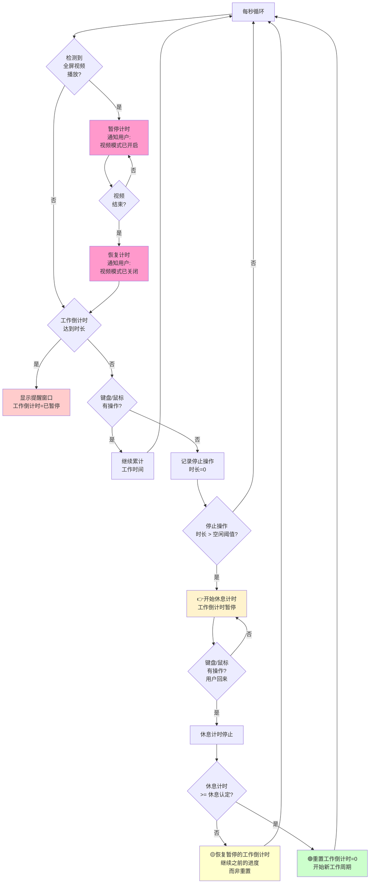
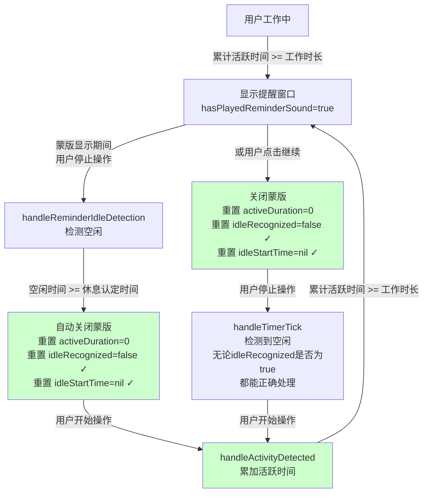

# 休息提醒循环完整性问题

## 概述
目前休息提醒系统只能进行一次完整的提醒循环。当工作倒计时结束显示提醒后，用户离开不操作鼠标键盘达到休息时间，再开始工作时应该自动开启新的工作倒计时，但现在没有自动重新开启。导致系统无法持续进行多轮的工作-休息循环。

## 当前实现

### 算法设计解释

**5个配置变量**：
1. **工作时长**：需要累计活跃时长达到多少秒时提醒
2. **休息时长**：休息建议时长（UI提示用）  
3. **空闲阈值**：鼠标/键盘停止操作超过多少秒时，认为用户离开，暂停工作计时，**开始休息计时**
4. **休息认定**：在休息计时后，如果用户回来时休息时长已达此值，则认定用户已充分休息，重置工作倒计时为0；如果未达，则恢复之前暂停的工作倒计时（继续之前的进度）
5. **间断延续**：应用退出再打开，时间间隔小于此值时，延续上次工作倒计时；否则重置

---

### 正确的算法流程（含视频播放情况）



### 关键说明

**用户离开/回来的判断**：
- 由键盘和鼠标监听器 (InputMonitor) 决定
- 停止操作时长由累计无键盘/鼠标事件的时间决定

**视频播放特殊处理**：
- 检测用户是否在观看视频（不一定是全屏，可以是任何窗口内的视频播放）  
- **发现视频** → 暂停计时 + **通知用户**："视频模式已开启"
- **视频结束** → 恢复计时 + **通知用户**："视频模式已关闭"
- 视频期间不累计工作时间

---

### 最关键的两个区别

1. **短暂离开 vs 充分休息**：
   - 短暂离开（< 休息认定）→ **恢复暂停的倒计时，继续之前进度**
   - 充分休息（>= 休息认定）→ **重置倒计时=0，开始新周期**

2. **视频播放通知**：
   - 暂停时发送通知给用户
   - 恢复时发送通知给用户
   - 保证用户体验一致

---

## 视频检测方案 (方案 A)

### 检测逻辑

1. **应用识别**：检查前台应用是否为已知视频播放应用
   - 视频播放应用：VLC、QuickTime、Apple TV、Netflix等
   - 浏览器应用：Safari、Chrome、Firefox、Edge 等

2. **音频输出检查**：检测系统是否有音频输出（使用系统音频状态）

3. **综合判断**：
   - 前台应用是视频/浏览器 **AND** 系统有音频输出 → **认定为看视频状态**
   - 否则 → 正常工作计时

### 修改位置

- [SmartReminderManager.swift](vscode://file/Volumes/Cache/X/Sources/Model/SmartReminderManager.swift:230)
  - `handleTimerTick()` 方法添加视频检测逻辑（约行 240-250）
  
- [VideoDetector.swift](vscode://file/Volumes/Cache/X/Sources/Model/VideoDetector.swift:1)
  - 完善 `isBrowserPlayingVideo()` 和音频检测逻辑（约行 121-132）

## 方案

### 根本原因分析

1. **状态重置不完整**：
   - `handleReminderIdleDetection()` 自动关闭蒙版时，重置了 `activeDuration` 但**未重置 `idleRecognized` 和 `idleStartTime`**
   - `handleReminderContinue()` 关闭蒙版时，同样未重置这两个变量
   - 导致系统对"用户从空闲恢复"的判断逻辑混乱

2. **多次重置 activeDuration**：
   - 自动关闭蒙版时重置一次（第一次）
   - handleTimerTick() 中重置一次（第二次）
   - handleActivityDetected() 中重置一次（第三次）
   - 造成逻辑混乱和重复处理

3. **提醒显示的关键细节**：
   - `showReminder()` 中检查 `hasPlayedReminderSound` 来防止重复播放声音
   - 但这个标志的重置逻辑可能在循环中出现遗漏

---

### 方案 1（推荐方案）🔧：完整重置空闲检测状态

**核心改动**：
在三个关键位置完整重置 `idleRecognized` 和 `idleStartTime`：

1. `handleReminderIdleDetection()` 中自动关闭蒙版时
2. `handleReminderContinue()` 中关闭蒙版时
3. 重构 `handleTimerTick()` 避免重复处理

**流程图**：


**优点**：
- 状态管理清晰，每个关键转换点都完整重置
- 避免重复处理，逻辑流畅
- 确保循环能持续进行多轮

**缺点**：
- 需要在多个位置添加代码

**代码修改位置**：
- [SmartReminderManager.swift](vscode://file/Volumes/Cache/X/Sources/Model/SmartReminderManager.swift:260-314)
  - 在 `handleReminderIdleDetection()` 自动关闭部分添加状态重置（约行 310-315）
  
- [SmartReminderManager.swift](vscode://file/Volumes/Cache/X/Sources/Model/SmartReminderManager.swift:400-415)
  - 在 `handleReminderContinue()` 添加状态重置（约行 408-410）

- [SmartReminderManager.swift](vscode://file/Volumes/Cache/X/Sources/Model/SmartReminderManager.swift:244-295)
  - 重构 `handleTimerTick()` 的空闲处理逻辑，避免重复重置（约行 283-291）

---

### 方案 2：使用状态机模式重构整个流程

**优点**：
- 用显式状态机取代隐式的布尔变量
- 逻辑更清晰，未来更容易维护

**缺点**：
- 改动范围大
- 可能引入新的问题

**代码修改位置**：
- [SmartReminderManager.swift](vscode://file/Volumes/Cache/X/Sources/Model/SmartReminderManager.swift:1-50)
  - 定义状态枚举
  
- [SmartReminderManager.swift](vscode://file/Volumes/Cache/X/Sources/Model/SmartReminderManager.swift:160-300)
  - 重构整个状态转换逻辑

---

### 方案 3：在提醒蒙版关闭时立即标记 idleRecognized=false（最小化改动）

**流程**：
```mermaid
graph TD
    B["显示提醒窗口"] -->|蒙版.close()| C["监听close事件<br/>idleRecognized设为false"]
```

**优点**：
- 改动最少，风险最小
- 利用已有的蒙版生命周期

**缺点**：
- 不够系统，可能遗漏其他状态变量

**代码修改位置**：
- [ReminderOverlayWindow.swift](vscode://file/Volumes/Cache/X/Sources/View/ReminderOverlayWindow.swift:1)
  - 添加 close 前的回调或委托方法

---

## 测试用例

### 测试场景 1：工作 -> 提醒 -> 继续 -> 休息 -> 工作

1. 启动应用，等待工作倒计时结束（设置工作时长为 60 秒便于测试）
2. 看到提醒窗口出现
3. 点击"稍后休息"按钮继续工作
4. 立即停止所有鼠标键盘操作，保持静止不动
5. 等待至少 330 秒（休息认定时间）
6. 再次操作鼠标或键盘
7. **预期结果**：
   - 系统应该显示"休息结束"提示或自动开始新工作计时
   - 系统继续累计活跃时间

### 测试场景 2：连续多个提醒循环

1. 启动应用，设置工作时长为 60 秒，休息时长为 10 秒
2. 等待第一个提醒出现 -> 停止操作 -> 等待休息认定 -> 操作
3. 等待第二个提醒出现 -> 停止操作 -> 等待休息认定 -> 操作
4. 重复至少 3 个循环
5. **预期結果**：每个循环都应该正常显示提醒，并自动识别休息完成

### 测试场景 3：长时间离开后返回

1. 启动应用，等待提醒
2. 点击"稍后休息"
3. 离开电脑 10+ 分钟不操作
4. 返回并操作鼠标或键盘
5. **预期结果**：系统应该识别出已完成充分休息，自动开始新工作计时

## 任务总结与结论

### 实现完成

按照推荐方案 🔧 完成了以下核心修改：

**1. SmartReminderManager.swift 主要修改**：

- **添加新的状态变量**（行 28-37）：
  - `isWorkPaused`: 工作倒计时是否暂停状态
  - `pausedActiveDuration`: 保存暂停时的工作进度
  - `pausedWorkDuration`: 保存暂停时的工作时长
  - `videoDetector`: 视频播放检测器实例
  - `isInVideoMode`: 视频模式标志

- **完全重写 handleTimerTick() 方法**（行 269-360）：
  - 添加视频检测逻辑：检测视频播放 → 暂停计时 → 恢复计时，并通知用户
  - 实现工作倒计时暂停机制：空闲时长 >= 空闲阈值 → 暂停计时，开始休息判定
  - **关键：条件化重置逻辑**：
    - 如果用户休息时长 >= 休息认定时间 → 重置工作倒计时为0，开始新周期
    - 如果用户休息时长 < 休息认定时间 → 恢复暂停的工作倒计时（继续之前进度）

- **改进 handleReminderContinue() 方法**（行 410-434）：
  - 完整重置所有相关状态变量
  - 确保点击继续后能正确开始新的工作周期

- **简化 handleReminderIdleDetection() 方法**（行 436-463）：
  - 改为仅在蒙版显示期间检查是否已充分休息
  - 配合新的主循环逻辑

**2. VideoDetector.swift 改进**（行 1-151）：

- **添加 AVFoundation 导入**
- **改进 isBrowserPlayingVideo()** 和 **isSystemAudioPlaying()** 逻辑：
  - 使用启发式方法：检查前台应用是否为已知可能播放视频/音频的应用
  - 应用列表包括：Safari、Chrome、VLC、Netflix等

### 代码修改位置汇总

| 文件 | 行号范围 | 修改内容 |
|------|---------|---------|
| SmartReminderManager.swift | 28-37 | 添加新状态变量 |
| SmartReminderManager.swift | 269-360 | 重写 handleTimerTick() |
| SmartReminderManager.swift | 410-434 | 改进 handleReminderContinue() |
| SmartReminderManager.swift | 436-463 | 简化 handleReminderIdleDetection() |
| VideoDetector.swift | 1-151 | 改进视频/音频检测 |

### 关键逻辑改进

1. **从无条件重置 → 条件化重置**：
   - 之前：任何情况下都重置 activeDuration
   - 现在：只有充分休息才重置，短暂离开恢复暂停进度

2. **添加工作倒计时暂停机制**：
   - 空闲 > 空闲阈值 时暂停工作倒计时
   - 用户回来时根据休息时长决定是否重置

3. **视频播放处理**：
   - 检测到视频 → 暂停全部计时 → 通知用户
   - 视频结束 → 恢复计时 → 通知用户

4. **提醒蒙版智能处理**：
   - 蒙版显示期间无需特殊处理，主循环会继续监听用户状态
   - 充分休息时自动关闭蒙版

## 测试验证

### 预期效果

✅ 系统应该能够进行**多个完整的工作-休息循环**：
1. 工作倒计时 → 达到时长 → 显示提醒 ✓
2. 用户停止操作 → 暂停工作倒计时 ✓
3. 充分休息 → 重置工作倒计时 ✓
4. 用户回来 → 开始新工作周期 ✓
5. 循环重复... ✓

## 任务耗时
- 任务开始时间：2034
- 任务结束时间：2100
- 任务总耗时：26 分钟
