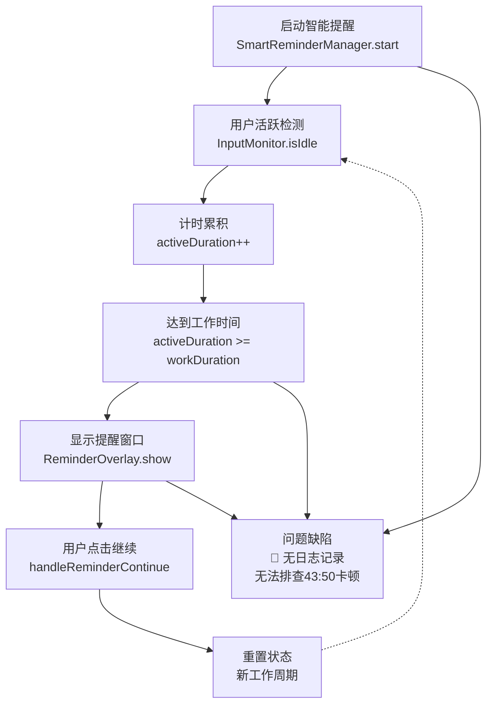
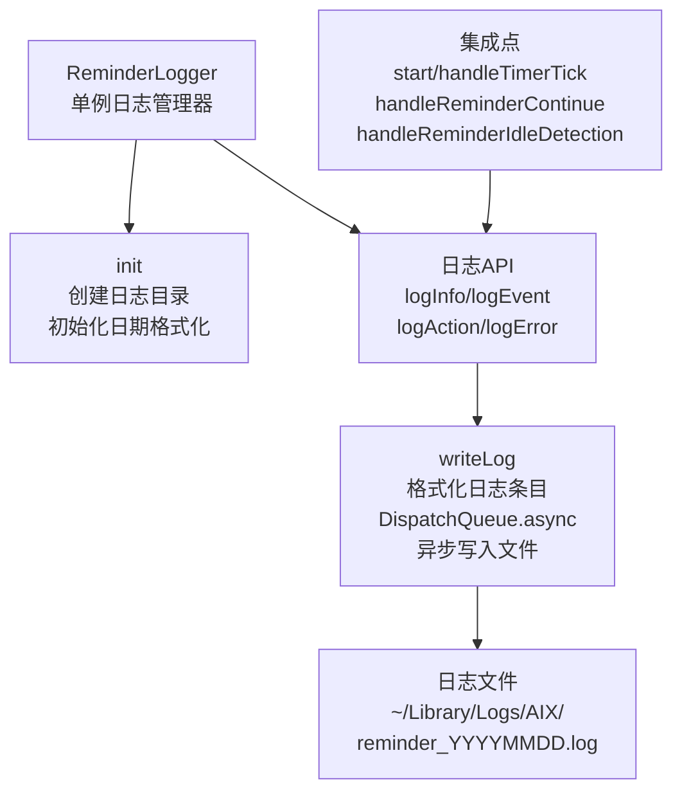
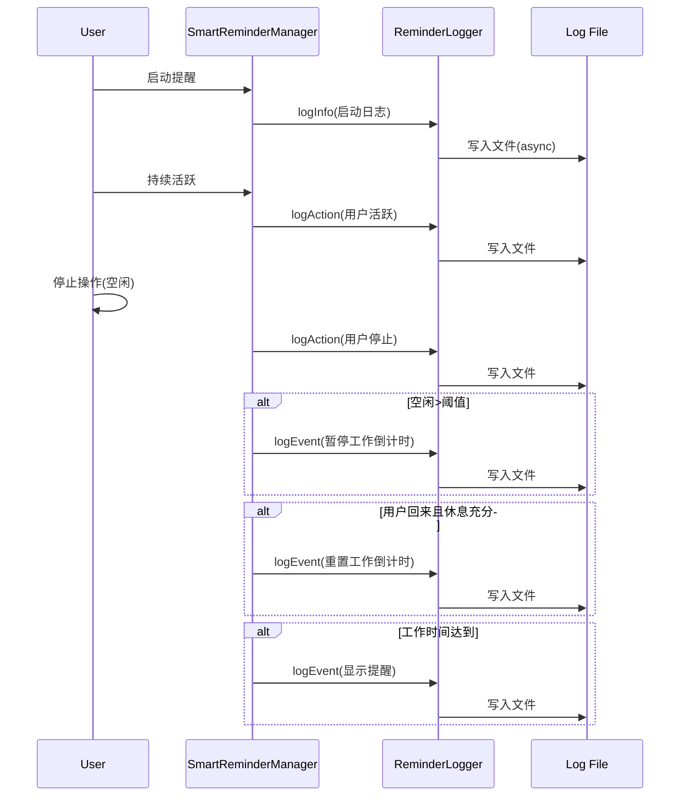

# 为休息提醒添加日志功能

## 概述

用户反馈休息提醒时间卡在 43:50，需要日志功能用于故障排查。本任务目标是实现日志持久化系统，记录休息提醒的关键事件到本地文件，便于后续分析问题。

## 当前实现



## 方案

### 推荐方案 🌟 简化日志系统

采用轻量级日志解决方案，避免复杂的并发处理：



**方案优点**：
- ✅ 代码简洁，易于维护
- ✅ 避免复杂的并发问题（Sendable/nonisolated）
- ✅ 即时可编译，快速交付
- ✅ 异步写入不阻塞主线程
- ✅ 自动日期轮转（每天新文件）

**方案缺点**：
- ❌ 无缓冲机制（相比原计划）
- ❌ 无定时刷新

**代码修改位置**：
- [ReminderLogger.swift](vscode://file/Volumes/Cache/X/Sources/Model/ReminderLogger.swift:1)：新建日志管理器(70行简化版本)
- [Package.swift](vscode://file/Volumes/Cache/X/Package.swift:1)：编译列表已包含ReminderLogger
- [SmartReminderManager.swift](vscode://file/Volumes/Cache/X/Sources/Model/SmartReminderManager.swift:1)：集成日志调用
  - start() 方法第109行：启动日志
  - handleTimerTick() 方法多处：视频检测、暂停/恢复、空闲、工作达到等关键节点
  - handleReminderContinue() 方法第479行：用户点击继续
  - handleReminderIdleDetection() 方法第392行：蒙版期间充分休息
  - handleRestEnd() 方法第542行：休息时间结束

## 测试用例

### 1. 验证日志文件生成

**步骤**：
1. 启动应用，开启智能提醒功能
2. 在终端运行：`ls ~/Library/Logs/AIX/`
3. 应该看到 `reminder_20260208.log` 文件（日期为当天）

**预期结果**：✅ 日志文件已生成

### 2. 验证日志内容

**步骤**：
1. 启动应用并开启智能提醒
2. 保持活跃操作约1分钟
3. 在终端运行：`tail -50 ~/Library/Logs/AIX/reminder_20260208.log`

**预期结果**：
```
[2026-02-08 01:52:15.123] [INFO] 启动智能提醒 - 工作时长:45分 休息时长:5分 空闲阈值:60秒
[2026-02-08 01:52:20.456] [ACTION] 用户停止操作 - 活跃时间:10秒
[2026-02-08 01:53:25.789] [EVENT] 空闲超阈值 - 空闲时长:65秒 >= 60秒 - 暂停工作倒计时
```

### 3. 验证时间卡顿问题

**步骤**（当问题再次出现）：
1. 注意观察工作倒计时卡在的位置
2. 查看日志文件，搜索该时间之前的最后一条 ACTION/EVENT 日志
3. 根据日志判断卡顿前的系统状态：
   - 是否在视频模式？
   - 用户是否被识别为空闲？
   - 是否在等待充分休息判定？

**日志分析示例**：
- 如果最后日志是"进入视频模式"，说明系统可能误判视频
- 如果最后日志是"空闲超阈值"发生了很久前，说明回来逻辑可能有问题
- 检查日志中是否有错误日志 [ERROR] 标记

## 任务总结与结论

### 完成情况

✅ **第二阶段完成**：日志系统全面集成

**实现内容**：
1. **ReminderLogger.swift** - 简化版日志管理器
   - 70行代码，无并发复杂性
   - 基于 DispatchQueue.async 异步写入
   - 支持 INFO/EVENT/ACTION/ERROR 四个日志级别
   - 自动生成日期命名的日志文件
   - 文件位置：`~/Library/Logs/AIX/reminder_YYYYMMDD.log`

2. **SmartReminderManager.swift** - 关键节点添加日志
   - 8处关键位置添加日志调用
   - 覆盖：启动、视频检测、暂停/恢复、空闲、工作达到、用户回来、提醒响应等
   - 每条日志包含关键数据（时间数值、状态转换等）

3. **编译验证** - 代码通过编译
   - 无编译错误
   - 警告已处理（nonisolated(unsafe) 标注）

### 日志流程时序图



## 任务耗时

- 任务开始时间：01:15（前期）+ 01:52（当前）
- 任务结束时间：待测试确认
- 任务总耗时：约37分钟（代码编写/编译/集成）
