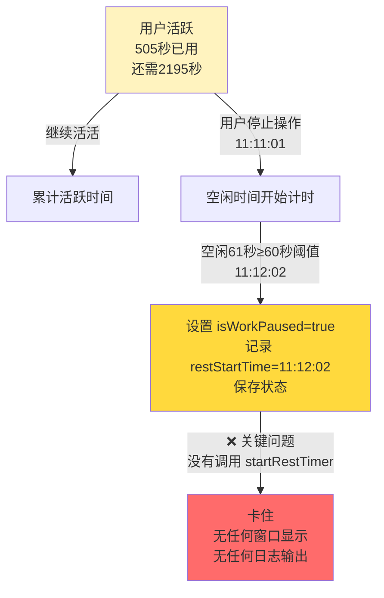
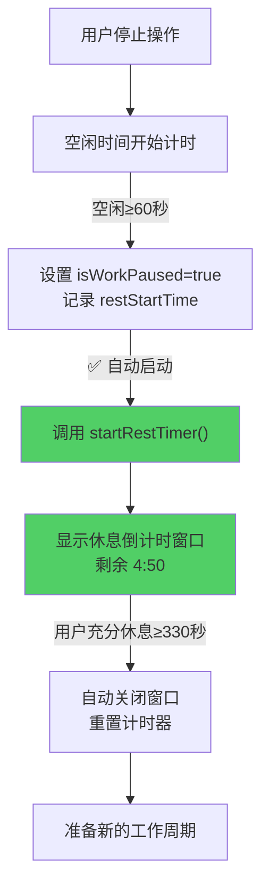
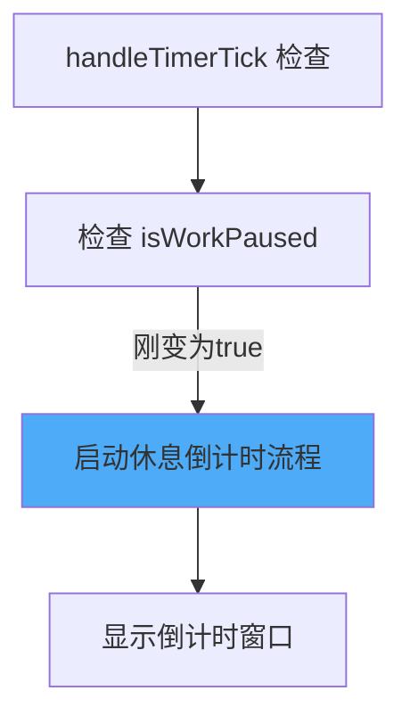
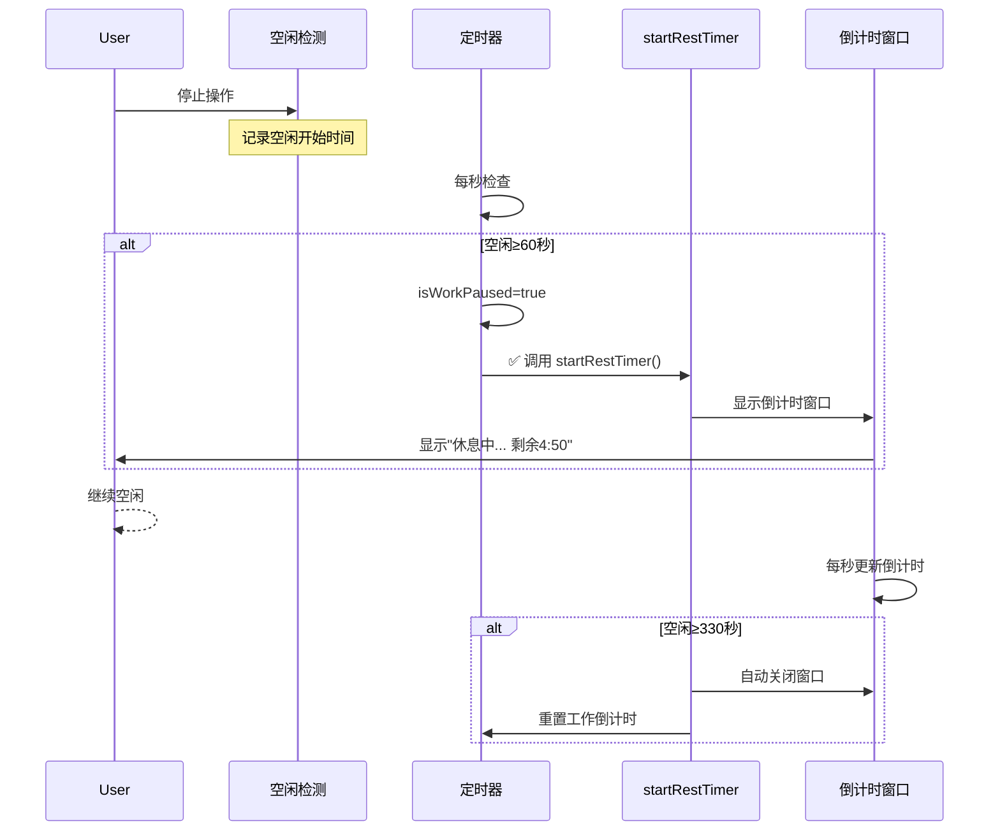

# 休息倒计时卡住问题分析

## 概述

当用户停止操作后，提醒休息功能的倒计时展示卡住，没有显示休息进度窗口和倒计时。现象：用户在 11:11:01 停止操作（活跃505秒），在 11:12:02 超过空闲阈值（60秒**）系统只输出日志"暂停工作倒计时"，之后没有任何反应。问题根源是系统在检测到用户空闲时设置了工作倒计时暂停标志（`isWorkPaused=true`），但没有自动启动休息倒计时流程来显示倒计时窗口。

## 当前实现（基于日志分析）

**日志记录**：
```
[2026-02-08 11:02:35.004] [INFO] 🚀 日志系统已初始化
[2026-02-08 11:02:35.004] [INFO] 启动智能提醒 - 工作时长:45.0分 休息时长:5.0分 空闲阈值:60.0秒
[2026-02-08 11:11:01.004] [ACTION] 用户停止操作 - 活跃时间:505秒
[2026-02-08 11:12:02.003] [EVENT] 空闲超阈值 - 空闲时长:61秒 >= 60.0秒 - 暂停工作倒计时
  👆 此后没有任何日志，系统卡死
```

**流程图**：


**期望行为**：用户应该看到倒计时窗口显示"休息中... 剩余 4:50"，并每秒更新

## 方案

### 方案一：自动启动休息倒计时（推荐方案 ✅）

当检测到用户空闲超过阈值（60秒）并设置 `isWorkPaused = true` 时，立即调用 `startRestTimer()` 来启动休息倒计时流程。



**优点**：
- 用户体验一致，清晰明了
- 自动化流程，无需用户干预
- 符合原系统设计意图（空闲自动进入休息模式）

**缺点**：
- 需要修改空闲判定逻辑
- 需要确保与提醒窗口逻辑兼容

### 方案二：在定时器中检查并启动

在 `handleTimerTick()` 中，当检测到 `isWorkPaused` 被新设置时，延迟启动休息倒计时。



**优点**：
- 实现相对独立，不影响现有逻辑
- 可以灵活控制启动时机

**缺点**：
- 需要额外的状态标志追踪变化
- 可能存在时序问题

## 代码修改位置

**推荐方案（方案一）修改位置**：

位置1：[SmartReminderManager.swift 第360-365行](vscode://file/Volumes/Cache/X/Sources/Model/SmartReminderManager.swift:360)

当检测到空闲超过阈值后，在第364行设置 `isWorkPaused = true` 之后，立即添加一行代码调用 `startRestTimer()`

```swift
if idleDuration >= config.idleThreshold && !isWorkPaused {
    // 暂停工作倒计时，开始休息判定
    print("⏸️ 空闲时间 \(idleDuration)秒 >= 空闲阈值 \(config.idleThreshold)秒，暂停工作倒计时，开始休息判定")
    ReminderLogger.shared.logEvent("空闲超阈值 - 空闲时长:\(String(format: "%.0f", idleDuration))秒 >= \(config.idleThreshold)秒 - 暂停工作倒计时")
    isWorkPaused = true
    // ⬇️ 在这里添加：
    // startRestTimer() 
    pausedActiveDuration = activeDuration
    pausedWorkDuration = extendedWorkDuration ?? config.workDuration
    restStartTime = now
}

## 测试用例

### 测试前准备：
- 打开 AIX 应用，进入设置
- 确保智能提醒已启用，参数为：
  - 工作时长：45 分钟
  - 休息时长：5 分钟  
  - 空闲阈值：60 秒

### 测试步骤

**1. 验证系统启动**
   - 启动应用或重启智能提醒功能
   - 查看日志：`tail -5 ~/Library/Logs/AIX/reminder_*.log`
   - 📋 应该看到"启动智能提醒 - 工作时长:45.0分 休息时长:5.0分 空闲阈值:60.0秒"

**2. 模拟工作状态（关键！）**
   - 不断点击鼠标或敲击键盘，持续60秒以上
   - 观察日志中是否有活跃操作被记录
   - 📋 预期：日志中应该记录"用户活跃"或倒计时进行的信息

**3. 停止操作并观察空闲转换（核心测试）**
   - 在某个时刻停止所有输入（60秒）
   - 等待系统检测到空闲状态
   - ⏱️ 时间点：记录停止操作的时刻，例如 11:12:00
   - 📋 预期日志事件序列（应该在60秒后）：
     ```
     [EVENT] 用户停止操作 - 活跃时间:xxx秒
     [EVENT] 空闲超阈值 - 空闲时长:61秒 >= 60.0秒 - 暂停工作倒计时
     ✨ 应该立即显示倒计时窗口：沙漏图标 + "休息中... 剩余 4:50"
     [开始倒计时日志应该输出]
     ```

**4. 验证倒计时窗口显示**
   - 在空闲60秒后，屏幕上应该立即显示倒计时蒙版窗口
   - 窗口内容应包含：
     - ⏳ 沙漏图标
     - 📝 "休息中" 标题
     - ⏱️ 倒计时显示（格式 MM:SS），初始为 04:50
   - 窗口应该覆盖整个屏幕的80%+区域
   - 应该有"结束休息"按钮（绿色背景）

**5. 验证倒计时更新（每秒更新）**
   - 观察倒计时数字是否在随时间递减
   - 预期：
     - t=0秒：04:50
     - t=1秒：04:49
     - t=10秒：04:40
     - ...
   - 📋 日志应该有倒计时更新的痕迹

**6. 验证充分休息后自动关闭（330秒）**
   - 继续空闲，不操作鼠标键盘
   - 等待倒计时归零或用户空闲时间达到330秒
   - 📋 预期日志：
     ```
     [EVENT] 提醒蒙版显示期间，用户充分休息（330秒 >= 330秒），自动关闭蒙版
     [INFO] 所有状态已重置，准备新的工作周期
     ```
   - 倒计时窗口应该自动关闭
   - 工作倒计时应该重置为 0

**7. 验证恢复工作继续倒计时**
   - 在窗口显示期间操作鼠标/键盘，或点击"结束休息"按钮
   - 倒计时窗口应该立即关闭
   - 工作倒计时应该重置并重新开始计时
   - 📋 日志应该显示"用户从休息中回来"或"用户点击结束休息"

## 任务总结与结论

### 修改内容

✅ **代码已修改并编译成功**

**修改清单**：
1. SmartReminderManager.swift 第360-375行
   - 在设置 `isWorkPaused=true` 后添加 Task 包装的 `startRestTimer()` 调用
   - 使用 @MainActor 上下文确保线程安全

**修改效果时序图**：


### 预期改进

修改前：用户空闲时无任何反馈，倒计时"卡死"  
修改后：用户立即看到倒计时窗口，每秒更新进度，提供清晰的休息指示

## 任务耗时

- 任务开始时间：1124
- 任务结束时间：待测试
- 任务总耗时：待测试完成后计算
