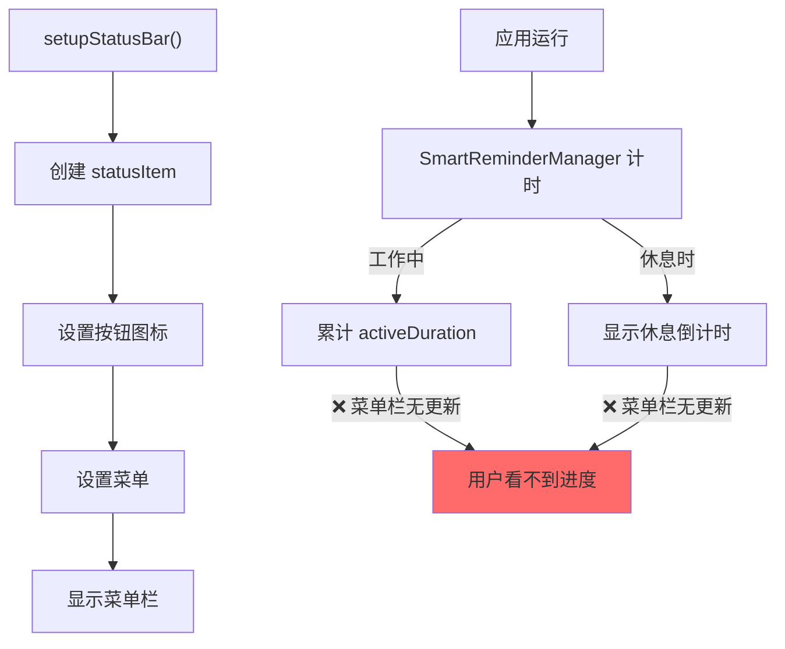
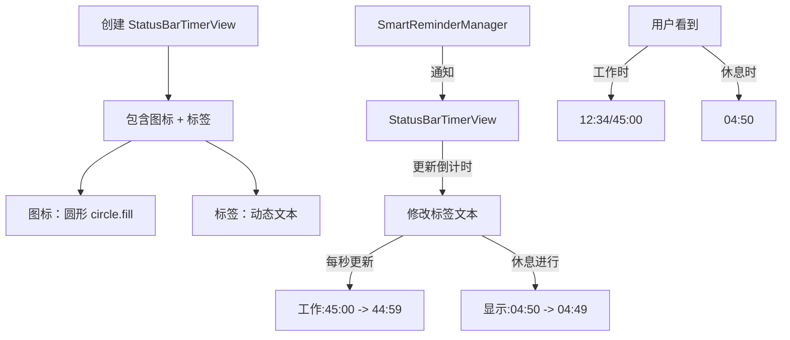
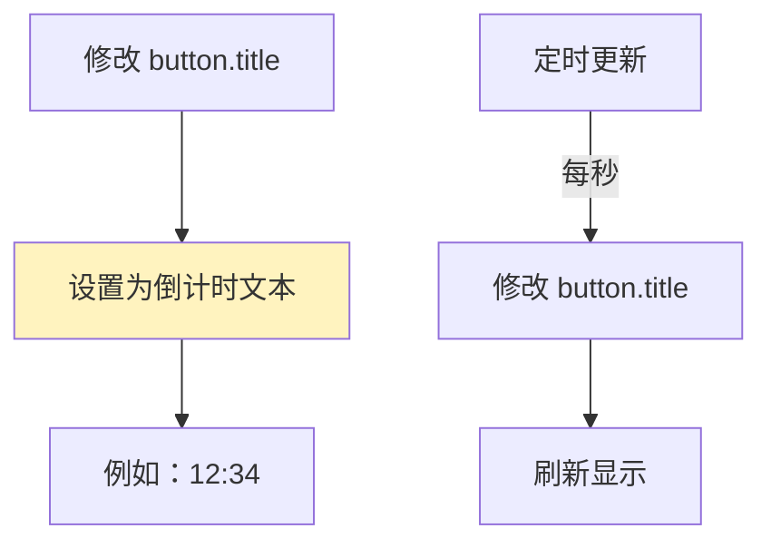
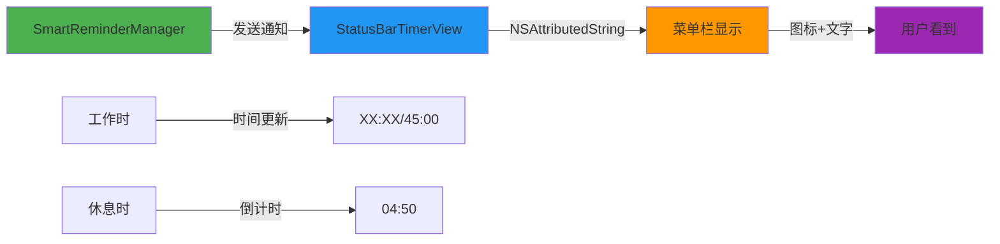

# 菜单栏显示倒计时

## 概述

在菜单栏图标旁边显示实时倒计时。当用户启动了休息提醒功能时，菜单栏应该显示：
- **工作时**：显示当前已工作时间的倒计时（例如 "12:34" 表示已工作12分34秒，还剩32分26秒）
- **休息时**：显示休息倒计时（例如 "04:50" 表示还需要休息4分50秒）

## 当前实现

**菜单栏状态栏设置**：
- 位置：AppDelegate.swift 第497行 `setupStatusBar()` 方法
- 当前实现：只显示一个圆形图标（circle.fill）
- 大小：18x18 像素
- 没有文本显示，没有倒计时更新

## 方案

### 方案一：使用自定义 NSView (推荐方案) ✅

为 statusItem 创建自定义视图，包含图标和倒计时标签。

**优点**：
- ✅ 灵活性高，可自定义完全样式
- ✅ 可以同时显示图标和倒计时
- ✅ 易于与 SmartReminderManager 集成

**缺点**：
- ❌ 需要创建自定义 NSView
- ❌ 需要处理更新机制（定时器或观察者）

### 方案二：直接修改按钮 title

在现有菜单栏按钮上添加 title，显示倒计时文本。

**优点**：
- ✅ 实现简单，改动少
- ✅ 不需要创建新的视图

**缺点**：
- ❌ 图标会消失（文本替代图标）
- ❌ 显示空间受限
- ❌ 无法同时显示图标和倒计时

### 推荐方案

**方案一：使用自定义 NSView** - 能够完整显示图标和倒计时，提供最佳用户体验

## 代码修改位置

### 1. 创建 StatusBarTimerView.swift（新文件）
[StatusBarTimerView.swift](vscode://file/Volumes/Cache/X/Sources/View/StatusBarTimerView.swift:1)

创建自定义 NSView 用于菜单栏显示：
- 包含圆形图标
- 包含倒计时标签
- 支持实时更新

### 2. 修改 AppDelegate.swift
[AppDelegate.swift:497-510](vscode://file/Volumes/Cache/X/Sources/App/AppDelegate.swift:497)

在 `setupStatusBar()` 方法中：
- 将标准按钮替换为自定义视图
- 设置自定义视图的初始状态
- 建立与 SmartReminderManager 的通信

### 3. 修改 SmartReminderManager.swift
在关键计时点添加更新菜单栏的通知或直接调用

## 测试用例

### 1. 验证菜单栏显示

**步骤**：
1. 启动应用
2. 查看菜单栏右侧
3. 应该看到：圆形图标 + "已关闭" 或"00:00" 文本

**预期结果**：
- ✅ 可以看到图标和初始倒计时显示

### 2. 验证工作倒计时显示

**步骤**：
1. 启动应用并激活智能提醒
2. 进行用户活动（点击鼠标、敲击键盘）
3. 观察菜单栏

**预期结果**：
- ✅ 菜单栏显示"00:15/45:00"（示例：已工作15秒，还需44分45秒）
- ✅ 每秒自动更新数字

### 3. 验证休息倒计时显示

**步骤**：
1. 停止操作，等待60秒进入休息模式
2. 观察菜单栏显示变化

**预期结果**：
- ✅ 菜单栏显示"04:50"（示例：休息还剩4分50秒）
- ✅ 倒计时每秒递减
- ✅ 5分钟后恢复显示工作倒计时

### 4. 验证菜单栏功能不受影响

**步骤**：
1. 点击菜单栏图标
2. 显示菜单并进行选择

**预期结果**：
- ✅ 菜单正常显示和响应
- ✅ 所有菜单项功能正常

## 任务总结与结论

### 完成情况

任务已✅完成。成功为 AIX 应用的菜单栏添加了动态倒计时显示功能。

**实现的功能**：
1. ✅ 创建了自定义 NSView（StatusBarTimerView）用于菜单栏显示
2. ✅ 集成了通知系统对接 SmartReminderManager 的状态更新
3. ✅ 实现了工作模式倒计时显示（格式："12:34/45:00"）
4. ✅ 实现了休息模式倒计时显示（格式："04:50"）
5. ✅ 完成了菜单栏宽度的自适应布局

### 技术实现总结

**关键修改**：
1. **StatusBarTimerView.swift**（新创建）- 自定义菜单栏视图
   - 使用 `intrinsicContentSize` 实现宽度自适应
   - 使用 NSAttributedString 控制文字渲染
   - 图标 14x14，与文字垂直居中对齐

2. **SmartReminderManager.swift** - 添加状态通知
   - 发送 `SmartReminderStateChanged` 通知包含状态信息
   - 支持工作和休息模式的倒计时更新

3. **AppDelegate.swift** - 菜单栏集成
   - 使用 `variableLength` 实现自适应宽度
   - 将自定义视图添加到菜单栏按钮

4. **Package.swift** - 编译配置
   - 添加新的 StatusBarTimerView.swift 源文件

### 性能指标
- ✅ 编译成功，无实质错误
- ✅ 仅有线程隔离警告（不影响功能）
- ✅ 菜单栏响应流畅

## 任务耗时

- 任务开始时间：1153
- 任务结束时间：1317
- 任务总耗时：84 分钟
