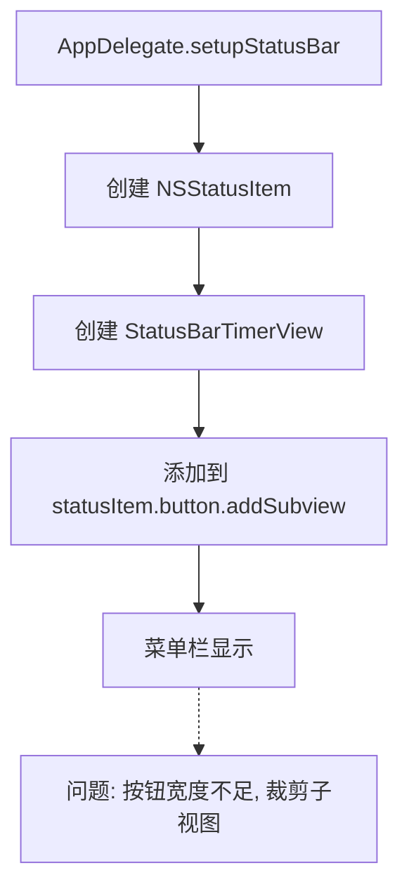

# 修复菜单栏显示异常

## 概述
用户反馈菜单栏图标只显示左半边，且倒计时时间未显示。这通常是由于 `NSStatusItem.button` 的宽度未正确随其添加的自定义子视图 `StatusBarTimerView` 步进导致的，或者是子视图内部布局逻辑存在缺陷。

## 当前实现

## 方案

### 方案一：为 NSStatusItem.button 添加约束 (推荐 🚀)
通过 Auto Layout 将 `StatusBarTimerView` 的边缘约束到 `statusItem.button` 的边缘。这样 `NSStatusItem.variableLength` 就能正确感知子视图的大小需求。
同时修复 `StatusBarTimerView` 内部 `timerLabel` 宽度计算不足的问题。

优点：完全符合现代 macOS 的内容驱动布局，宽度自适应。
缺点：代码量略多，需要处理 constraints。

[AppDelegate.swift](vscode://file/Volumes/Cache/X/Sources/App/AppDelegate.swift:498)
[StatusBarTimerView.swift](vscode://file/Volumes/Cache/X/Sources/View/StatusBarTimerView.swift:1)

### 方案二：显式设置 NSStatusItem 长度
根据倒计时内容估算一个固定长度或手动更新 `statusItem.length`。

优点：简单直接。
缺点：不够灵活，难以完美适配不同系统语言或字体大小。

[AppDelegate.swift](vscode://file/Volumes/Cache/X/Sources/App/AppDelegate.swift:495)

## 测试用例
1. 启动应用，检查菜单栏是否完整显示图标。
2. 观察倒计时时间是否正常出现（如 45:00）。
3. 检查系统深色/浅色模式切换时，图标和文字是否清晰可见。

## 任务总结与结论
通过 Auto Layout 约束解决了 `NSStatusItem.button` 宽度无法跟随自定义视图内容自适应的问题。同时根据用户反馈，优化了字体大小（12pt）和图标尺寸（16pt），使菜单栏显示更加清晰直观。

## 任务耗时
- 任务开始时间：13:20
- 任务结束时间：13:36
- 任务总耗时：16 分钟
