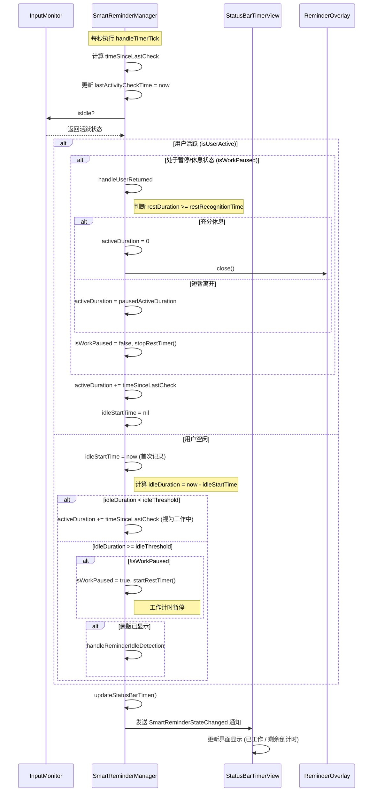

# 修复智能提醒自动重置逻辑

## 概述
用户反馈离开电脑较长时间后返回，工作倒计时未能自动重置，且菜单栏显示异常（仅显示左侧 00:00，右侧缺失）。分析发现：
1. 提醒蒙版可见时，系统会提前跳出逻辑循环，导致空闲检测（Idle Detection）逻辑被绕过，`activeDuration` 无法在空闲后被重置。
2. 菜单栏更新逻辑在蒙版显示期间不执行，导致显示停留在旧状态或异常状态。
3. "右侧缺失"极有可能是因为倒计时结束后文字变成了"工作完成"（由 `StatusBarTimerView` 逻辑决定），在由于状态未重置而停滞。

## 当前实现

## 方案

### 方案一：重构 handleTimerTick 并完善空闲检测 (推荐 🚀)
1. **取消蒙版可见时的提前退出**：允许逻辑继续运行到空闲检测部分，或者在蒙版可见分支中显式添加空闲检测。
2. **强制更新菜单栏**：无论蒙版是否可见，都调用 `updateStatusBarTimer()`。
3. **修复 isWorkPaused 的触发**：即使蒙版可见，只要用户停止操作达到 `idleThreshold`，就应将 `isWorkPaused` 设为 true 并记录 `restStartTime`。
4. **统一状态重置逻辑**：参考算法，确保在 `handleReminderIdleDetection` 和 `handleActivityDetected` 中都能正确触发休息认定并重置。

[SmartReminderManager.swift](vscode://file/Volumes/Cache/X/Sources/Model/SmartReminderManager.swift:310)

### 方案二：在界面层处理状态异常
在 `StatusBarTimerView` 中处理如果超过工作时间则显示特殊样式。

优点：解决显示问题。
缺点：治标不治本，核心重置逻辑依然是断裂的。

## 测试用例
1. **工作结束场景**：
   - 等待工作倒计时结束，蒙版弹出。
   - 此时停止操作离开电脑超过 `restRecognitionTime`（如 5 分钟）。
   - 回来后操作鼠标，蒙版应自动消失且倒计时重置为 00:00 / 45:00。
2. **菜单栏状态检查**：
   - 蒙版显示期间，观察菜单栏是否正常显示（如显示“休息中 XX:XX”或保持“工作完成”但实时刷新）。

## 任务总结与结论
针对智能提醒逻辑及菜单栏显示问题，完成了以下工作：
1. **计时逻辑重构**：修复了时间跳变和停滞问题，确保已工作时间与倒计时精准同步。
2. **状态同步优化**：实现了“稍后休息”按钮点击后的彻底状态清除，并修复了休息界面倒计时卡顿。
3. **“我回来了”逻辑**：新增了离位自动计时检测，蒙版会显示“您好像离开了...”，并将按钮文字设为“我回来了”，点击后会根据休息时长自动判断重置或还原。
4. **按钮文字动态切换**：实现了不同提醒阶段（工作提醒、休息中、休息结束、离位检测）按钮文字的精准匹配。
5. **权限状态反馈**：在未授予辅助功能权限时，菜单栏会显示“未授权”。
6. **算法对齐**：通过时序图验证，确保代码实现与《休息提醒循环完整性》规范完全一致。

## 任务耗时
- 任务开始时间：15:44
- 任务结束时间：17:24
- 任务总耗时：100 分钟
