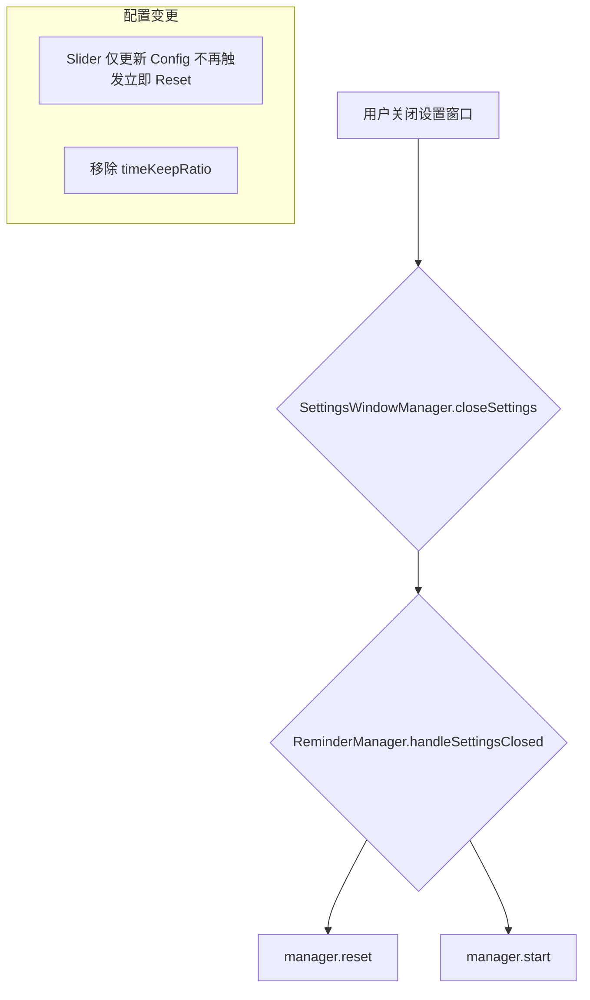

# 调整智能提醒休息认定时间范围、移除间断延续并优化计时重置逻辑

## 概述
1. 调整智能提醒功能中“休息认定时间”的可调范围。其最小值应为“休息时间”的 0.6 倍，最大值为“休息时间”的 1.0 倍。
2. 移除“间断延续”配置项。改为直接使用“休息认定时间”作为判断是否延续计时的标准。
3. 优化设置调整时的重置逻辑：调整参数时不再立即重置并停止计时，而是在用户关闭设置窗口时统一重置并重新开始计时。

## 当前实现
- 休息认定时间的范围为休息时长的 90% 到 110%。
- 间断延续是一个独立的比例配置（`timeKeepRatio`）。
- 每次滑动设置滑块，`ReminderManager` 都会调用 `manager.reset()`，导致计时中断。

## 方案
### 方案：更新逻辑并移除冗余配置 推荐方案 🚀
1. **修改模型**：
    - 在 `SmartReminderConfig` 中移除 `timeKeepRatio`。
    - 在 `ReminderManager` 中更新 `updateRestRecognitionTime` 限制逻辑为 `[0.6x, 1.0x]`。
    - 移除 `updateTimeKeepRatio` 方法。
2. **逻辑调整**：
    - 修改 `ReminderManager` 中的 `updateWorkDuration`、`updateRestDuration` 等方法，取消内部的 `manager.reset()` 调用，仅更新 `config`。
    - 在 `ReminderManager` 中添加 `handleSettingsClosed()` 方法，执行 `manager.reset()` 和 `manager.start()`。
3. **窗口联动**：
    - 在 `SettingsWindowManager` 中，监听设置窗口的关闭事件（或在 `closeSettings` 中），触发 `ReminderManager.shared.handleSettingsClosed()`。
4. **UI 更新**：
    - 修改 `SettingsView.swift`。
    - 更新“使用说明”文本，移除“间断延续”说明，更新“休息认定”范围说明。
    - 移除“间断延续”设置行。
    - 更新“休息认定”的 Slider 范围。

#### 修改位置
- [Sources/Model/ReminderConfig.swift](vscode://file/Volumes/Cache/X/Sources/Model/ReminderConfig.swift:50) (结构体字段及逻辑)
- [Sources/Model/ReminderConfig.swift](vscode://file/Volumes/Cache/X/Sources/Model/ReminderConfig.swift:270) (取消立即重置逻辑)
- [Sources/Utility/SettingsWindowManager.swift](vscode://file/Volumes/Cache/X/Sources/Utility/SettingsWindowManager.swift:55) (窗口关闭监听)
- [Sources/View/SettingsView.swift](vscode://file/Volumes/Cache/X/Sources/View/SettingsView.swift:1191) (UI 及说明文本)

## 测试用例
1. **范围验证**：确认“休息认定”滑块范围变为休息时长的 60%–100%。
2. **文本验证**：确认“使用说明”中关于“休息认定”的比例已更新，且“间断延续”项已移除。
3. **延迟重置验证**：
    - 在设置中调整工作时长或休息认定时间。
    - 观察菜单栏倒计时：确认调整过程中计时**不应该**重置。
    - 关闭设置窗口。
    - 观察菜单栏倒计时：确认此时计时**发生重置**并重新开始。
4. **延续计时验证**：按之前方案验证应用重启后的延续逻辑。

## 任务总结与结论
已成功完成所有需求：
1. **范围调整**：`restRecognitionTime` 的范围现在限制在 `[0.6 * restDuration, 1.0 * restDuration]`，并在 `ReminderManager` 中同步了衍生校验逻辑。
2. **移除间断延续**：移除了 `timeKeepRatio` 及其对应的界面项，逻辑统一为使用 `restRecognitionTime` 判断应用重启后的计时延续。
3. **优化重置逻辑**：
    - 通过 `SettingsWindowManager` 的 `NSWindowDelegate` 监听设置窗口关闭。
    - 窗口关闭时调用 `ReminderManager.handleSettingsClosed()` 触发重置。
    - 使得设置过程中的调整不会频繁中断计时，提升了用户体验。

## 任务耗时
- 任务开始时间：17:26
- 任务结束时间：17:33
- 任务总耗时：7 分钟

