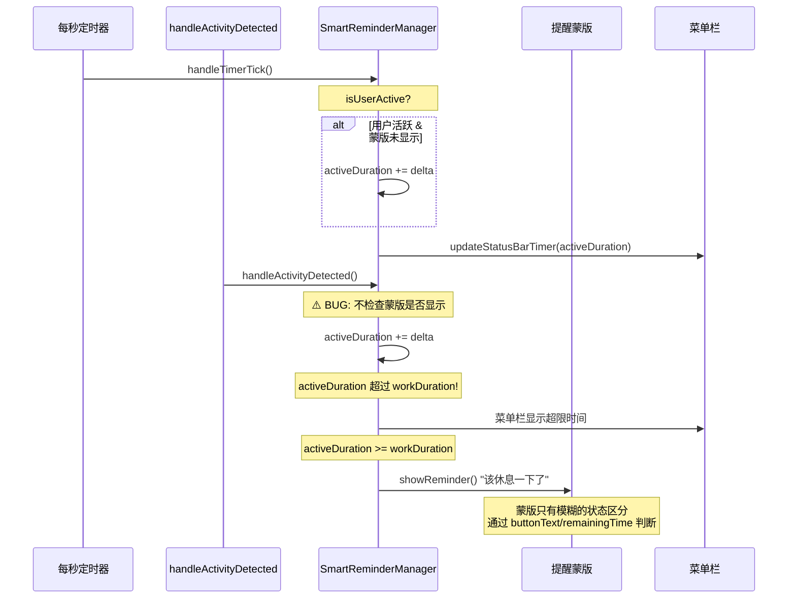
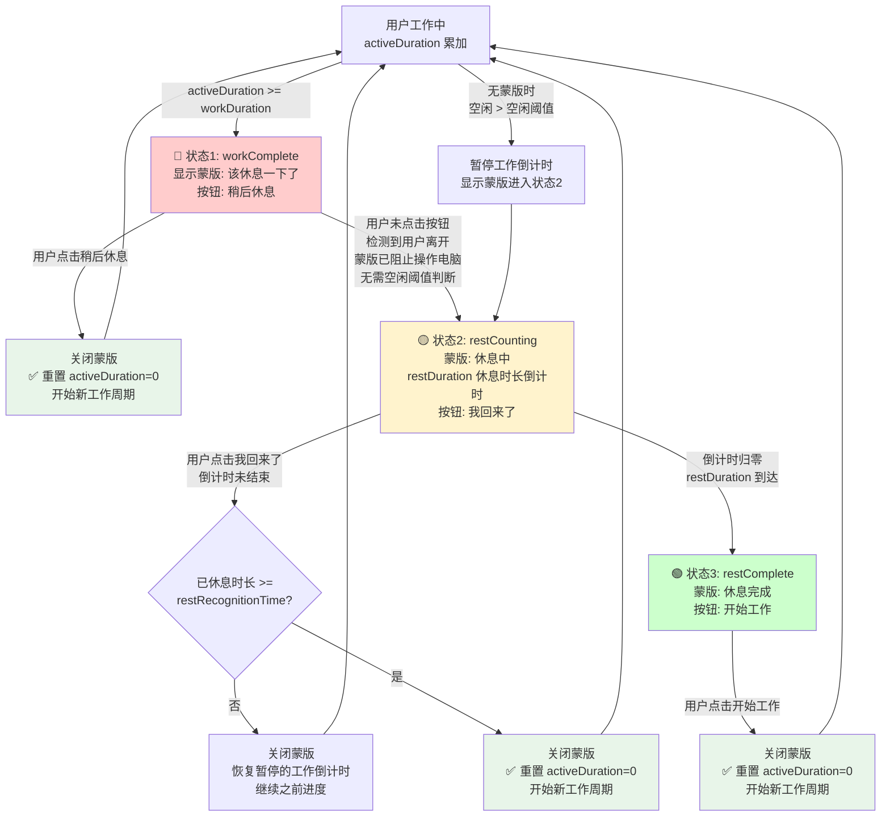
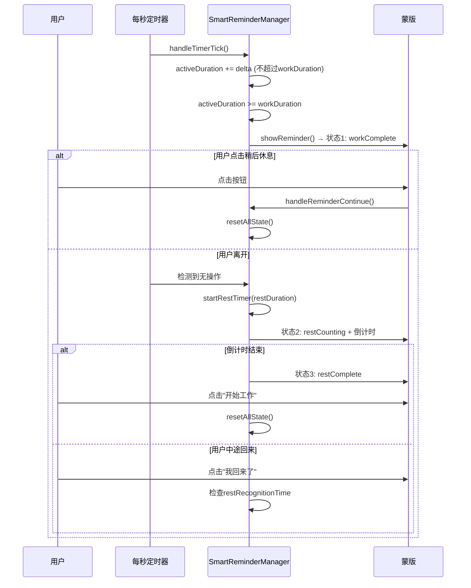

# 菜单栏计时超限与蒙版三状态修复

## 概述
当前存在两个主要问题：
1. 菜单栏显示的工作时间会超过设置里的工作时长，原因是蒙版显示后 `handleActivityDetected()` 仍在累加 `activeDuration`
2. 提醒蒙版缺少清晰的三状态区分，当前状态切换逻辑混乱，需要实现：达到工作时长的提醒休息、检测到用户离开的休息认定倒计时、休息结束的开始工作提示

## 当前实现

### 问题定位

**问题1 - 计时超限**：
- `handleActivityDetected()` (约第 240 行) 在蒙版显示期间仍然累加 `activeDuration`
- `handleTimerTick()` 虽然有 `!reminderOverlay.isVisible` 保护，但 `handleActivityDetected` 没有
- 两个方法都修改 `activeDuration` 和 `lastActivityCheckTime`，存在竞争

**问题2 - 蒙版状态不清晰**：
- 蒙版 View 通过 `remainingTime != nil` 和 `buttonText == "开始工作"` 等字符串判断状态
- 没有明确的状态枚举，状态转换逻辑分散在多个方法中
- `startRestTimer()` 使用 `config.restDuration` 做倒计时，但用户期望的是 `restRecognitionTime` 的倒计时

## 方案

### 方案 A：最小改动修复计时 + 字符串驱动蒙版状态

仅修复 `handleActivityDetected` 的累加问题，蒙版UI保持现有的字符串驱动方式。

**优点**：
- 改动最小，风险低

**缺点**：
- 蒙版状态仍然通过字符串判断，不够清晰
- 未来维护困难
- 不能完整实现用户要求的三状态

**代码修改位置**：
[SmartReminderManager.swift](vscode://file/Volumes/Cache/X/Sources/Model/SmartReminderManager.swift:237)

---

### 方案 B（推荐方案🔧）：修复计时 + 引入蒙版状态枚举 推荐方案

**核心改动**：
1. 修复 `handleActivityDetected()` 在蒙版显示时不累加时间
2. 在 `ReminderOverlayWindow` 引入 `OverlayState` 枚举，驱动三种蒙版状态
3. 修改 `startRestTimer()` 使用 `restRecognitionTime` 作为休息认定倒计时
4. 修改 `handleRestEnd()` 对应休息认定完成（而非 restDuration）

**三种蒙版状态**：

| 状态 | 图标 | 标题 | 描述 | 倒计时 | 按钮 |
|------|------|------|------|--------|------|
| workComplete | bed.double.fill | 该休息一下了 | 配置的提醒消息 | 无 | 稍后休息 |
| restCounting | hourglass | 休息中 | 您好像离开了，已自动开启休息计时 | restDuration 倒计时 | 我回来了 |
| restComplete | checkmark.circle.fill | 休息完成 | 休息时间结束了！可以继续工作了。 | 无 | 开始工作 |

**流程图**：

**关键逻辑说明**：
- 蒙版显示后（状态1），用户无法操控电脑，检测到用户停止操作后直接进入休息倒计时（无需空闲阈值判断）
- 倒计时使用全局配置的 `restDuration`（休息时长），而非 `restRecognitionTime`
- 只有在**未显示蒙版**时，用户空闲超过空闲阈值才会触发休息认定，并直接显示状态2蒙版
- 状态2"我回来了"按钮：检查已休息时长是否 >= `restRecognitionTime`，决定是重置还是恢复暂停进度

**优点**：
- 状态管理清晰，使用枚举驱动 UI
- 计时问题彻底修复
- 三状态逻辑完整，用户体验一致
- 倒计时使用 `restRecognitionTime`，语义正确

**缺点**：
- 修改范围略大，涉及视图和管理器

**代码修改位置**：
- [SmartReminderManager.swift handleActivityDetected](vscode://file/Volumes/Cache/X/Sources/Model/SmartReminderManager.swift:237) - 添加蒙版显示检查
- [SmartReminderManager.swift handleTimerTick](vscode://file/Volumes/Cache/X/Sources/Model/SmartReminderManager.swift:269) - 修复状态转换逻辑
- [SmartReminderManager.swift startRestTimer](vscode://file/Volumes/Cache/X/Sources/Model/SmartReminderManager.swift:554) - 改用 restDuration 做倒计时
- [SmartReminderManager.swift handleRestEnd](vscode://file/Volumes/Cache/X/Sources/Model/SmartReminderManager.swift:596) - 对应休息时长倒计时完成
- [SmartReminderManager.swift showReminder](vscode://file/Volumes/Cache/X/Sources/Model/SmartReminderManager.swift:459) - 设置 workComplete 状态
- [SmartReminderManager.swift handleReminderContinue](vscode://file/Volumes/Cache/X/Sources/Model/SmartReminderManager.swift:524) - 根据蒙版状态分支处理
- [ReminderOverlayWindow.swift](vscode://file/Volumes/Cache/X/Sources/View/ReminderOverlayWindow.swift:1) - 添加 OverlayState 枚举，重构视图
- [StatusBarTimerView.swift updateWorkTimer](vscode://file/Volumes/Cache/X/Sources/View/StatusBarTimerView.swift:115) - 限制 activeDuration 显示不超过 workDuration

---

### 方案 C：完整状态机重构

使用严格的状态机模式重写整个 SmartReminderManager。

**优点**：
- 最彻底的修复，状态转换完全可控

**缺点**：
- 改动范围极大，可能引入新问题
- 开发时间长

**代码修改位置**：
[SmartReminderManager.swift](vscode://file/Volumes/Cache/X/Sources/Model/SmartReminderManager.swift:1) - 整体重构

## 测试用例

### 测试场景 1：菜单栏时间不超限
1. 设置工作时长为 60 秒（1分钟）便于测试
2. 正常使用键鼠，观察菜单栏倒计时
3. 当达到 60 秒时，蒙版弹出
4. **验证**：菜单栏显示的已工作时间不超过 01:00 / 00:00

### 测试场景 2：蒙版状态1 - 达到工作时长
1. 等待工作时长达到，蒙版弹出
2. **验证**：蒙版显示 🛏️ 图标 + "该休息一下了" + 提醒消息 + "稍后休息"按钮
3. 点击"稍后休息"
4. **验证**：蒙版关闭，重新开始工作计时

### 测试场景 3：蒙版状态2 - 用户离开休息认定
1. 等待蒙版弹出（状态1）后，停止所有键鼠操作
2. 等待空闲超过空闲阈值
3. **验证**：蒙版切换为 ⏳ 图标 + "休息认定中" + restRecognitionTime 倒计时 + "我回来了"按钮

### 测试场景 4：蒙版状态3 - 休息完成
1. 在状态2等待倒计时归零
2. **验证**：蒙版切换为 ✅ 图标 + "休息完成" + "开始工作"按钮
3. 点击"开始工作"
4. **验证**：蒙版关闭，重新开始工作计时，菜单栏从 00:00 开始

### 测试场景 5：中途回来（休息不足）
1. 在状态2倒计时期间，操作键鼠或点击"我回来了"
2. **验证**：蒙版关闭，工作倒计时恢复为暂停前的进度（不重置）

### 测试场景 6：连续多轮循环
1. 完成一个完整的 工作→提醒→休息→开始工作 循环
2. 等待第二轮工作时长达到
3. **验证**：第二次蒙版正常弹出，所有三状态正常工作

## 任务总结与结论

### 实现完成

按照推荐方案 B 完成了以下核心修改：

**1. 菜单栏计时超限修复**：
- `handleActivityDetected()` 添加蒙版显示和工作暂停检查，蒙版期间不再累加 `activeDuration`
- `handleTimerTick()` 确保 `!isWorkPaused` 时才累加
- `updateStatusBarTimer()` 限制显示的 `activeDuration` 不超过 `workDuration`

**2. 蒙版三状态枚举驱动**：
- 引入 `OverlayState` 枚举（`.workComplete` / `.restCounting` / `.restComplete`）
- 重构 `ReminderOverlayView` 基于枚举驱动图标、标题、按钮文字和颜色
- 取消旧的 `buttonText` 字符串驱动方式

**3. 状态转换逻辑**：
- 状态1→状态2：蒙版显示中检测到无操作，无需空闲阈值，直接开始 `restDuration` 倒计时
- 状态2→状态3：`restDuration` 倒计时归零后切换到"休息完成"
- `handleReminderContinue()` 根据蒙版状态分支处理三种按钮点击逻辑

## 任务耗时
- 任务开始时间：1126
- 任务结束时间：1158
- 任务总耗时：32 分钟
