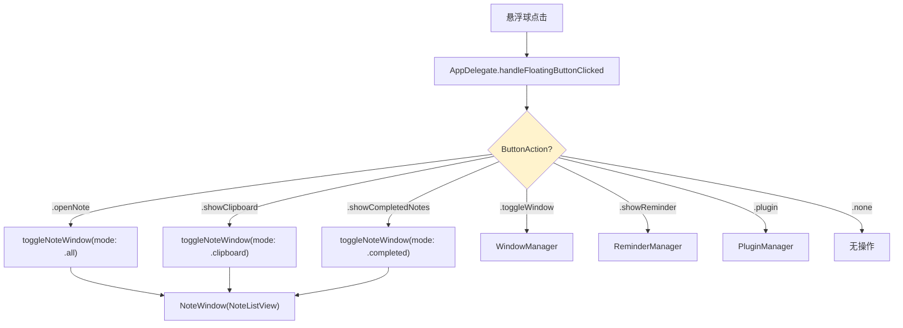
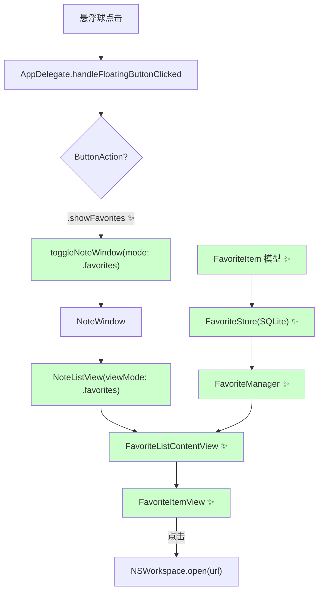
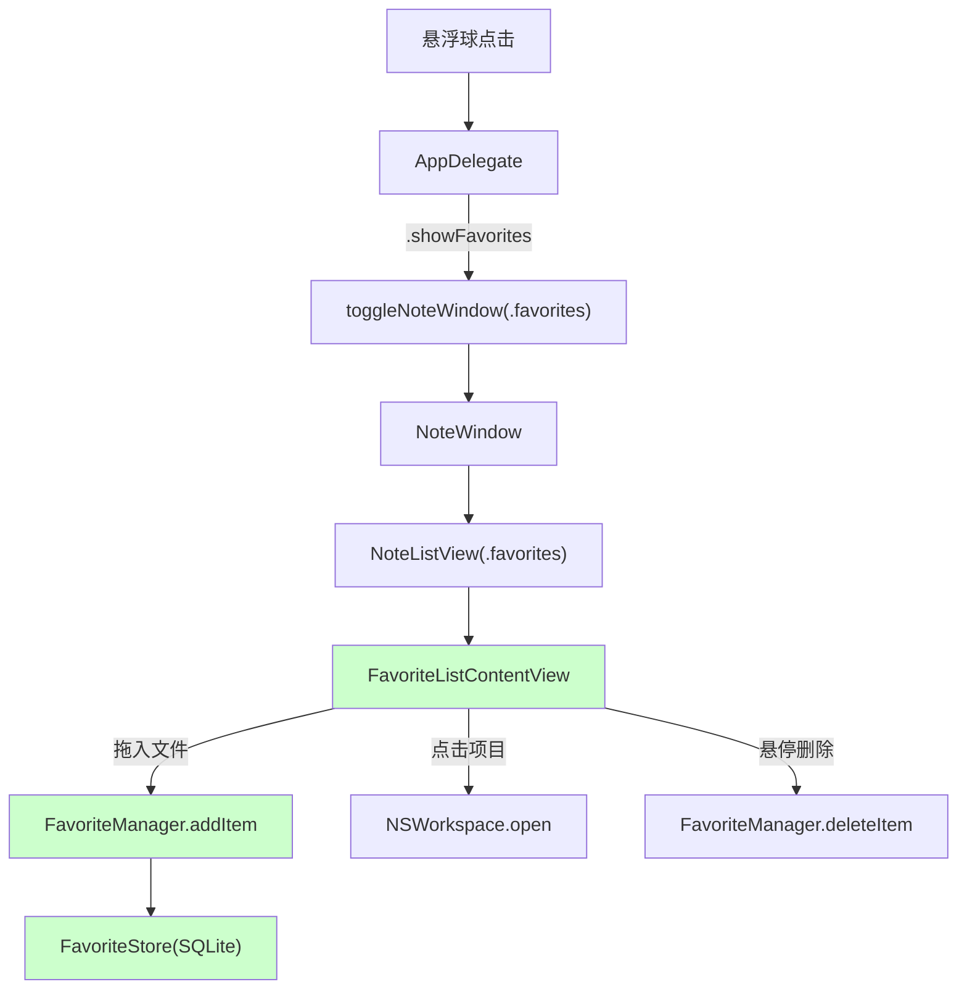

# 悬浮球绑定常用文件和文件夹功能

## 概述
为悬浮球添加新的可绑定功能"常用文件和文件夹"。用户可以添加任意文件和文件夹到常用列表，以类似笔记列表的方式显示，点击后使用系统默认方式打开文件或文件夹。

## 当前实现

### 当前 ButtonAction 枚举值
- `.none` / `.openNote` / `.showCompletedNotes` / `.showClipboard` / `.toggleWindow` / `.showReminder` / `.plugin`

### 笔记功能架构
- `Note` 模型 + `NoteStore`(SQLite) + `NoteManager`(ObservableObject)
- `NoteListView` + `NoteItemView` 显示列表
- `NoteWindow`(NSPanel) 承载视图，依附悬浮球位置显示

## 方案

### 方案 A（推荐方案🔧）：新增 ButtonAction + NoteListView.ViewMode + FavoriteItem 模型 推荐方案

复用现有 NoteWindow 架构，添加 `.favorites` ViewMode，新建独立的数据模型和视图。

**新增文件**：
- `Sources/Model/FavoriteItem.swift` — 数据模型 + FavoriteManager
- `Sources/Model/FavoriteStore.swift` — SQLite 持久化存储
- `Sources/View/FavoriteListView.swift` — 常用文件/文件夹列表视图

**修改文件**：
- [FloatingButtonConfig.swift](vscode://file/Volumes/Cache/X/Sources/Model/FloatingButtonConfig.swift:153) — ButtonAction 枚举添加 `.showFavorites`
- [NoteListView.swift](vscode://file/Volumes/Cache/X/Sources/View/NoteListView.swift:433) — ViewMode 添加 `.favorites`
- [NoteListView.swift](vscode://file/Volumes/Cache/X/Sources/View/NoteListView.swift:445) — body 中添加 favorites 模式分支
- [AppDelegate.swift](vscode://file/Volumes/Cache/X/Sources/App/AppDelegate.swift:300) — handleFloatingButtonClicked 添加 `.showFavorites` case
- [AppDatabase.swift](vscode://file/Volumes/Cache/X/Sources/Model/AppDatabase.swift:1) — 添加 FavoriteStore 实例

**优点**：
- 复用 NoteWindow 窗口机制，代码量少
- 与笔记列表体验一致
- 独立模型不影响现有笔记功能

**缺点**：
- NoteListView 需要添加分支逻辑

---

### 方案 B：完全独立的 FavoriteWindow

创建独立的 FavoriteWindow、FavoriteListView，不复用 NoteWindow。

**优点**：
- 完全独立，不影响现有代码

**缺点**：
- 代码重复量大（窗口定位、显示/隐藏逻辑）
- 需要在 AppDelegate 维护另一个窗口实例

**代码修改位置**：
[AppDelegate.swift](vscode://file/Volumes/Cache/X/Sources/App/AppDelegate.swift:10) — 新增 favoriteWindow 属性和管理逻辑

## 测试用例

### 测试场景 1：添加文件
1. 在悬浮球右键菜单中绑定"常用文件"动作
2. 点击悬浮球打开常用列表
3. 点击"+"按钮，选择一个文件
4. **验证**：文件出现在列表中，显示文件名和文件类型图标

### 测试场景 2：添加文件夹
1. 点击"+"按钮，选择一个文件夹
2. **验证**：文件夹出现在列表中，显示文件夹名和文件夹图标

### 测试场景 3：打开文件/文件夹
1. 点击列表中的文件项
2. **验证**：系统使用默认应用打开该文件
3. 点击列表中的文件夹项
4. **验证**：Finder 打开该文件夹

### 测试场景 4：删除项目
1. 右键点击某个项目，选择删除
2. **验证**：项目从列表中移除

### 测试场景 5：悬浮球绑定
1. 右键悬浮球 → 切换动作 → 选择"常用文件"
2. 点击悬浮球
3. **验证**：打开常用文件列表窗口

## 任务总结与结论

采用方案A实现，复用 NoteWindow 架构，新增 `.favorites` ViewMode。最终采用拖拽方式添加文件/文件夹（替代 NSOpenPanel，因浮动窗口焦点冲突）。

### 新增文件
- `FavoriteItem.swift` — 数据模型（含智能文件图标）
- `FavoriteStore.swift` — SQLite CRUD
- `FavoriteListView.swift` — FavoriteManager + 视图组件

### 修改文件
- `Package.swift` — 注册新文件
- `AppDatabase.swift` — favoriteStore
- `FloatingButtonConfig.swift` — `.showFavorites`
- `NoteListView.swift` — `.favorites` ViewMode + 工具栏按钮
- `AppDelegate.swift` — 点击处理

## 任务耗时
- 任务开始时间：12:23
- 任务结束时间：14:08
- 任务总耗时：105 分钟
