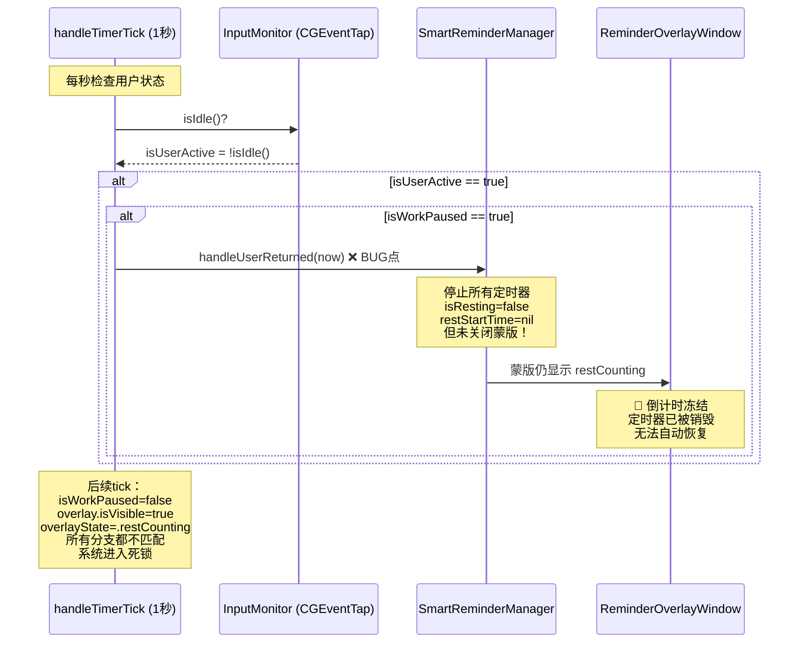
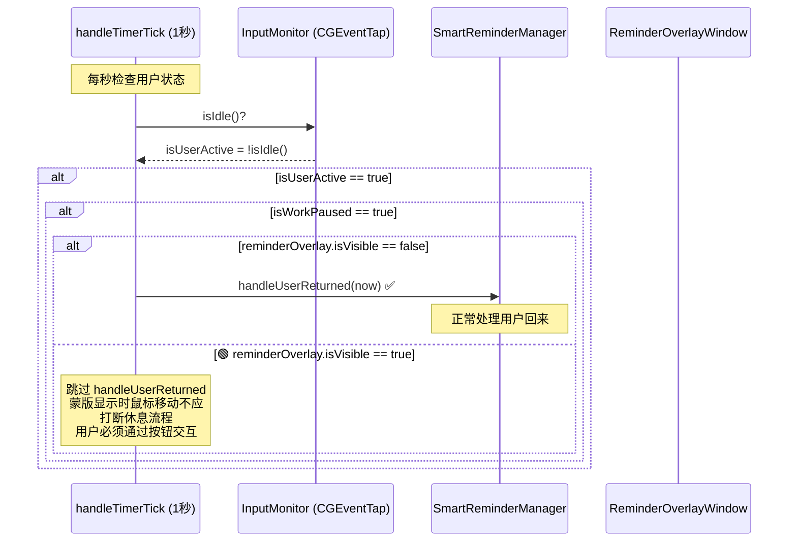
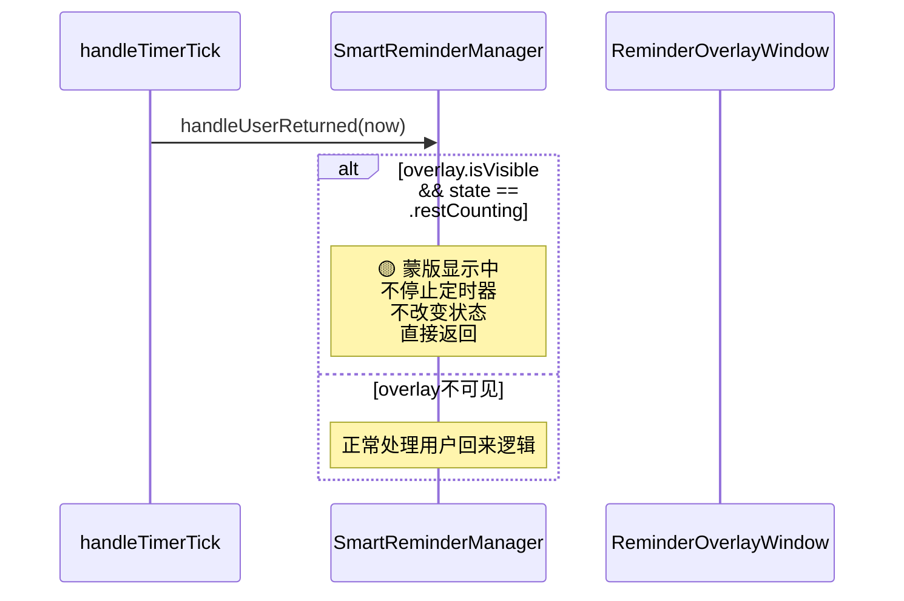
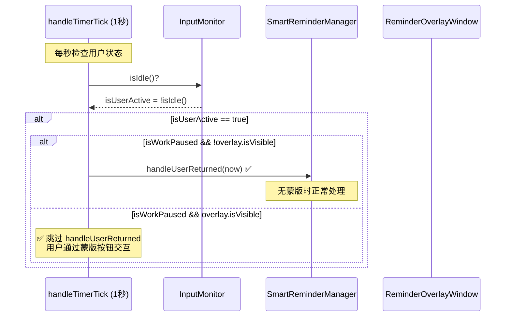

# 休息倒计时卡住修复

## 概述
用户反馈休息倒计时有时会卡住（蒙版显示冻结的倒计时，无法自动更新或结束）。通过分析日志和代码，发现根本原因是：当蒙版（overlay）在状态2（restCounting）显示期间，CGEventTap 依然能检测到用户的鼠标移动，导致 `handleUserReturned()` 被错误调用，停止了所有休息定时器，但未关闭蒙版，使系统进入死锁状态。

## 当前实现

### 问题详细描述

1. **蒙版显示状态2（restCounting）** — 休息倒计时进行中，`isWorkPaused=true`
2. **用户移动鼠标** — CGEventTap 捕获到移动事件（即使蒙版遮挡全屏），`isIdle()` 返回 `false`
3. **handleTimerTick 判定为活跃** — `isUserActive=true, isWorkPaused=true` → 调用 `handleUserReturned(now)`
4. **handleUserReturned 执行**：
   - 调用 `stopRestTimer()` → `restTimer=nil, isResting=false, restStartTime=nil`
   - 销毁 `restCountdownTimer`
   - 休息不足时：`activeDuration = pausedActiveDuration`, `isWorkPaused=false`
   - **但蒙版没有被关闭**（只有休息充足时才关闭蒙版）
5. **后续每次 tick 进入死锁**：
   - `isWorkPaused=false` → 不会再调 `handleUserReturned`
   - `reminderOverlay.isVisible=true` → 不累加时间，不调 `checkAndShowReminder`
   - `overlayState=.restCounting` → 不匹配 `.workComplete` 分支
   - `handleReminderIdleDetection` 要求 `isWorkPaused=true` → 不满足
   - **所有代码路径都不匹配，系统停滞**

### 日志佐证

日志中仅记录了 1 次 `startRestTimer`、1 次 `showRestOverlay`，但有 2 次 `用户回来`。说明 `handleUserReturned` 在蒙版显示期间被鼠标移动触发，打断了休息流程。

## 方案

### 方案A：蒙版显示时屏蔽 handleUserReturned（推荐方案🏆）

**优点：**
- 修改量极小，仅需添加一个条件判断
- 逻辑清晰：蒙版显示时，用户只能通过蒙版按钮交互
- 不影响无蒙版场景的正常处理（如音频播放暂停后用户回来）
- 完全解决死锁问题

**缺点：**
- 无

**代码修改位置：**
[SmartReminderManager.swift](vscode://file/Volumes/Cache/X/Sources/Model/SmartReminderManager.swift:303) — `handleTimerTick()` 方法中 `isWorkPaused` 判断处，添加 `&& !reminderOverlay.isVisible` 条件

### 方案B：handleUserReturned 中检查蒙版状态并正确处理

**优点：**
- 也能解决问题
- 在 handleUserReturned 内部做保护

**缺点：**
- handleUserReturned 的职责变得不纯粹（既要处理返回逻辑，又要判断蒙版状态）
- 需要修改 handleUserReturned 方法的逻辑
- 不如方案A从源头屏蔽来得干净

**代码修改位置：**
[SmartReminderManager.swift](vscode://file/Volumes/Cache/X/Sources/Model/SmartReminderManager.swift:376) — `handleUserReturned()` 方法开头添加蒙版可见性检查

## 测试用例

### 测试1：状态2期间鼠标移动不应打断倒计时
1. 将工作时长设置为 1 分钟（方便测试）
2. 正常使用电脑，等待工作时间到达
3. 看到状态1蒙版（"该休息了"），停止操作
4. 蒙版自动切换到状态2（休息倒计时开始）
5. **轻微移动鼠标** — 验证倒计时不会卡住，继续正常倒计时
6. 等待倒计时结束，验证自动切换到状态3（"休息结束"）

### 测试2：状态2期间点击"我回来了"正常工作
1. 在状态2倒计时期间，点击"我回来了"按钮
2. 验证蒙版正常关闭
3. 验证工作倒计时恢复（如果休息不足）或重置（如果休息充足）

### 测试3：无蒙版场景的用户回来正常工作
1. 正常使用电脑，然后离开一段时间（超过空闲阈值）
2. 回来后移动鼠标/键盘
3. 验证系统正确识别用户回来并恢复/重置计时

### 测试4：状态3期间鼠标移动不应自动关闭蒙版
1. 等待状态2倒计时结束，蒙版切换到状态3（"开始工作"）
2. 移动鼠标 — 验证蒙版不会自动关闭
3. 点击"开始工作"按钮 — 验证蒙版正常关闭并重置计时

## 任务总结与结论

通过在 `handleTimerTick()` 中添加 `!reminderOverlay.isVisible` 条件，解决了蒙版显示期间鼠标移动导致 `handleUserReturned()` 被错误调用的问题。同时优化了日志系统，增加了文件大小限制（2MB）和自动清理（7天过期）。

## 任务耗时
- 任务开始时间：12:34
- 任务结束时间：12:42
- 任务总耗时：8 分钟
