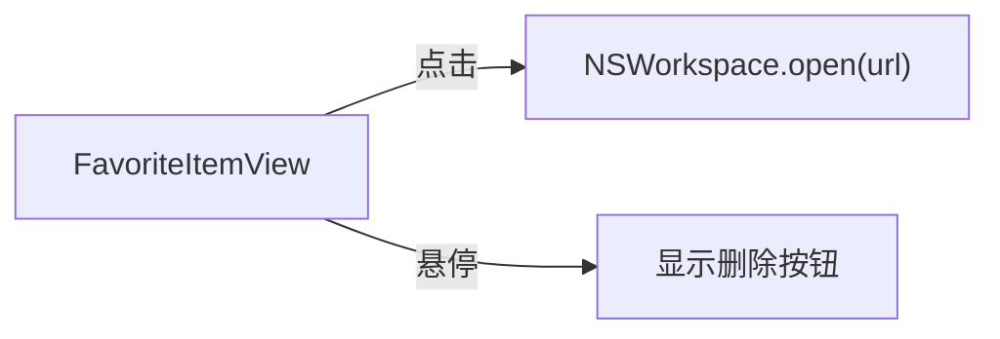
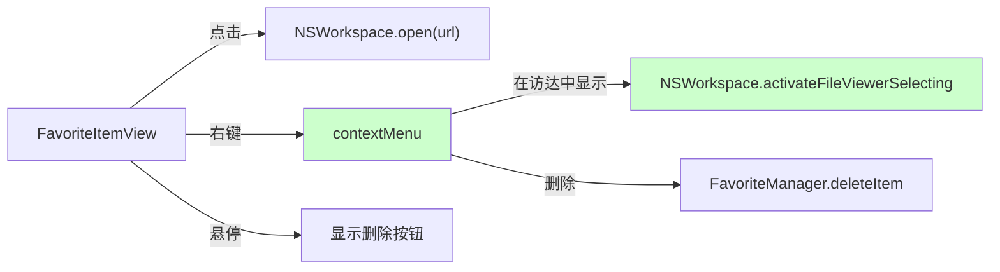

# 常用文件右键在访达中显示

## 概述
为常用文件列表的每个项目添加右键菜单，支持"在访达中显示"功能。

## 当前实现

## 方案

### 方案A：添加 contextMenu 推荐方案🏆

**优点：**
- SwiftUI 原生 contextMenu，代码量极小
- 可扩展更多右键选项

**缺点：**
- 无

**代码修改位置：**
[FavoriteListView.swift](vscode://file/Volumes/Cache/X/Sources/View/FavoriteListView.swift:216) — FavoriteItemView body 末尾添加 `.contextMenu`

## 测试用例
1. 右键点击文件列表项 → 弹出菜单显示"在访达中显示"和"删除"
2. 点击"在访达中显示" → Finder 打开并选中该文件
3. 点击"删除" → 项目从列表移除

## 任务总结与结论

使用 SwiftUI `.contextMenu` 为 FavoriteItemView 添加右键菜单，包含"在访达中显示"（`NSWorkspace.activateFileViewerSelecting`）和"删除"选项。同时将列表项背景改为纯白不透明，加深阴影。

## 任务耗时
- 任务开始时间：14:10
- 任务结束时间：14:13
- 任务总耗时：3 分钟
