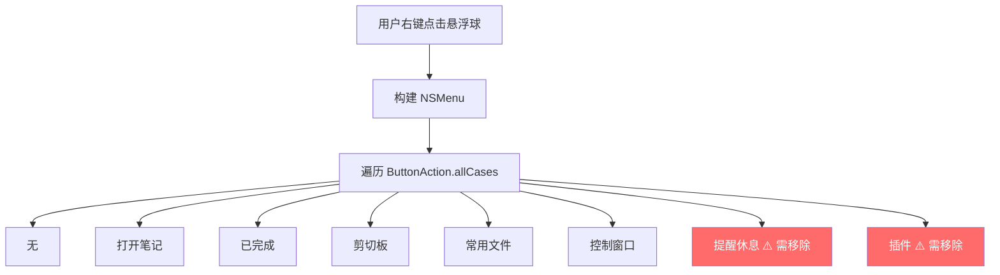
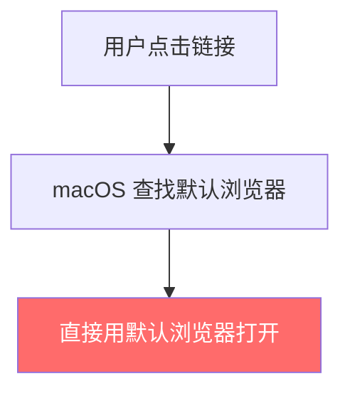
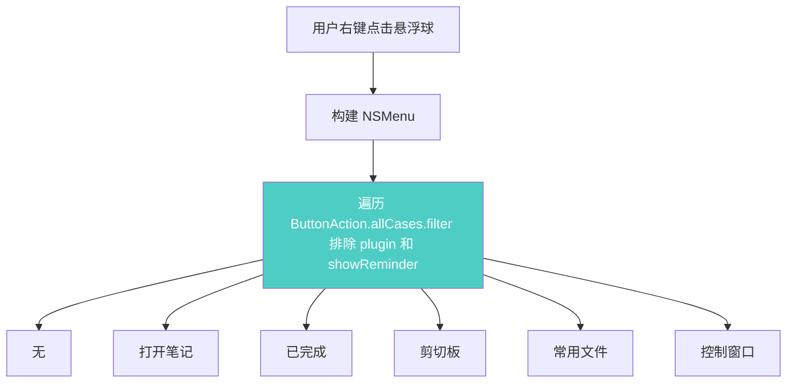
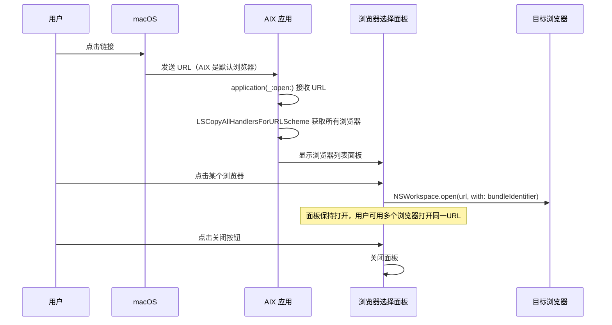
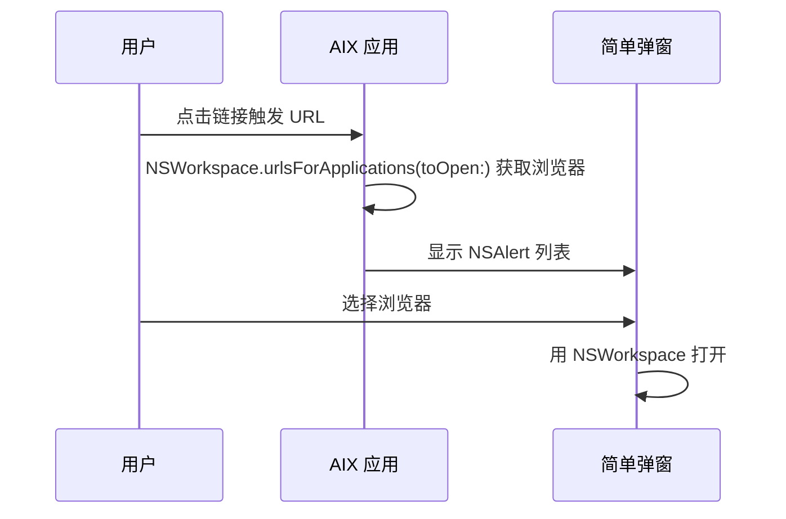
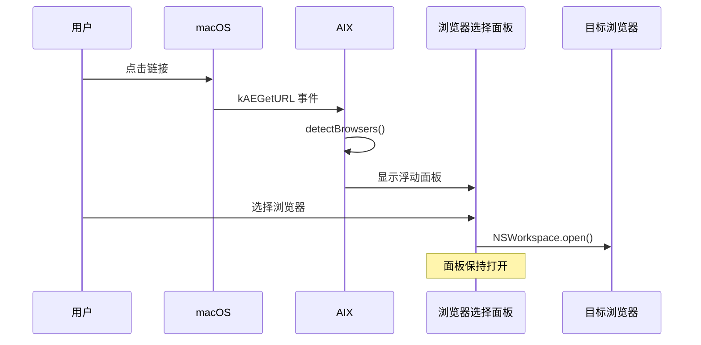

# 去除绑定项与多浏览器打开

## 概述
本任务包含两个子任务：
1. **去除悬浮球右键可绑定项**：移除右键菜单中的「插件」和「提醒休息」两个可绑定操作
2. **多浏览器打开功能**：将 AIX 注册为系统浏览器，当用户设置 AIX 为默认浏览器后，点击任何链接时弹出浏览器选择面板，用户选择目标浏览器即可打开

## 当前实现

### 子任务1：悬浮球右键菜单

### 子任务2：多浏览器打开（当前不存在该功能）

## 方案

### 子任务1 方案：过滤枚举值 🎯 推荐方案

**优点：**
- 改动最小，只需在 3 处遍历 `allCases` 的地方加 `.filter`
- 不影响已绑定了「插件」或「提醒休息」的用户的现有配置（枚举值保留，仅菜单不再展示）
- 向后兼容

**缺点：**
- 无明显缺点

**修改位置：**
- [GlowFloatingButtonView.swift](vscode://file/Volumes/Cache/X/Sources/View/GlowFloatingButtonView.swift:348) — 右键菜单 allCases 遍历
- [FloatingButtonView.swift](vscode://file/Volumes/Cache/X/Sources/View/FloatingButtonView.swift:500) — 右键菜单 allCases 遍历
- [AppDelegate.swift](vscode://file/Volumes/Cache/X/Sources/App/AppDelegate.swift:540) — 状态栏菜单 allCases 遍历

---

### 子任务2 方案A：URL Scheme 注册 + 浮动选择面板 🎯 推荐方案

**优点：**
- 使用 macOS 原生 API（`LSCopyAllHandlersForURLScheme`）检测浏览器，可靠性高
- 浮动面板 UI 与现有 NoteWindow 风格一致
- 用户体验流畅，可以为每个浏览器显示图标和名称

**缺点：**
- 需要修改 Info.plist 添加 URL Scheme
- 需要用户手动到系统设置中将 AIX 设为默认浏览器

**修改位置：**
- [Info.plist](vscode://file/Volumes/Cache/X/Info.plist:1) — 添加 CFBundleURLTypes（http/https）
- [AppDelegate.swift](vscode://file/Volumes/Cache/X/Sources/App/AppDelegate.swift:22) — 添加 URL 处理方法
- 新建 `Sources/Model/BrowserDetector.swift` — 浏览器检测逻辑
- 新建 `Sources/View/BrowserPickerWindow.swift` — 浏览器选择面板 UI
- [Package.swift](vscode://file/Volumes/Cache/X/Package.swift:20) — 添加新文件

### 子任务2 方案B：仅使用 NSWorkspace 查询

**优点：**
- 使用更新的 API（macOS 12+）

**缺点：**
- `urlsForApplications(toOpen:)` 返回的是应用路径而非 bundle ID，需要额外解析
- NSAlert 样式的列表不够美观
- 对低版本系统兼容性略差

**修改位置：**
- 同方案A

## 测试用例

### 子任务1 测试
1. 右键点击任意悬浮球，确认菜单中**不再出现**「提醒休息」和「插件」选项
2. 状态栏菜单 → 悬浮球操作 → 按钮子菜单中，确认**不再出现**「提醒休息」和「插件」选项
3. 已绑定「提醒休息」或「插件」的悬浮球，功能应仍然正常（仅菜单不展示，不影响执行）

### 子任务2 测试
1. 编译运行 AIX 后，前往 **系统设置 → 桌面与程序坞 → 默认网页浏览器**，确认 AIX 出现在候选列表中
2. 将 AIX 设为默认浏览器
3. 在任意应用（如备忘录、终端）中点击一个链接
4. 确认 AIX 弹出浏览器选择面板，面板中列出电脑上安装的所有浏览器（如 Safari、Chrome、Firefox 等）
5. 点击某个浏览器图标，确认链接在该浏览器中正确打开
6. 确认面板**不会**自动关闭，用户可以继续点击其他浏览器打开同一 URL
7. 点击面板上的关闭按钮，确认面板关闭

## 任务总结与结论

### 子任务1：去除绑定项
在 GlowFloatingButtonView、FloatingButtonView、AppDelegate 三处遍历 `ButtonAction.allCases` 的位置添加 `where action != .plugin && action != .showReminder` 过滤条件，右键菜单和状态栏菜单不再展示这两项，已绑定的不受影响。

### 子任务2：多浏览器打开
- Info.plist 注册 http/https URL Scheme，使 AIX 可被设为默认浏览器
- AppDelegate 通过 `NSAppleEventManager` 注册 `kAEGetURL` 事件，接收系统发来的 URL
- BrowserDetector 使用 `NSWorkspace.urlsForApplications(toOpen:)` 检测所有已安装浏览器
- BrowserPickerWindow 以浮动面板展示浏览器列表，点击后打开 URL，面板保持打开

## 任务耗时
- 任务开始时间：14:20
- 任务结束时间：14:28
- 任务总耗时：8 分钟
