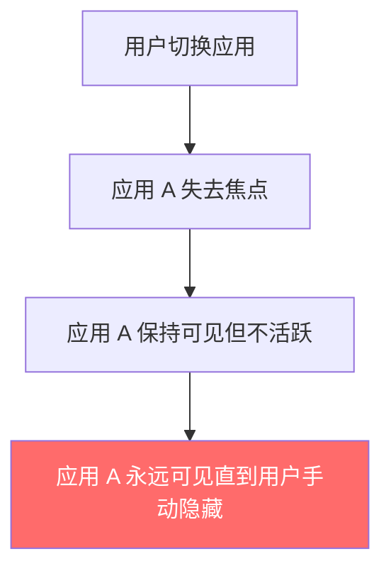
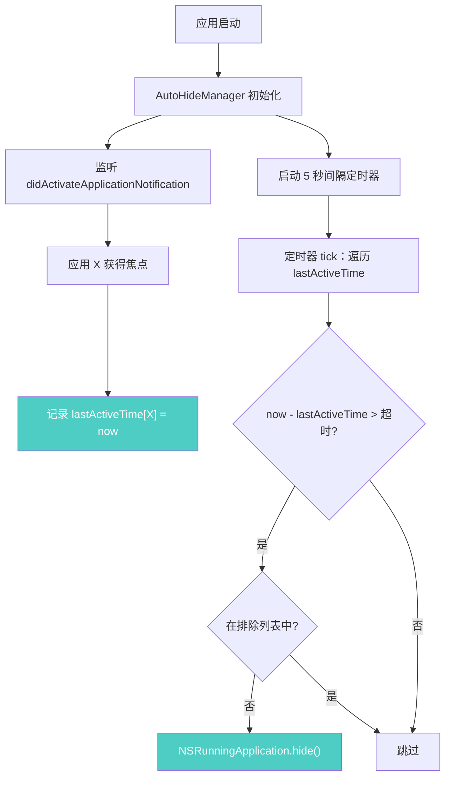
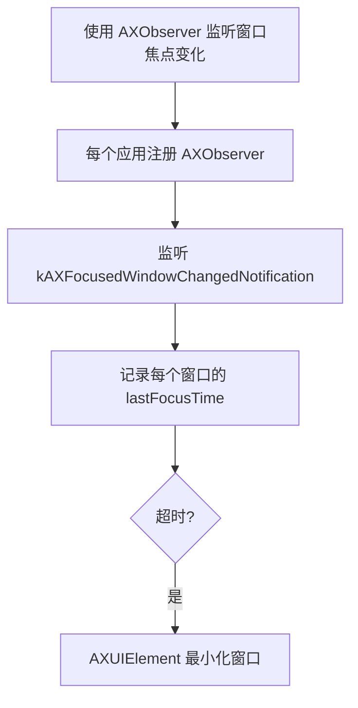
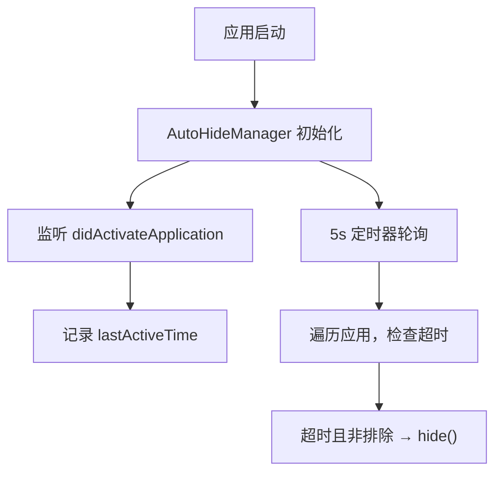

# 窗口自动隐藏

## 概述
添加系统级后台功能：监控所有运行中的应用，当某个应用超过用户设定的时间未被激活（不活跃），自动隐藏该应用。用户可配置超时时间和排除特定应用。

## 当前实现

目前 AIX 不具备任何应用自动隐藏的功能。

## 方案

### 方案A：NSWorkspace 通知 + Timer 轮询 🎯 推荐方案

**优点：**
- 使用原生 `NSWorkspace.didActivateApplicationNotification`，可靠且低开销
- Timer 轮询间隔 5 秒，CPU 开销极小
- `NSRunningApplication.hide()` 是 macOS 标准隐藏方式（Cmd+H 效果）
- 排除列表可让用户保护重要应用

**缺点：**
- 无法感知窗口级别的活跃（只能感知应用级别）

**修改位置：**
- 新建 [AutoHideManager.swift](vscode://file/Volumes/Cache/X/Sources/Model/AutoHideManager.swift:1) — 核心逻辑
- [SettingsView.swift](vscode://file/Volumes/Cache/X/Sources/View/SettingsView.swift:1) — 添加自动隐藏设置 UI
- [AppDelegate.swift](vscode://file/Volumes/Cache/X/Sources/App/AppDelegate.swift:22) — 初始化 AutoHideManager
- [Package.swift](vscode://file/Volumes/Cache/X/Package.swift:20) — 添加新文件

### 方案B：Accessibility API 监控窗口焦点

**优点：**
- 窗口级别的精细控制
- 可以最小化单个窗口而非隐藏整个应用

**缺点：**
- 需要为每个应用创建 AXObserver，资源开销大
- 需要辅助功能权限
- 实现复杂度高，容易出 bug
- 新应用启动时需要动态注册

**修改位置：**
- 同方案A

## 测试用例
1. 在设置中启用自动隐藏功能，设置超时为 1 分钟
2. 打开多个应用（如 Safari、终端、访达）
3. 切换到某个应用，等待超过 1 分钟
4. 确认其他不活跃的应用被自动隐藏（从 Dock 可看到应用图标变暗）
5. 将某个应用加入排除列表，确认该应用不会被自动隐藏
6. 关闭自动隐藏功能，确认所有应用不再被自动隐藏

## 任务总结与结论

新建 AutoHideManager 监听 `NSWorkspace.didActivateApplicationNotification` 记录每个应用最后活跃时间，5 秒间隔定时器轮询检查超时应用并调用 `NSRunningApplication.hide()` 隐藏。设置 UI 在通用页新增"自动隐藏"区域，支持开关、超时时间（20-60分钟）和排除列表管理。自动排除系统应用和 AIX 自身，配置持久化到 SQLite。

## 任务耗时
- 任务开始时间：14:32
- 任务结束时间：14:41
- 任务总耗时：9 分钟
