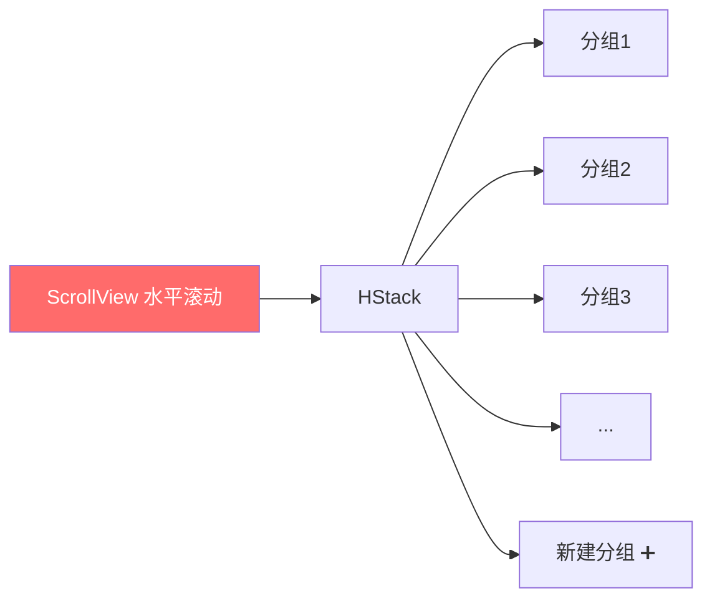
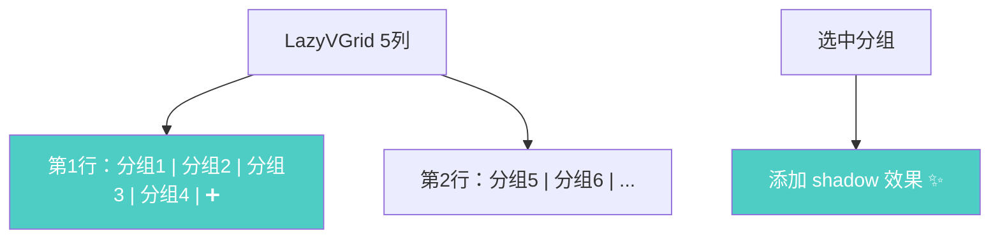
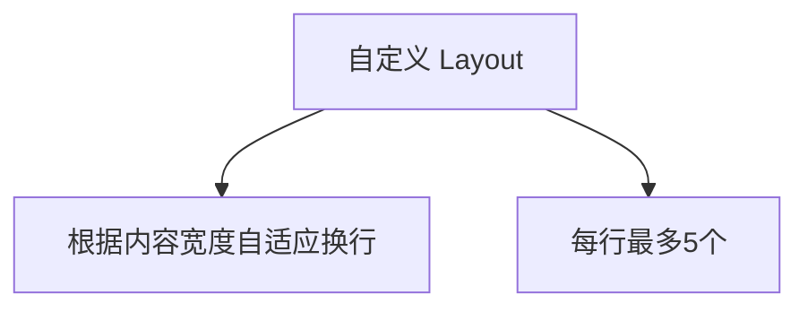

# 分组每行最多5个与选中阴影

## 概述
修改笔记上方的分组选择器布局：每行最多显示 5 个分组按钮（含新建分组图标），超出换行显示。分组选中时添加阴影效果。

## 当前实现

当前使用 `ScrollView(.horizontal)` + `HStack`，所有分组在一行水平排列，超出时水平滚动。选中分组仅有背景色变化，无阴影。

## 方案

### 方案A：LazyVGrid 网格布局 🎯 推荐方案

**优点：**
- `LazyVGrid` 是 SwiftUI 原生组件，实现简洁
- 固定 5 列网格自动换行
- 性能好，支持大量分组

**缺点：**
- 网格列宽固定均分，按钮可能不够紧凑

**修改位置：**
- [NoteListView.swift](vscode://file/Volumes/Cache/X/Sources/View/NoteListView.swift:633) — groupSelectorView 属性

### 方案B：自定义 FlowLayout

**优点：**
- 按钮大小自适应，排列更紧凑

**缺点：**
- 需要自定义 Layout 协议实现，代码复杂
- macOS 14+ Layout 协议可用但实现比较繁琐

## 测试用例
1. 创建 6 个以上分组，确认前 4 个分组 + 新建按钮占满第一行，第 5 个及之后在第二行
2. 点击某个分组，确认选中的分组按钮有阴影效果
3. 切换分组，确认阴影跟随选中状态移动
4. 分组少于 5 个时，确认一行即可显示完毕

## 任务总结与结论

将 `groupSelectorView` 从 `ScrollView(.horizontal)` + `HStack` 改为 `LazyVGrid` 5 列网格布局，分组按钮和新建按钮自动换行。选中分组添加 `shadow(color: .white.opacity(0.5), radius: 4)` 阴影效果。

## 任务耗时
- 任务开始时间：14:42
- 任务结束时间：14:45
- 任务总耗时：3 分钟
