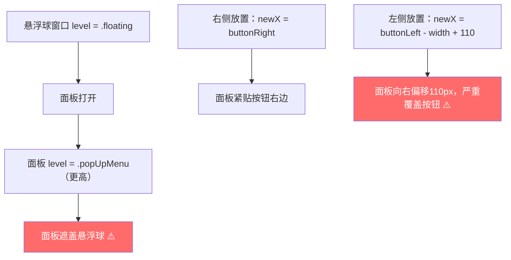
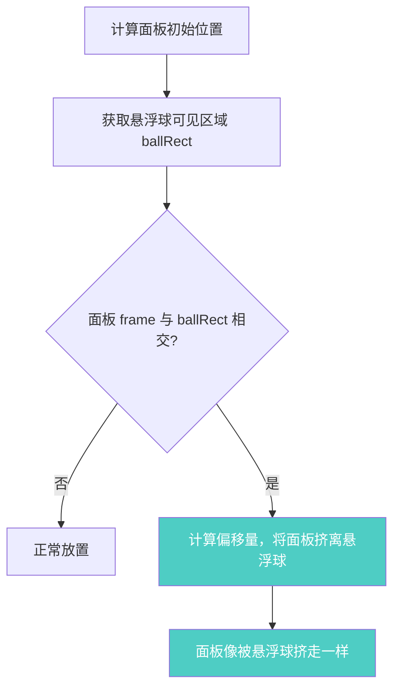

# 面板防遮盖悬浮球

## 概述
当笔记面板打开时，面板窗口可能遮盖悬浮球，导致用户无法看到或操作悬浮球。需确保面板打开时悬浮球始终可见。

## 当前实现

**问题根因：**
1. 面板 level(.popUpMenu) 高于悬浮球 level(.floating)，面板在悬浮球之上
2. 左侧放置时 110px 偏移导致面板直接覆盖悬浮球位置

## 方案

### 方案A：动态检测遮盖并偏移面板 🎯 推荐方案

**优点：**
- 保持原有的 110px 偏移和面板层级
- 只在实际发生遮盖时才调整，影响最小
- 视觉上像悬浮球把面板挤开

**缺点：**
- 无明显缺点

**修改位置：**
- [AppDelegate.swift](vscode://file/Volumes/Cache/X/Sources/App/AppDelegate.swift:402) — updateNoteWindowPosition 方法中调整层级和偏移

## 测试用例
1. 点击悬浮球打开面板，确认悬浮球不被面板遮盖（面板在右侧和左侧时均测试）
2. 将悬浮球拖到屏幕右边缘附近，打开面板（触发左侧放置），确认悬浮球可见
3. 关闭面板后再打开其他应用窗口，确认悬浮球层级恢复正常（不会遮挡其他应用）
4. 切换不同悬浮球打开面板，确认旧悬浮球恢复原层级

## 任务总结与结论

在 `updateNoteWindowPosition()` 中，计算面板初始位置后，新增防遮盖检测：计算悬浮球可见区域 `ballRect`，检测面板 `noteRect` 是否与之相交，若相交则根据面板在悬浮球的左/右侧将面板挤开到悬浮球边缘外（4px 间距），并确保不超出屏幕边缘。

## 任务耗时
- 任务开始时间：14:46
- 任务结束时间：14:54
- 任务总耗时：8 分钟
