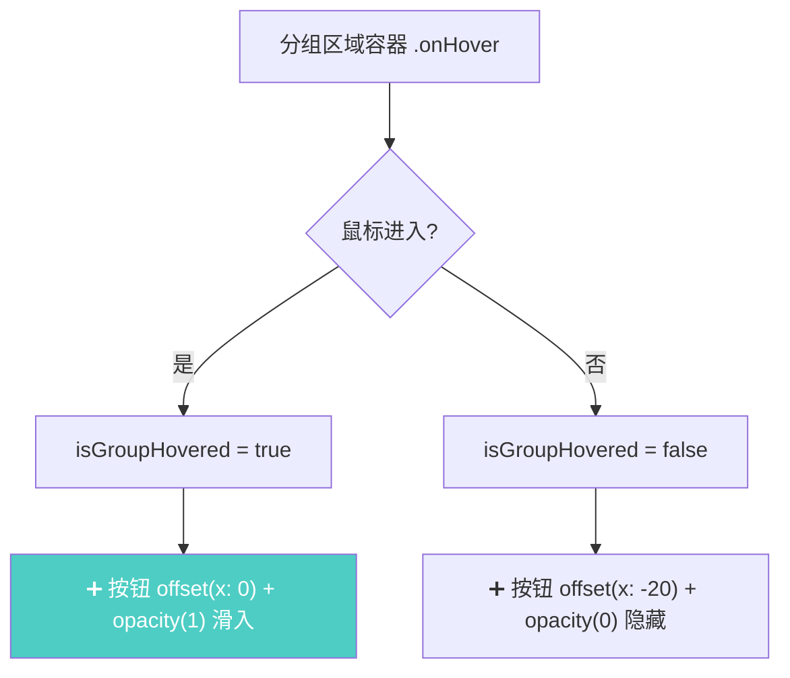

# 新建分组按钮悬停滑出

## 概述
修改新建分组按钮（folder.badge.plus），默认隐藏，当鼠标移入分组区域时，按钮从左向右滑动显示。

## 当前实现

新建分组按钮始终作为 LazyVGrid 的一个格子显示，占据一列位置。

## 方案

### 方案A：将按钮移出 Grid，悬停时动画滑入 🎯 推荐方案

**优点：**
- 动画流畅，用户体验好
- 新建按钮不再占用 Grid 列位置

**缺点：**
- 无明显缺点

**修改位置：**
- [NoteListView.swift](vscode://file/Volumes/Cache/X/Sources/View/NoteListView.swift:633) — groupSelectorView 属性

## 测试用例
1. 打开面板到笔记模式，确认「新建分组」按钮默认不可见
2. 鼠标移入分组区域，确认按钮向右滑出动画
3. 鼠标移出分组区域，确认按钮向左滑回隐藏
4. 确认按钮可正常点击打开分组管理

## 任务总结与结论

将 groupSelectorView 从 LazyVGrid 改为手动分行 HStack 布局：分组按钮紧凑排列，每行最多 5 个；新建分组按钮紧跟最后一个分组，默认隐藏，鼠标悬停分组区域时向右滑出（offset + opacity 动画 0.25s）。同时将父 VStack alignment 改为 .leading 修复左对齐。

## 任务耗时
- 任务开始时间：14:56
- 任务结束时间：15:07
- 任务总耗时：11 分钟
