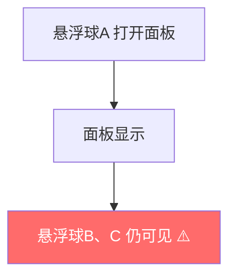
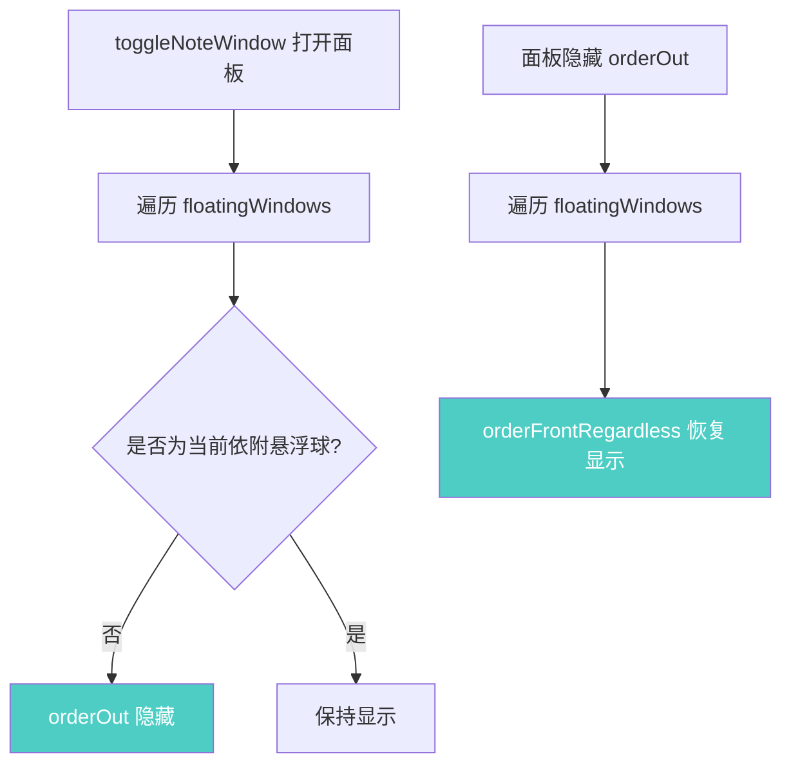
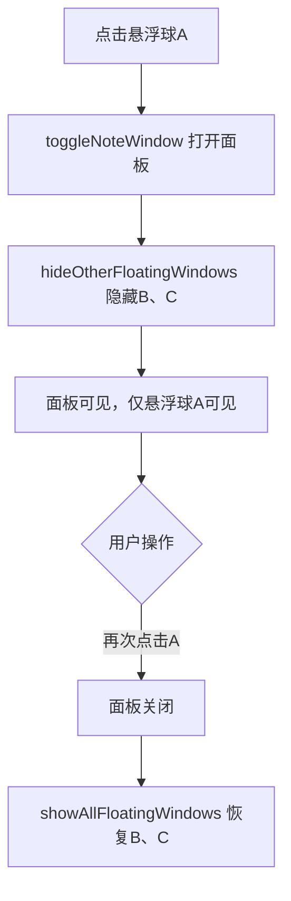

# 面板打开时隐藏其他悬浮球

## 概述
当某个悬浮球点击打开面板时，隐藏其他悬浮球；面板关闭后恢复显示。

## 当前实现

## 方案

### 方案A：在 toggleNoteWindow 中管理 🎯 推荐方案

**优点：**
- 集中在 toggleNoteWindow 一处管理，逻辑清晰
- 提取 showOtherFloatingWindows / hideOtherFloatingWindows 方法，所有 orderOut 调用点都可复用

**缺点：**
- 无明显缺点

**修改位置：**
- [AppDelegate.swift](vscode://file/Volumes/Cache/X/Sources/App/AppDelegate.swift:362) — toggleNoteWindow 方法

## 测试用例
1. 创建 2+ 个悬浮球
2. 点击悬浮球 A 打开面板，确认悬浮球 B 消失
3. 再次点击悬浮球 A 关闭面板，确认悬浮球 B 恢复显示
4. 点击悬浮球 A 打开面板，然后点击悬浮球 B（已隐藏的不应响应），确认行为正常

## 任务总结与结论
在 `toggleNoteWindow` 中添加悬浮球显隐管理逻辑：面板打开时隐藏非依附悬浮球，面板关闭时恢复所有悬浮球。提取 `hideOtherFloatingWindows(except:)` 和 `showAllFloatingWindows()` 两个辅助方法，在删除悬浮球和全局显隐切换时复用。

## 任务耗时
- 任务开始时间：16:41
- 任务结束时间：16:50
- 任务总耗时：9 分钟
