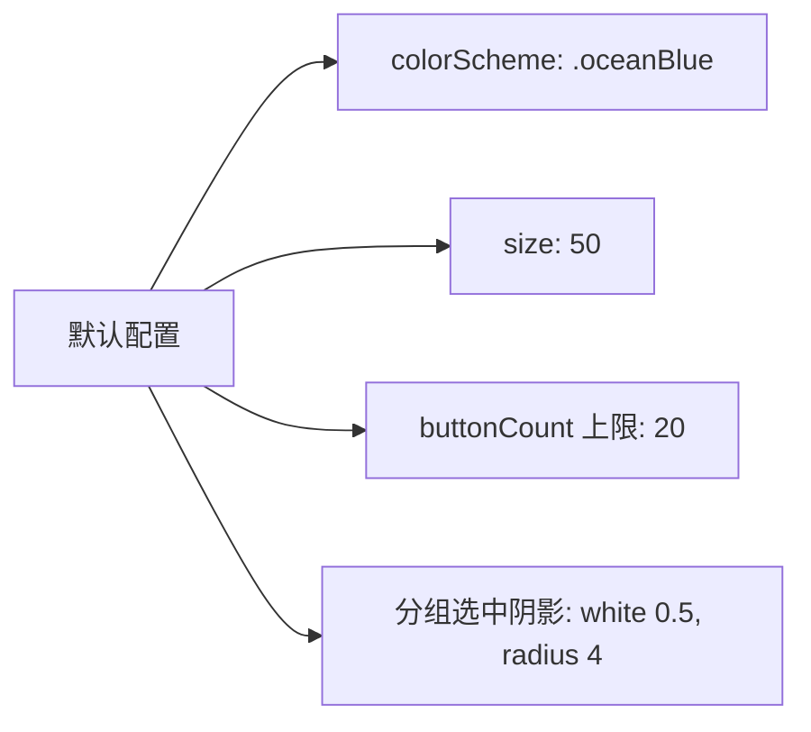
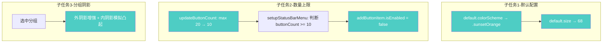
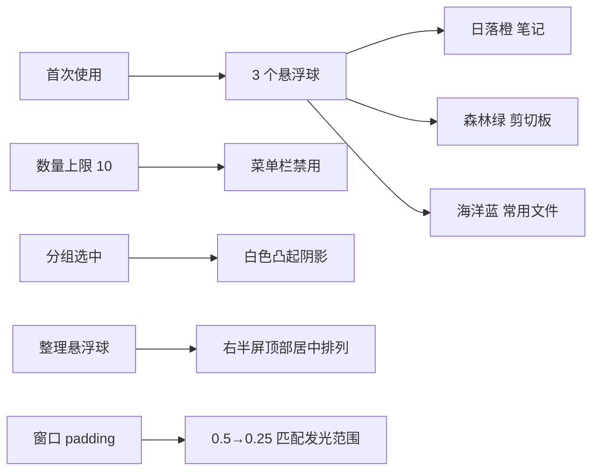

# 默认颜色大小与数量上限与分组阴影

## 概述
六个子任务：
1. 修改悬浮球默认颜色为日落橙，默认大小为 68px
2. 悬浮球数量上限改为 10，达到上限时菜单栏"添加悬浮球"按钮禁用
3. 笔记分组选中时增强阴影效果，实现白色按钮凸起感
4. 首次使用时自动创建 3 个悬浮球：日落橙（笔记）、森林绿（剪切板）、海洋蓝（常用文件）
5. 首次使用时 3 个悬浮球在屏幕右半边顶部居中排列；剪切板默认记录 50 条
6. 菜单栏添加"整理悬浮球"按钮，将所有悬浮球从右半屏顶部居中排列，超出换行
7. 悬浮球窗口 padding 从 0.5 倍减小到 0.25 倍，匹配发光最大半径 0.15 倍
8. 整理间距使用按钮可见直径的 0.1 倍

## 当前实现

## 方案

### 方案A：直接修改配置与视图 🎯 推荐方案

**优点：**
- 改动集中，三个子任务互不干扰
- 分组阴影可通过 overlay + shadow 组合实现凸起效果

**缺点：**
- 无明显缺点

**修改位置：**
- [FloatingButtonConfig.swift](vscode://file/Volumes/Cache/X/Sources/Model/FloatingButtonConfig.swift:247) — 默认 size、colorScheme、buttonCount、clipboardHistoryLimit、buttonCustomizations
- [FloatingButtonConfig.swift](vscode://file/Volumes/Cache/X/Sources/Model/FloatingButtonConfig.swift:344) — updateButtonCount 上限 20→10
- [AppDelegate.swift](vscode://file/Volumes/Cache/X/Sources/App/AppDelegate.swift:655) — 菜单栏添加按钮禁用逻辑 + 整理悬浮球按钮
- [AppDelegate.swift](vscode://file/Volumes/Cache/X/Sources/App/AppDelegate.swift:760) — 默认位置改为右半屏顶部居中
- [AppDelegate.swift](vscode://file/Volumes/Cache/X/Sources/App/AppDelegate.swift:868) — arrangeFloatingWindows 整理方法
- [FloatingWindow.swift](vscode://file/Volumes/Cache/X/Sources/View/FloatingWindow.swift:21) — 窗口 padding 0.5→0.25
- [NoteListView.swift](vscode://file/Volumes/Cache/X/Sources/View/NoteListView.swift:676) — 分组选中阴影效果

## 测试用例
1. 重置配置或首次启动，确认悬浮球为日落橙色、68px 大小
2. 首次启动确认 3 个悬浮球在右半屏顶部居中排列
3. 添加悬浮球至 10 个，确认菜单栏"添加悬浮球"变灰不可点击
4. 删除一个悬浮球后，确认"添加悬浮球"恢复可用
5. 查看笔记分组，选中分组应有明显的白色凸起阴影效果
6. 菜单栏点击"整理悬浮球"，确认所有悬浮球整齐排列在右半屏顶部
7. 剪切板默认记录数量为 50 条

## 任务总结与结论
修改默认配置为日落橙 68px、首次使用创建 3 个不同颜色悬浮球并在右半屏顶部排列、剪切板默认 50 条、数量上限改为 10 并在菜单栏联动禁用、分组选中增强凸起阴影效果、菜单栏新增整理悬浮球功能、悬浮球窗口 padding 优化为 0.25 倍。

## 任务耗时
- 任务开始时间：16:52
- 任务结束时间：17:24
- 任务总耗时：32 分钟
