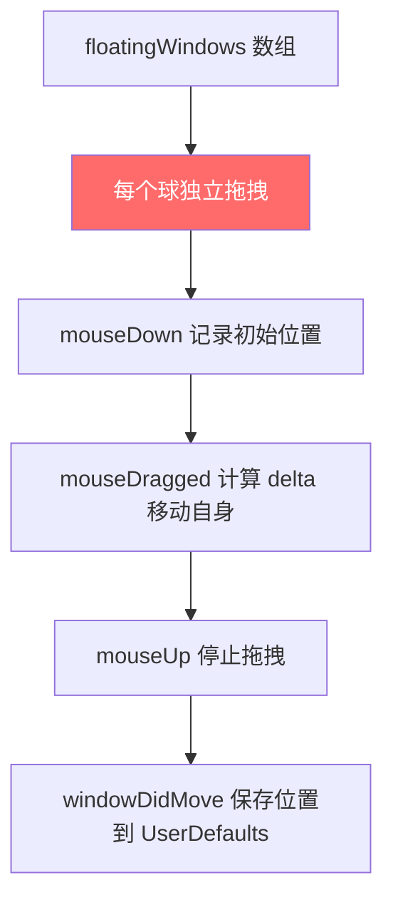
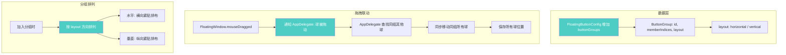
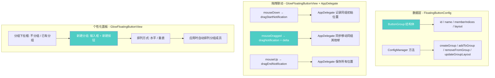

# 悬浮球分组功能

## 概述
开发悬浮球分组功能：同一组的悬浮球保持相对位置，水平或垂直排布，移动时一起联动。

## 当前实现

当前每个悬浮球完全独立，无分组概念，无联动。

## 方案

### 方案A：在 FloatingButtonConfig 中增加分组数据 + 拖拽联动 🎯 推荐方案

**优点：**
- 分组数据持久化在配置中，重启保留
- 通过通知机制实现拖拽联动，FloatingWindow 不需要知道其他球的存在
- 水平/垂直布局灵活

**缺点：**
- 需要在右键菜单中添加分组管理入口

**修改位置：**
- [FloatingButtonConfig.swift](vscode://file/Volumes/Cache/X/Sources/Model/FloatingButtonConfig.swift:6) — 增加 ButtonGroup 结构和 buttonGroups 字段
- [FloatingWindow.swift](vscode://file/Volumes/Cache/X/Sources/View/FloatingWindow.swift:107) — mouseDragged 发送拖拽通知
- [AppDelegate.swift](vscode://file/Volumes/Cache/X/Sources/App/AppDelegate.swift:810) — windowDidMove 中处理同组联动
- [GlowFloatingButtonView.swift](vscode://file/Volumes/Cache/X/Sources/View/GlowFloatingButtonView.swift:342) — 右键菜单添加分组选项

## 测试用例
1. 右键悬浮球 → 创建分组 → 选择其他球加入
2. 拖动分组中的一个球，确认同组其他球同步移动
3. 切换分组方向（水平/垂直），确认球重新排列
4. 将球移出分组，确认该球可独立移动
5. 重启应用，确认分组关系保持

## 任务总结与结论

通过方案A实现了悬浮球分组功能，主要修改：

关键解决的问题：
1. 鼠标事件被 GlowFloatingButtonView 拦截，需在视图层发送拖拽通知而非窗口层
2. 个性化面板使用 NSApp.setActivationPolicy(.accessory) 临时切换允许键盘输入
3. 新建分组使用独立输入框 + 按钮，点击后立即创建并刷新下拉框

## 任务耗时
- 任务开始时间：17:26
- 任务结束时间：18:08
- 任务总耗时：42 分钟
