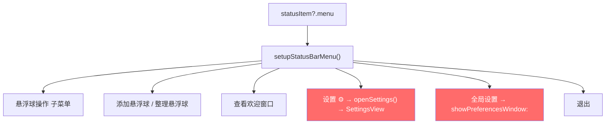
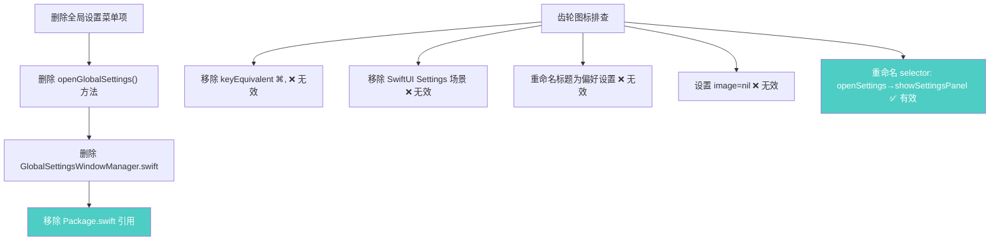
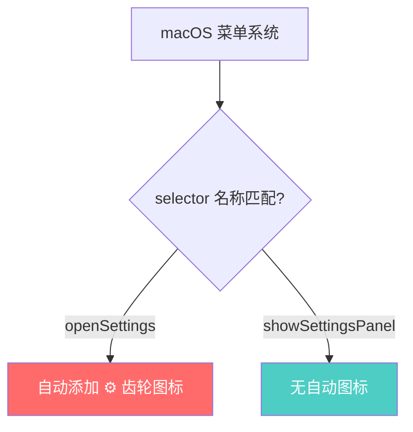

# 菜单栏设置图标与全局设置

## 概述
1. 去除菜单栏菜单里"设置"的左侧齿轮图标
2. 删除"全局设置"菜单项

## 当前实现

## 方案

### 方案A：删除全局设置 + 重命名 selector 消除齿轮图标 🎯 推荐方案

**优点：** 彻底解决问题
**缺点：** 无

**修改位置：**
[AppDelegate.swift](vscode://file/Volumes/Cache/X/Sources/App/AppDelegate.swift:702) — 删除全局设置菜单项，重命名 selector
[FloatingButtonApp.swift](vscode://file/Volumes/Cache/X/Sources/App/FloatingButtonApp.swift:8) — 替换 Settings 场景为 Window 场景
[Package.swift](vscode://file/Volumes/Cache/X/Package.swift:46) — 移除 GlobalSettingsWindowManager.swift 引用

## 测试用例
1. 点击菜单栏图标，确认菜单中不再有"全局设置"选项
2. 确认"偏好设置"左侧无齿轮图标

## 任务总结与结论

macOS 会自动根据 NSMenuItem 的 selector 名称为菜单项添加系统图标。`openSettings` 被识别为系统设置相关 selector，自动添加齿轮图标。

解决方案：将 `openSettings()` 重命名为 `showSettingsPanel()`，同时清理了不再需要的 `GlobalSettingsWindowManager.swift` 和 SwiftUI `Settings` 场景。

## 任务耗时
- 任务开始时间：18:10
- 任务结束时间：18:29
- 任务总耗时：19 分钟
