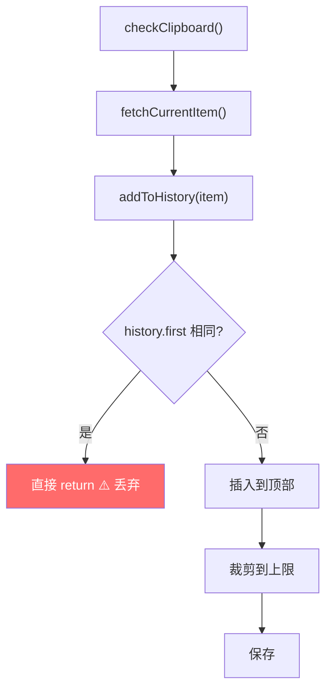
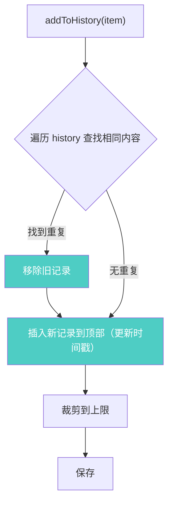
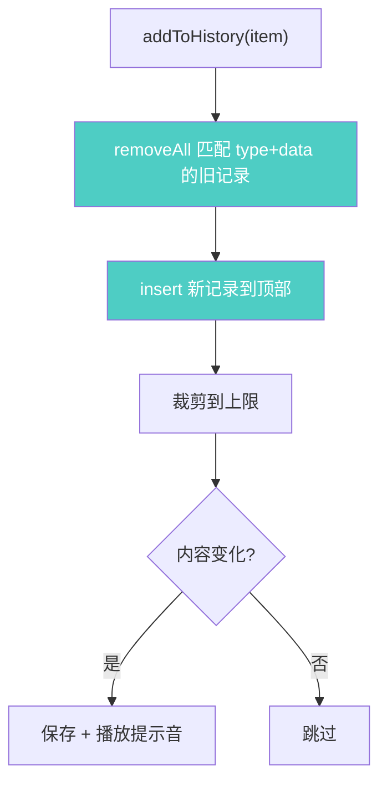

# 剪切板去重移至顶部

## 概述
复制剪切板内容后，若内容已存在于历史中（去重），当前直接丢弃。应改为保留去重逻辑，但将已有内容移动到顶部并更新时间戳。

## 当前实现

问题：只检查了第一条记录，且重复时直接丢弃而非移到顶部。

## 方案

### 方案A：全量去重 + 移到顶部 🎯 推荐方案

**优点：** 改动最小（只修改 `addToHistory` 方法内几行），保留去重语义
**缺点：** 无

**修改位置：**
[ClipboardManager.swift](vscode://file/Volumes/Cache/X/Sources/Utility/ClipboardManager.swift:123) — 修改 `addToHistory` 方法的去重逻辑

## 测试用例
1. 复制文本 A → 确认 A 出现在顶部
2. 复制文本 B → 确认 B 在顶部，A 在第二
3. 再次复制文本 A → 确认 A 回到顶部，B 在第二（不应有两个 A）
4. 确认历史记录数量不超过上限

## 任务总结与结论

修改了 `ClipboardManager.addToHistory` 方法，将原来的"只检查第一条、重复则丢弃"改为"全量去重 + 移到顶部"：

额外改动：
- 剪切板历史复制按钮增加蓝色"已复制"胶囊提示
- 默认提示音从 Glass 改为 Blow

## 任务耗时
- 任务开始时间：18:30
- 任务结束时间：18:40
- 任务总耗时：10 分钟
