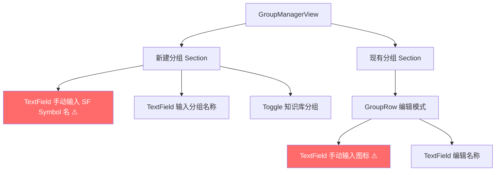
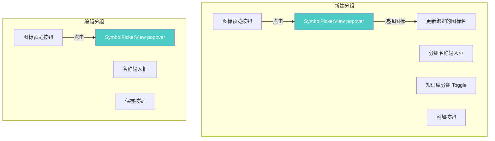
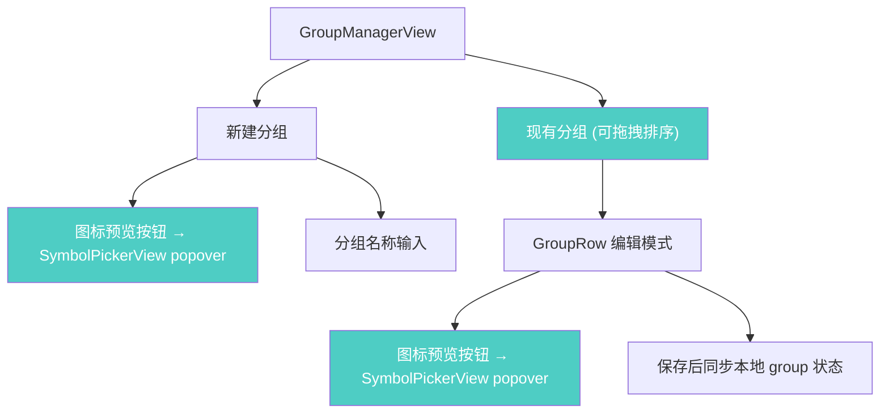

# 优化笔记分组创建窗口

## 概述
优化笔记分组管理窗口（GroupManagerView），将图标输入从手动输入 SF Symbol 名称改为使用已有的 SymbolPickerView 图标选择组件。

## 当前实现

## 方案

### 方案A：集成 SymbolPickerView + 优化布局 🎯 推荐方案

**优点：**
- 复用已有组件，一致性好
- 用户可视化选择图标，无需记忆 SF Symbol 名

**缺点：** 无

**修改位置：**
[NoteListView.swift](vscode://file/Volumes/Cache/X/Sources/View/NoteListView.swift:761) — GroupManagerView 新建分组区域
[NoteListView.swift](vscode://file/Volumes/Cache/X/Sources/View/NoteListView.swift:817) — GroupRow 编辑模式区域

## 测试用例
1. 打开分组管理窗口，点击新建分组的图标按钮 → 弹出 SymbolPickerView
2. 选择图标后，图标预览更新
3. 输入名称并添加分组，确认图标正确
4. 编辑现有分组的图标，点击图标按钮 → 弹出 SymbolPickerView
5. 选择新图标并保存，确认图标更新

## 任务总结与结论

将 GroupManagerView 和 GroupRow 中的 SF Symbol 手动输入 TextField 替换为 SymbolPickerView 图标选择器，并添加了拖拽排序功能。

## 任务耗时
- 任务开始时间：18:42
- 任务结束时间：18:52
- 任务总耗时：10 分钟
