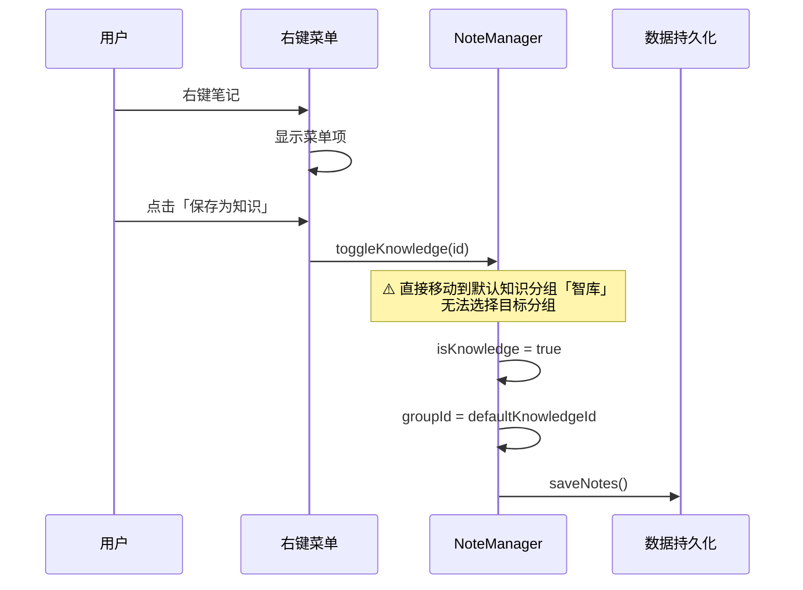
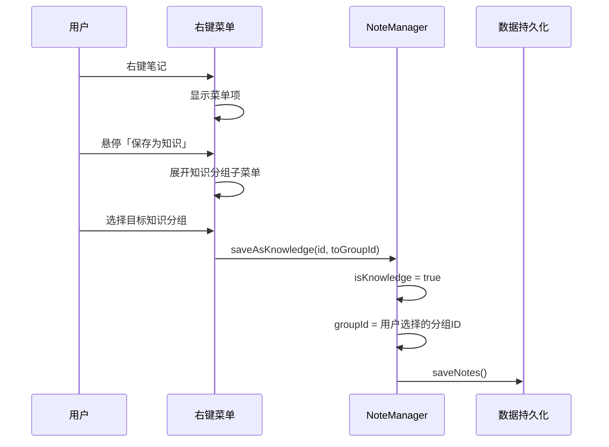
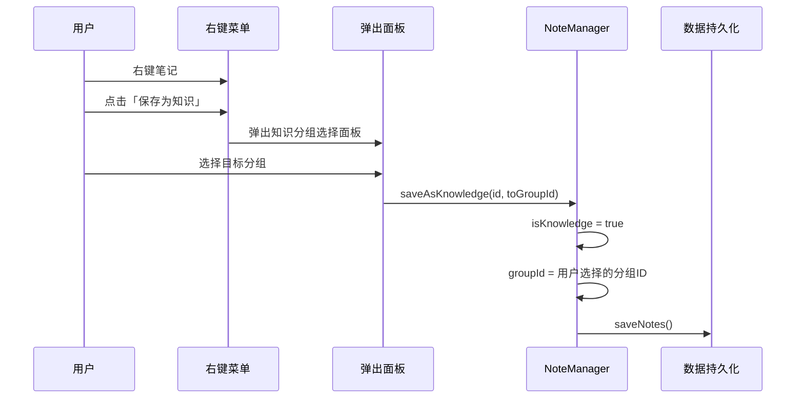
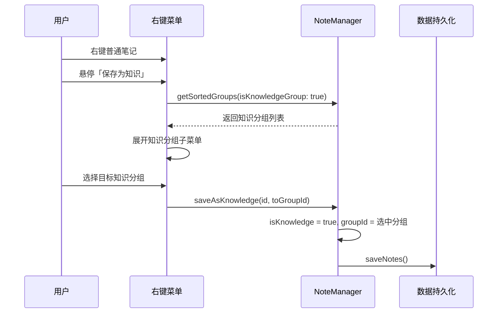

# 保存为知识分组选择

## 概述
当用户右键笔记点击「保存为知识」时，不再直接将笔记移动到默认知识分组（智库），而是弹出知识分组选择子菜单，让用户选择目标知识分组后，再将笔记移动到对应分组。

## 当前实现

当前问题：点击「保存为知识」后，笔记一律被移动到默认知识分组「智库」，用户无法选择将其归类到哪个知识分组。

## 方案

### 方案一：将「保存为知识」改为子菜单 ✨推荐方案

**优点：**
- 用户体验一致：与现有「移动到分组」子菜单交互方式相同
- 实现简单：仅需将 Button 替换为 Menu，新增一个 NoteManager 方法
- 无额外弹窗，操作流畅

**缺点：**
- 如果知识分组较多，子菜单可能较长（但一般分组不会太多）

**代码修改位置：**
[NoteListView.swift](vscode://file/Volumes/Cache/X/Sources/View/NoteListView.swift:247) — 将「保存为知识」Button 改为 Menu 子菜单
[Note.swift](vscode://file/Volumes/Cache/X/Sources/Model/Note.swift:297) — 新增 `saveAsKnowledge(id:toGroupId:)` 方法

### 方案二：保留按钮 + 额外弹出面板

**优点：**
- 可以在面板中提供更丰富的交互（如搜索、预览）

**缺点：**
- 实现复杂：需要额外的弹窗管理逻辑
- 操作步骤变多，体验不如子菜单流畅
- 与现有右键菜单风格不一致

**代码修改位置：**
[NoteListView.swift](vscode://file/Volumes/Cache/X/Sources/View/NoteListView.swift:247) — 修改按钮逻辑
[NoteListView.swift](vscode://file/Volumes/Cache/X/Sources/View/NoteListView.swift:161) — NoteItemView 新增弹出面板状态和视图
[Note.swift](vscode://file/Volumes/Cache/X/Sources/Model/Note.swift:297) — 新增方法

## 测试用例

1. **右键普通笔记 → 查看「保存为知识」子菜单**
   - 预期：悬停后展开子菜单，列出所有知识分组（智库、以及用户自建的知识分组）

2. **选择某个知识分组**
   - 预期：笔记从当前普通分组消失，出现在选中的知识分组中，且笔记被标记为知识

3. **右键已是知识的笔记**
   - 预期：菜单显示「从知识库移除」按钮（非子菜单），点击后笔记回到默认普通分组

4. **仅有默认知识分组时保存为知识**
   - 预期：子菜单中只有「智库」一项，选择后笔记移入智库

## 任务总结与结论

采用方案一，将右键菜单中的「保存为知识」按钮改为 Menu 子菜单，展开后列出所有知识分组供用户选择。

修改两个文件：
- Note.swift：新增 `saveAsKnowledge(id:toGroupId:)` 方法，设置 isKnowledge 并移动到指定分组
- NoteListView.swift：将「保存为知识」Button 替换为 Menu 子菜单，非知识笔记展开分组选择，已是知识的笔记显示「从知识库移除」按钮

## 任务耗时
- 任务开始时间：18:54
- 任务结束时间：19:02
- 任务总耗时：8 分钟
