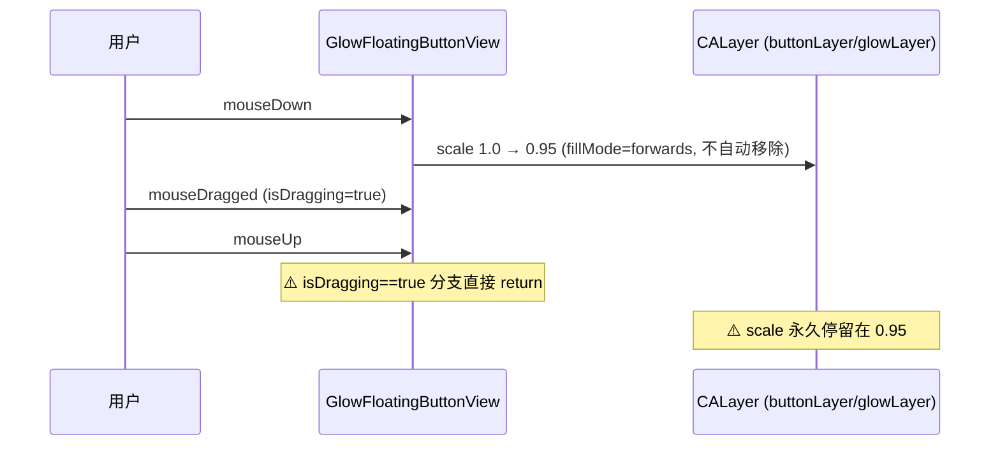
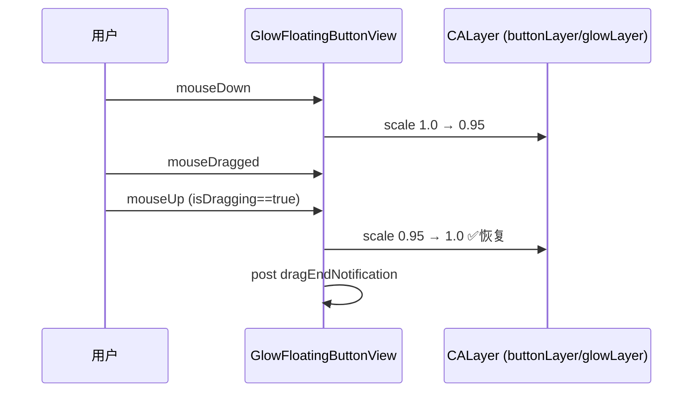
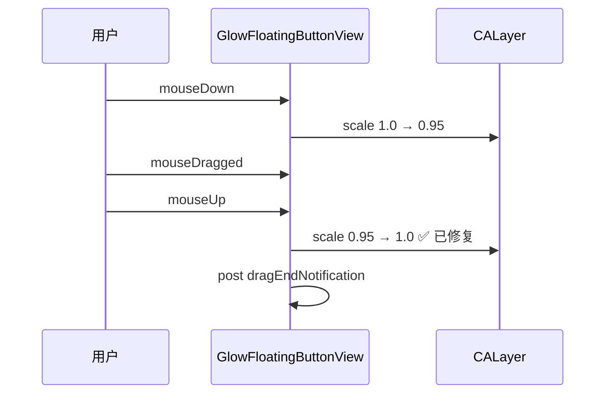

# 悬浮球拖拽后缩小修复

## 概述
移动悬浮球后，悬浮球看起来比默认状态小。原因是拖拽结束时缩放动画未恢复。

## 当前实现

问题：`mouseDown` 添加缩放动画到 0.95，设置 `fillMode = .forwards` + `isRemovedOnCompletion = false`。`mouseUp` 在 `isDragging` 分支中直接 return，跳过了 0.95→1.0 的恢复动画。

## 方案

### 方案一：在拖拽分支中添加恢复缩放动画 ✨推荐方案

**优点：**
- 修改最小，仅需在 return 前添加恢复动画
- 与非拖拽路径的恢复逻辑一致

**缺点：**
- 无

**代码修改位置：**
[GlowFloatingButtonView.swift](vscode://file/Volumes/Cache/X/Sources/View/GlowFloatingButtonView.swift:283) — mouseUp 方法中 isDragging 分支，return 前添加恢复缩放

## 测试用例
1. 拖拽移动悬浮球 → 松开后悬浮球大小应与拖拽前一致
2. 点击悬浮球（不拖拽）→ 正常触发点击，大小正常
3. 多次拖拽后大小仍正常

## 任务总结与结论

在 `mouseUp` 的 `isDragging` 分支中，`return` 前添加了 0.95→1.0 的 CASpringAnimation 恢复缩放动画，与非拖拽路径的恢复逻辑一致。

## 任务耗时
- 任务开始时间：19:07
- 任务结束时间：19:12
- 任务总耗时：5 分钟
