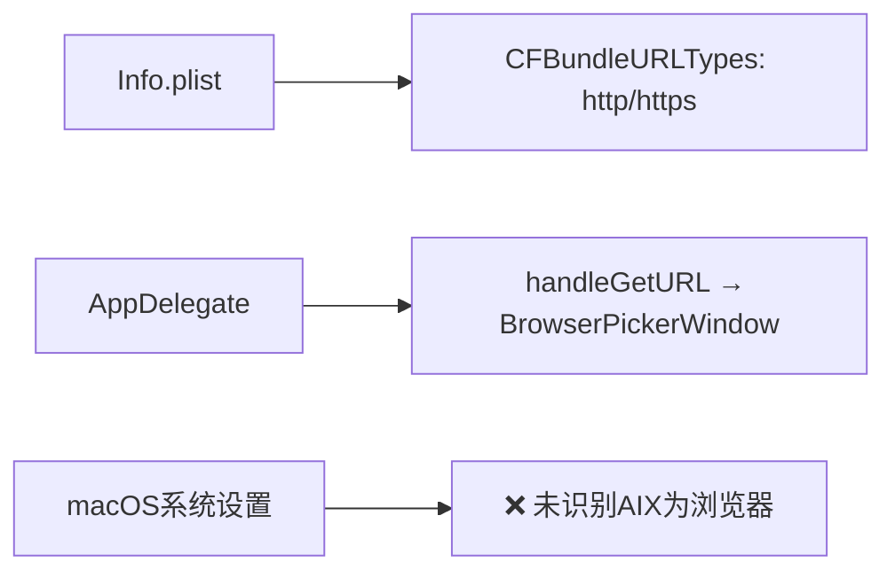
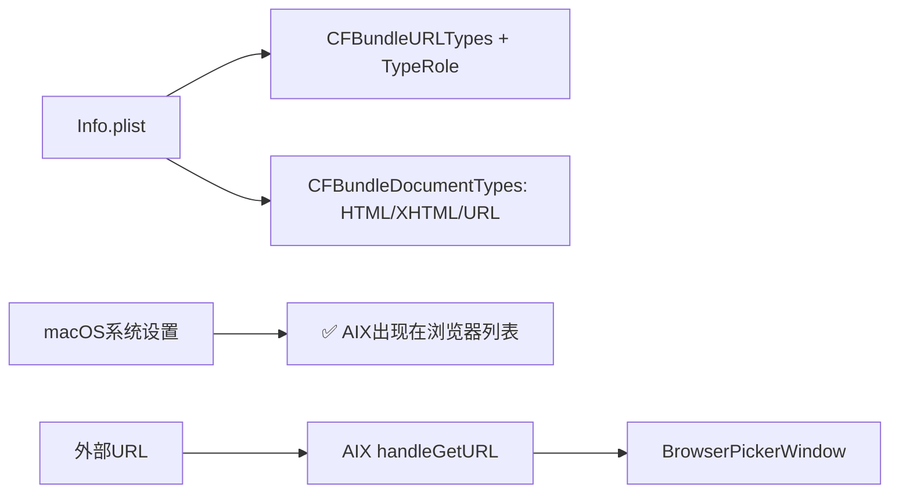

# 注册为macOS默认浏览器

## 概述
让 AIX 在 macOS 系统设置中被识别为浏览器，用户可在「系统设置 > 默认应用 > Web 浏览器」中选择 AIX。当外部 URL 通过 AIX 打开时，触发已有的浏览器选择功能。

## 当前实现

已有 URL scheme 注册和事件处理链路，但 macOS 无法将 AIX 识别为浏览器，原因是缺少 `CFBundleDocumentTypes` 和 `CFBundleTypeRole` 声明。

## 方案

### 方案一：补充 Info.plist 声明 ✨推荐方案

在 Info.plist 中添加：
1. `CFBundleDocumentTypes` — 声明可查看 HTML 文档（public.html, public.xhtml, public.url）
2. `CFBundleTypeRole = Viewer` — 在 CFBundleURLTypes 中补充角色声明

**优点：**
- 仅修改配置文件，无需改代码
- URL 处理链路已完整，即装即用

**缺点：**
- 无

**代码修改位置：**
[Info.plist](vscode://file/Volumes/Cache/X/Info.plist:19) — 补充 CFBundleTypeRole 和 CFBundleDocumentTypes

## 测试用例
1. 编译安装后，打开「系统设置 > 桌面与程序坞 > 默认 Web 浏览器」→ AIX 应出现在列表中
2. 设为默认浏览器后，在其他应用中点击链接 → 应弹出 AIX 的浏览器选择窗口

## 任务总结与结论

通过补充 Info.plist 声明，AIX 被 macOS 识别为浏览器：
1. `CFBundleURLTypes` 添加 `CFBundleTypeRole = Viewer`
2. 新增 `CFBundleDocumentTypes` 声明 HTML/XHTML/URL 文档类型
3. 额外优化：隐藏浏览器选择窗口的左上角控制按钮

## 任务耗时
- 任务开始时间：19:31
- 任务结束时间：19:43
- 任务总耗时：12 分钟
