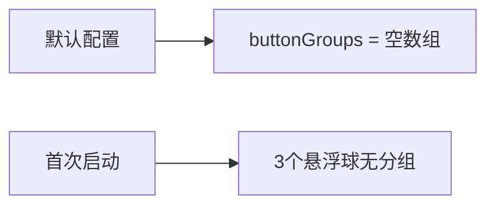
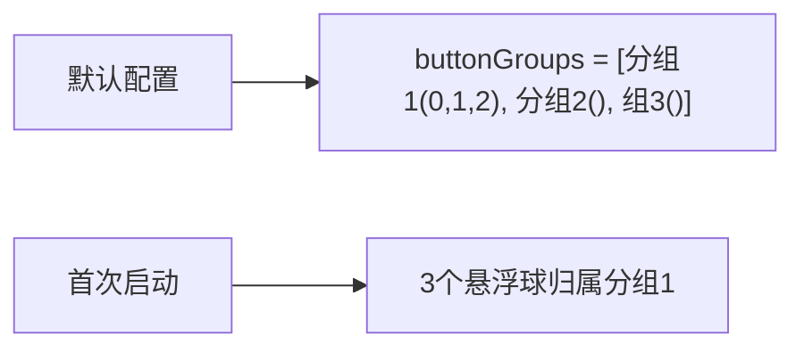

# 悬浮球默认分组

## 概述
为悬浮球分组添加 3 个默认选项（分组1、分组2、分组3），首次使用时 3 个默认悬浮球全部归入分组1。

## 当前实现

默认配置中 `buttonGroups` 为空数组，首次用户没有任何预设分组。

## 方案

### 方案一：在默认配置中预设3个分组 ✨推荐方案

在 `FloatingButtonConfig.default` 中添加 `buttonGroups` 参数，预设 3 个分组，分组1 包含索引 [0,1,2]。

**优点：**
- 修改极小，仅改默认配置一行
- 用户首次体验即有分组

**缺点：**
- 无

**代码修改位置：**
[FloatingButtonConfig.swift](vscode://file/Volumes/Cache/X/Sources/Model/FloatingButtonConfig.swift:270) — 默认配置添加 buttonGroups 参数

## 测试用例
1. 清除配置后重启 → 3 个悬浮球应在分组1中联动移动
2. 自定义面板中分组下拉应显示分组1、分组2、分组3

## 任务总结与结论

在 `FloatingButtonConfig.default` 中添加了 `buttonGroups` 参数，预设 3 个分组（分组1含索引0/1/2，分组2和分组3为空）。首次启动时 3 个悬浮球自动归入分组1联动移动。

## 任务耗时
- 任务开始时间：19:49
- 任务结束时间：19:54
- 任务总耗时：5 分钟
