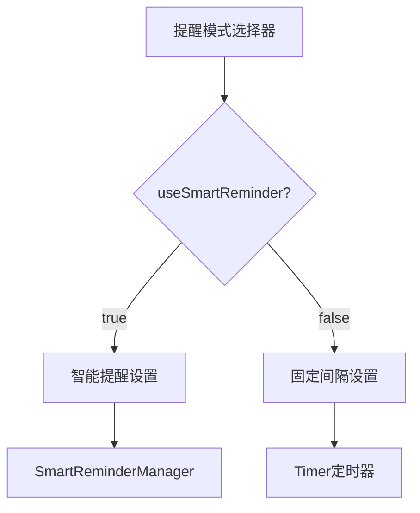
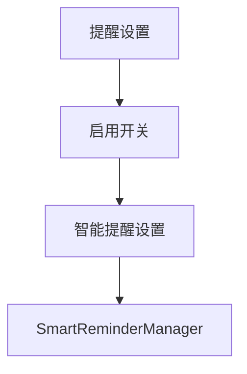
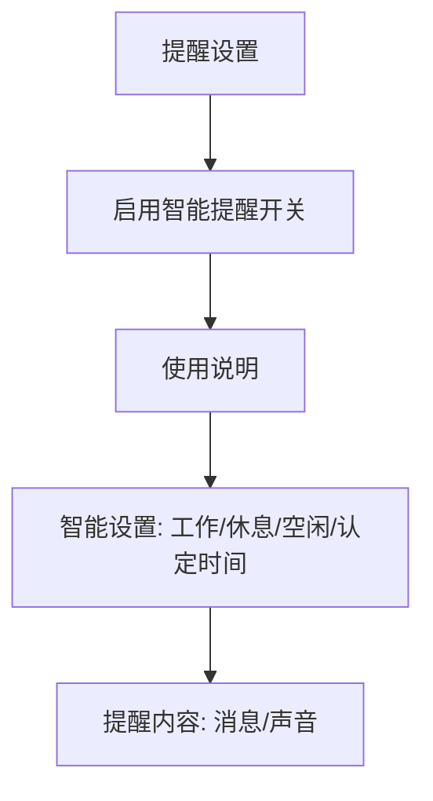

# 去除间隔提醒保留智能提醒

## 概述
去除休息提醒中的「固定间隔」模式，只保留「智能提醒」，并重写智能提醒使用说明。

## 当前实现

UI 中有分段选择器切换「固定间隔」和「智能提醒」两种模式，代码中 `useSmartReminder` 控制分支。

## 方案

### 方案一：移除间隔提醒UI和模式选择器 ✨推荐方案

1. 移除模式选择器（Picker：固定间隔/智能提醒）
2. 移除固定间隔设置区块
3. 启用开关直接控制智能提醒
4. 强制 `useSmartReminder = true`
5. 重写使用说明文字

**优点：**
- UI 更简洁，无需用户选择模式
- 减少维护代码

**缺点：**
- 无

**代码修改位置：**
[SettingsView.swift](vscode://file/Volumes/Cache/X/Sources/View/SettingsView.swift:976) — 启用开关简化为只控制智能提醒
[SettingsView.swift](vscode://file/Volumes/Cache/X/Sources/View/SettingsView.swift:1030) — 移除模式选择器区块
[SettingsView.swift](vscode://file/Volumes/Cache/X/Sources/View/SettingsView.swift:1050) — 移除固定间隔设置区块和条件分支
[SettingsView.swift](vscode://file/Volumes/Cache/X/Sources/View/SettingsView.swift:1203) — 重写使用说明文字

## 测试用例
1. 打开设置 → 提醒标签页 → 不再有「固定间隔/智能提醒」分段选择器
2. 启用开关直接控制智能提醒的开关
3. 使用说明文字已更新

## 任务总结与结论

移除了固定间隔提醒的完整 UI 和模式选择器，强制使用智能提醒模式。重写使用说明为 5 条流程化描述。

修改文件：
- SettingsView.swift：移除模式选择器和间隔设置，重写使用说明
- ReminderConfig.swift：强制 useSmartReminder = true

## 任务耗时
- 任务开始时间：19:55
- 任务结束时间：20:06
- 任务总耗时：11 分钟
