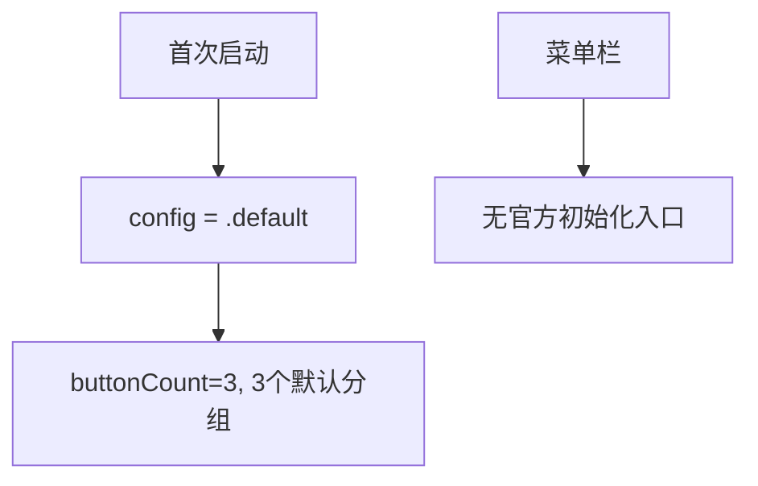
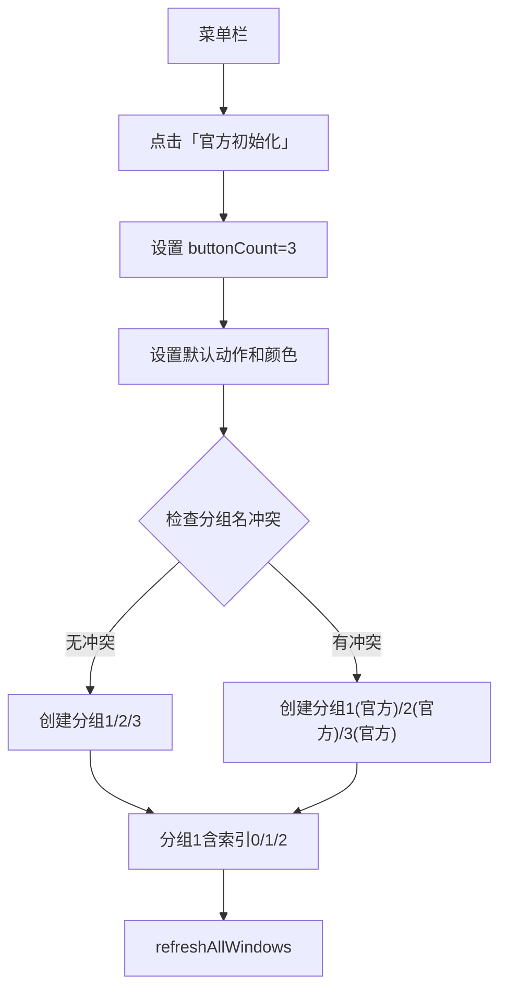
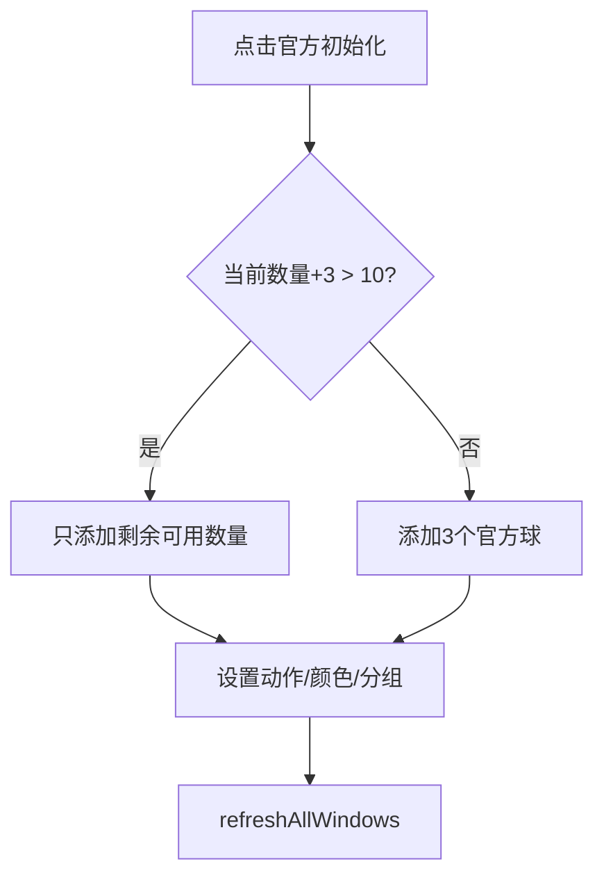

# 官方初始化菜单项

## 概述
在菜单栏添加「官方初始化」菜单项，点击后创建 3 个默认悬浮球（笔记/剪切板/常用文件），全部归入分组1。若已有同名分组则自动添加"(官方)"后缀避免冲突。

## 当前实现

首次启动使用默认配置，但没有运行时重新初始化的入口。

## 方案

### 方案一：添加菜单项 + officialInit 方法 ✨推荐方案

**优点：**
- 用户随时可重置为官方推荐配置
- 保留用户已有分组，新建额外分组避免冲突

**缺点：**
- 无

**代码修改位置：**
[AppDelegate.swift](vscode://file/Volumes/Cache/X/Sources/App/AppDelegate.swift:697) — setupStatusBarMenu 中添加菜单项
[AppDelegate.swift](vscode://file/Volumes/Cache/X/Sources/App/AppDelegate.swift:1063) — 新增 officialInit 方法
[FloatingButtonConfig.swift](vscode://file/Volumes/Cache/X/Sources/Model/FloatingButtonConfig.swift:376) — 可能需要 resetToOfficial 方法

## 测试用例
1. 点击「官方初始化」→ 创建 3 个悬浮球（橙/绿/蓝），全部在分组1联动
2. 已有自建分组时点击「官方初始化」→ 新建的分组不与已有分组名冲突

## 任务总结与结论

在菜单栏添加「官方初始化」菜单项，点击后在现有悬浮球基础上额外添加最多 3 个官方默认球（橙-笔记/绿-剪切板/蓝-常用文件），创建分组1/2/3（冲突加"(官方)"后缀），新球全归入分组1联动。增加 10 个上限边界检查。

## 任务耗时
- 任务开始时间：20:08
- 任务结束时间：20:17
- 任务总耗时：9 分钟
