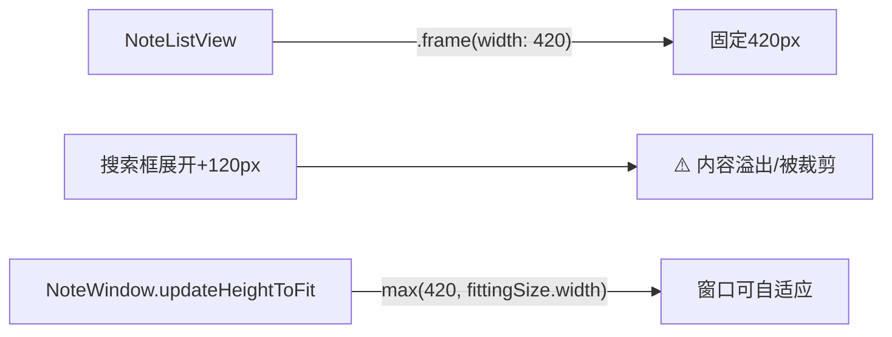
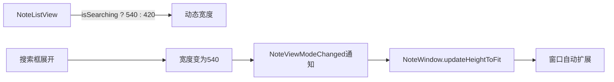
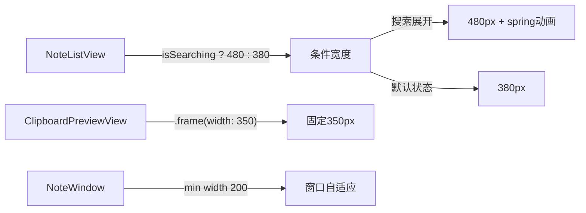

# 搜索框展开时窗口宽度自适应

## 概述
点击搜索按钮展开搜索框时，NoteListView 固定宽度 420px 不变，导致工具栏内容溢出，笔记列表被压缩左移。需改为根据内容自适应宽度。

## 当前实现

NoteListView 硬编码 `.frame(width: 420)`，SwiftUI 无法请求更大的 fittingSize，窗口也无法扩展。

## 方案

### 方案一：搜索态时动态调整宽度 ✨推荐方案

将 `.frame(width: 420)` 改为 `.frame(width: isSearching ? 540 : 420)`。搜索状态变化已发送 `NoteViewModeChanged` 通知，窗口会自动调整大小。

**优点：**
- 修改极小，仅改一处
- 利用已有的窗口自适应机制

**缺点：**
- 无

**代码修改位置：**
[NoteListView.swift](vscode://file/Volumes/Cache/X/Sources/View/NoteListView.swift:495) — `.frame(width: 420)` 改为动态宽度

## 测试用例
1. 点击搜索按钮 → 窗口宽度应自动扩展，笔记列表不被遮盖
2. 关闭搜索 → 窗口恢复原宽度
3. 切换模式（笔记/知识/剪切板）→ 宽度正常

## 任务总结与结论

最终采用条件宽度方案，根据搜索状态动态切换宽度，同时缩减默认宽度并为剪切板视图添加独立宽度约束。

**修改内容：**
1. NoteListView：`.frame(width: 420)` → `.frame(width: isSearching ? 480 : 380)` + spring动画
2. ClipboardPreviewView：添加 `.frame(width: 350)` 固定宽度
3. NoteWindow：初始宽度 420→350，最小宽度 420→200

## 任务耗时
- 任务开始时间：20:19
- 任务结束时间：20:39
- 任务总耗时：20 分钟
