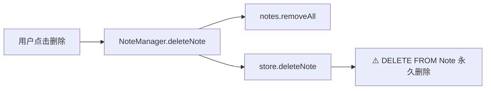
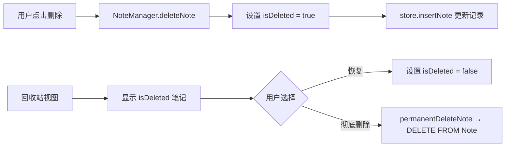
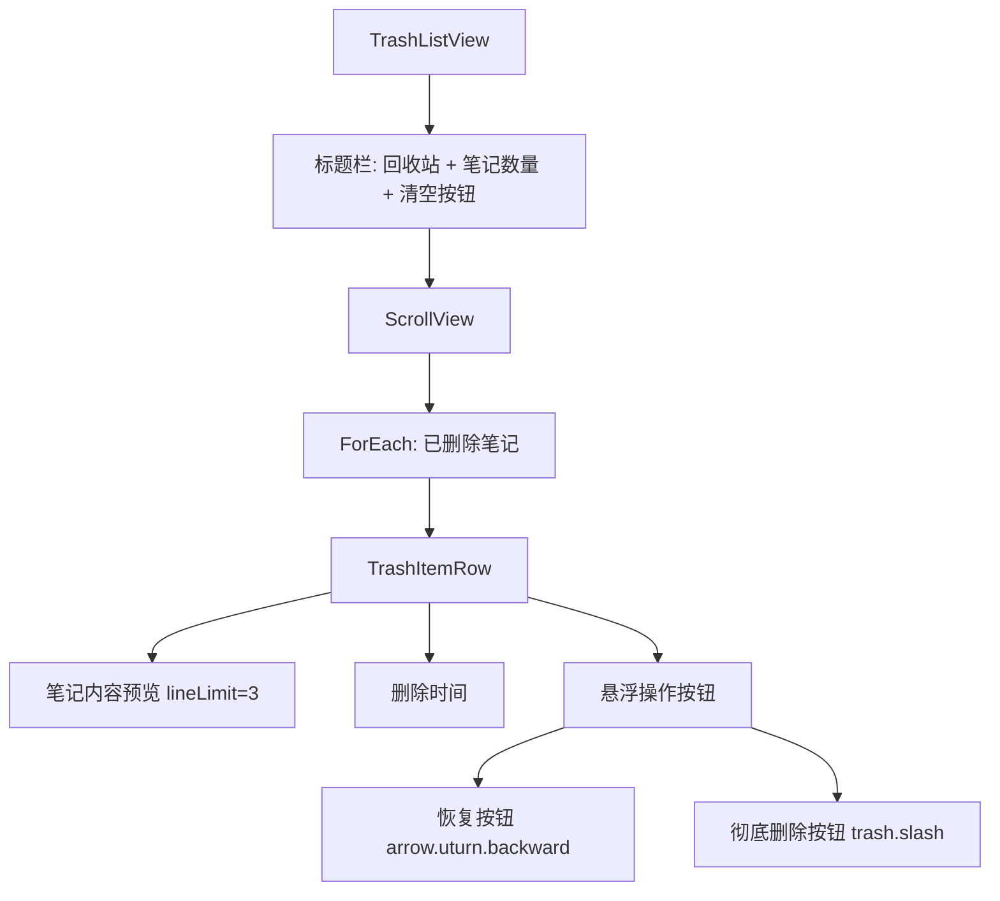
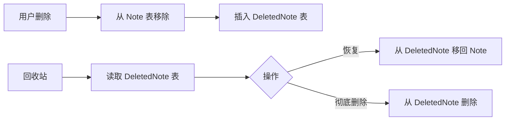
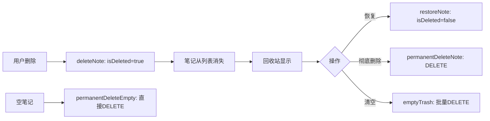

# 笔记回收站

## 概述
当前删除笔记会直接从数据库永久清除。需增加回收站功能：删除操作改为"软删除"（移入回收站），在回收站中可恢复或彻底删除。

## 当前实现

删除触发点：
- NoteItemView 右键菜单"删除笔记"
- NoteItemView 悬浮按钮 trash 图标
- 空笔记自动删除（finishEditing 内容为空时）

## 方案

### 方案一：给 Note 增加 isDeleted 字段（软删除）✨推荐方案

#### 前端页面实现

**工具栏**：在搜索按钮右侧新增回收站按钮（icon: `trash`），点击切换进入回收站模式

**回收站列表视图（TrashListView）**：

- 每个 TrashItemRow 显示：笔记内容（最多3行）+ 原分组名 + 删除时间
- 悬浮时显示操作按钮：恢复（arrow.uturn.backward）、彻底删除（trash.slash）
- 右键菜单：恢复、彻底删除
- 标题栏右侧"清空回收站"按钮，二次确认后批量永久删除
- 为空时显示空状态提示（trash 图标 + "回收站为空"文字）
- 整体风格与 ClipboardPreviewView 一致：蓝色圆角背景、白色文字

**优点：**
- 修改最小，复用现有 Note 结构和存储逻辑
- 无需新建表
- `insertNote` 使用 `INSERT OR REPLACE`，直接更新 isDeleted 字段即可

**缺点：**
- 需要做数据库迁移（ALTER TABLE 增加列）

**代码修改位置：**
[Note.swift](vscode://file/Volumes/Cache/X/Sources/Model/Note.swift:42) — Note 结构体增加 `isDeleted` 字段
[Note.swift](vscode://file/Volumes/Cache/X/Sources/Model/Note.swift:270) — `deleteNote(id:)` 改为软删除
[NoteStore.swift](vscode://file/Volumes/Cache/X/Sources/Model/NoteStore.swift:12) — `createTables` 增加 isDeleted 列
[NoteStore.swift](vscode://file/Volumes/Cache/X/Sources/Model/NoteStore.swift:42) — `insertNote` 增加 isDeleted 参数
[NoteStore.swift](vscode://file/Volumes/Cache/X/Sources/Model/NoteStore.swift:86) — `getAllNotes` 增加 isDeleted 读取
[NoteListView.swift](vscode://file/Volumes/Cache/X/Sources/View/NoteListView.swift:449) — ViewMode 增加 `.trash`
[NoteListView.swift](vscode://file/Volumes/Cache/X/Sources/View/NoteListView.swift:560) — 工具栏增加回收站按钮
[NoteListView.swift](vscode://file/Volumes/Cache/X/Sources/View/NoteListView.swift:728) — noteListContentView 增加回收站视图

### 方案二：新建 DeletedNote 表

**优点：**
- 数据隔离清晰

**缺点：**
- 需要新建表和完整的 CRUD
- 数据结构重复
- 恢复操作涉及跨表移动，逻辑复杂

**代码修改位置：**
新增 DeletedNoteStore，修改 NoteStore/NoteManager/NoteListView

## 测试用例
1. 删除一个笔记 → 笔记从列表消失
2. 点击回收站按钮 → 看到刚删除的笔记
3. 在回收站点击"恢复"→ 笔记回到原列表
4. 在回收站点击"彻底删除"→ 笔记永久消失
5. 空笔记自动删除 → 不进回收站（直接永久删除）
6. 通用笔记、知识库笔记、已完成笔记删除后均可在回收站看到

## 任务总结与结论

采用方案一（isDeleted 字段软删除）实现回收站功能：

**修改内容：**
1. Note 结构体增加 isDeleted/deletedAt 字段
2. NoteStore 增加列迁移（ALTER TABLE）、更新 insertNote/getAllNotes
3. NoteManager 增加软删除、永久删除、恢复、清空回收站方法
4. NoteListView 增加 .trash ViewMode、工具栏回收站按钮、TrashListView/TrashItemRow
5. 空笔记自动删除改为 permanentDeleteEmpty（不进回收站）

## 任务耗时
- 任务开始时间：20:42
- 任务结束时间：20:50
- 任务总耗时：8 分钟
