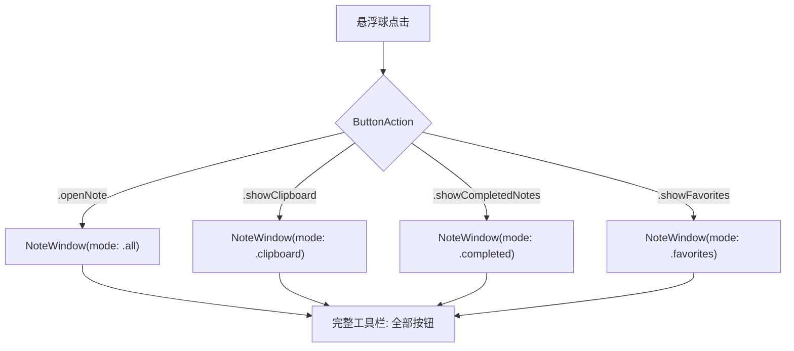
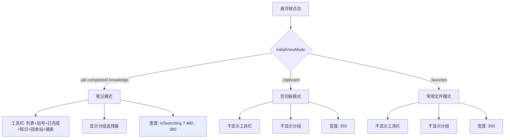
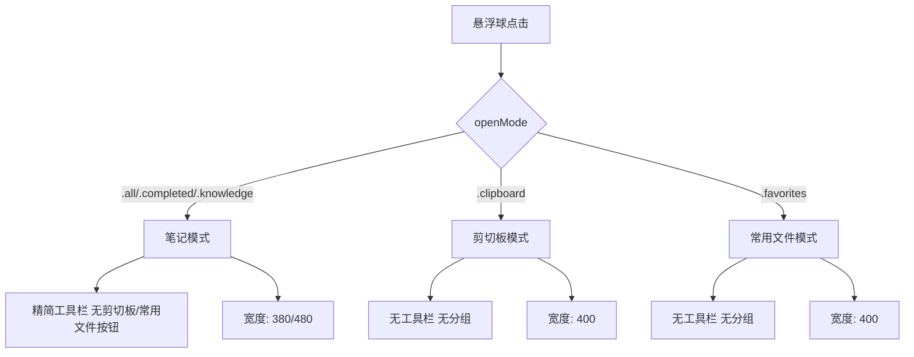

# 窗口显示模式精简

## 概述
根据悬浮球打开窗口的方式，精简各模式下的工具栏和显示内容。笔记模式不显示剪切板/常用文件按钮，剪切板和常用文件模式不显示工具栏。各页面重新估算合适宽度。

## 当前实现

当前所有打开模式都显示完整工具栏（笔记/剪切板/知识/常用/搜索等按钮），用户需手动切换。

## 方案

### 方案一：根据 initialViewMode 控制工具栏显示 ✨推荐方案

**修改点：**
- NoteListView 新增 `initialViewMode` 属性保存初始模式
- toolbarView 根据 initialViewMode 条件显示按钮
- 剪切板/常用文件模式下隐藏整个工具栏
- body 中条件显示分组选择器
- 各模式设置对应宽度

**优点：**
- 界面更精简，各模式只显示相关内容
- 宽度适配更合理

**缺点：**
- 无

**代码修改位置：**
[NoteListView.swift](vscode://file/Volumes/Cache/X/Sources/View/NoteListView.swift:439) — 新增 initialViewMode 存储属性
[NoteListView.swift](vscode://file/Volumes/Cache/X/Sources/View/NoteListView.swift:493) — body 条件控制工具栏和分组显示
[NoteListView.swift](vscode://file/Volumes/Cache/X/Sources/View/NoteListView.swift:557) — toolbarView 条件显示按钮
[NoteListView.swift](vscode://file/Volumes/Cache/X/Sources/View/NoteListView.swift:501) — 宽度计算调整

## 测试用例
1. 悬浮球打开笔记 → 工具栏无剪切板/常用文件按钮，宽度正常
2. 悬浮球打开剪切板 → 无工具栏，直接显示剪切板内容
3. 悬浮球打开常用文件 → 无工具栏，直接显示文件列表
4. 笔记模式搜索框展开 → 宽度从380自适应到480
5. 知识库模式 → 显示笔记模式工具栏

## 任务总结与结论

根据打开模式精简窗口显示，同时进行了两个附加调整。

**修改内容：**
1. NoteListView 新增 `openMode` 属性，根据模式控制工具栏和宽度
2. 笔记模式隐藏剪切板/常用文件按钮
3. 剪切板/常用文件模式完全隐藏工具栏和分组选择器
4. ClipboardPreviewView/TrashListView 宽度改为 maxWidth: .infinity 适应容器
5. 悬浮球右键菜单移除"已完成"选项
6. 全局设置隐藏插件面板入口（注释保留）

## 任务耗时
- 任务开始时间：20:51
- 任务结束时间：21:05
- 任务总耗时：14 分钟
