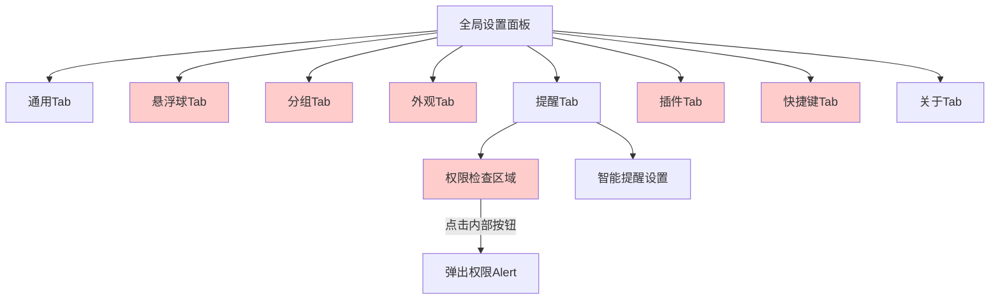
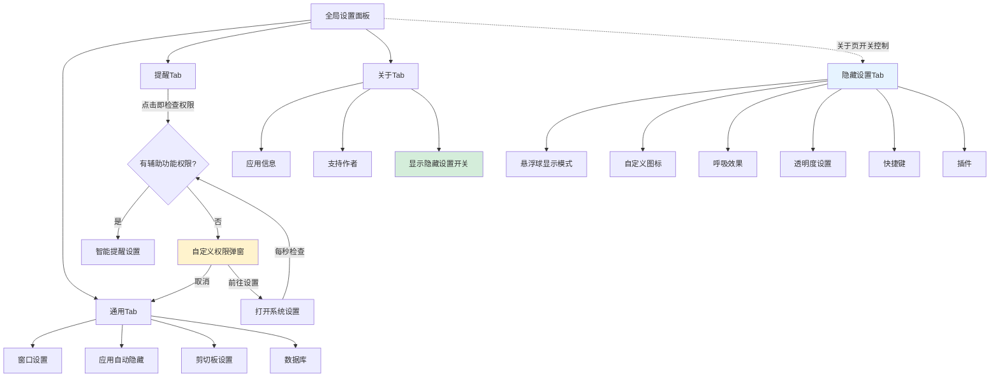
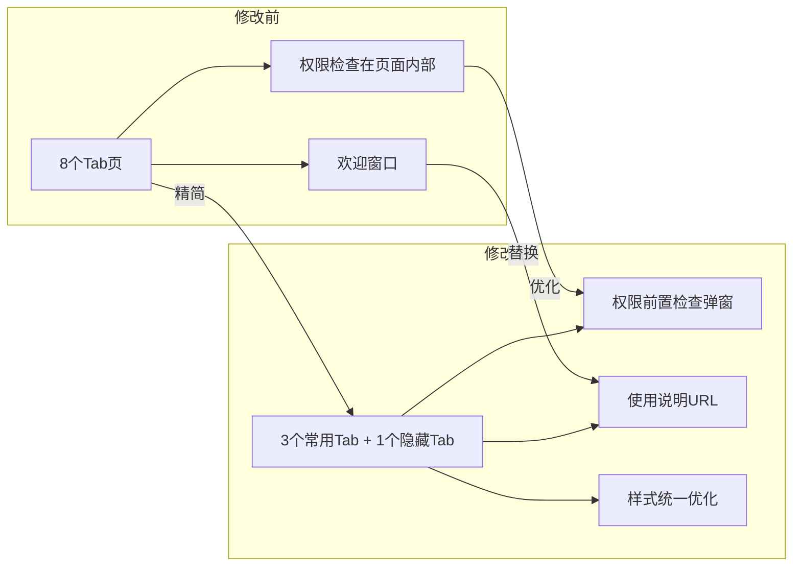

# 整理全局设置面板

## 概述
全面重构全局设置面板：精简可见 Tab 页至通用/提醒/关于三个页面，隐藏设置项集中至「隐藏设置」页面（通过关于页面的开关控制显示），优化提醒 Tab 的辅助功能权限检查流程，去除欢迎页面改为打开使用说明链接。

## 当前实现

## 方案

### 方案一：Tab精简+隐藏设置聚合+权限前置检查 ✨推荐方案

**优点：**
- 精简主界面，仅保留常用设置
- 隐藏设置可通过开关恢复，不丢失功能
- 权限检查前置，避免用户进入提醒页后困惑
- 自定义弹窗不会因点击按钮自动关闭

**缺点：**
- 隐藏设置集中在单页，内容较多

**代码修改位置：**
[SettingsView.swift](vscode://file/Volumes/Cache/X/Sources/View/SettingsView.swift:5) — SettingsView tabs/switch 逻辑重构
[SettingsView.swift](vscode://file/Volumes/Cache/X/Sources/View/SettingsView.swift:108) — GeneralSettingsView 精简（移除透明度，重排顺序）
[SettingsView.swift](vscode://file/Volumes/Cache/X/Sources/View/SettingsView.swift:632) — AboutSettingsView 添加隐藏设置开关
[SettingsView.swift](vscode://file/Volumes/Cache/X/Sources/View/SettingsView.swift:700) — 新增 HiddenSettingsView
[SettingsView.swift](vscode://file/Volumes/Cache/X/Sources/View/SettingsView.swift:1180) — ReminderSettingsView 移除旧权限弹窗
[SettingsView.swift](vscode://file/Volumes/Cache/X/Sources/View/SettingsView.swift:913) — SettingsSection/SettingsRow 样式优化
[AppDelegate.swift](vscode://file/Volumes/Cache/X/Sources/App/AppDelegate.swift:40) — 首次启动改为打开URL
[AppDelegate.swift](vscode://file/Volumes/Cache/X/Sources/App/AppDelegate.swift:702) — 菜单栏「查看使用说明」

## 测试用例
1. 打开全局设置 → 确认只有通用/提醒/关于三个Tab
2. 通用Tab → 确认顺序：窗口设置 → 应用自动隐藏 → 剪切板设置 → 数据库
3. 提醒Tab → 无权限时弹出自定义权限弹窗，点击取消回到通用Tab
4. 提醒Tab → 点击前往设置后弹窗不消失，授权后自动消失
5. 关于Tab → 底部有「显示隐藏设置」开关，勾选后出现「隐藏设置」Tab
6. 隐藏设置Tab → 确认包含悬浮球显示模式/自定义图标/呼吸效果/透明度/快捷键/插件
7. 右键菜单栏 → 显示「查看使用说明」，点击后打开浏览器

## 任务总结与结论

本次任务对全局设置面板进行了全面重构：
1. **Tab精简**：从8个Tab精简为3+1个，常用设置集中在通用/提醒/关于
2. **隐藏设置聚合**：所有临时隐藏的设置项统一放入「隐藏设置」页面，通过关于页面的开关控制
3. **权限检查优化**：提醒Tab点击即检查辅助功能权限，使用自定义overlay弹窗（不会因按钮点击关闭）
4. **样式优化**：大标题15pt粗体，设置项标题13pt中等，描述11pt
5. **欢迎页替换**：去除WelcomeWindow，菜单栏改为「查看使用说明」打开外部URL

## 任务耗时
- 任务开始时间：22:31
- 任务结束时间：23:24
- 任务总耗时：53 分钟
