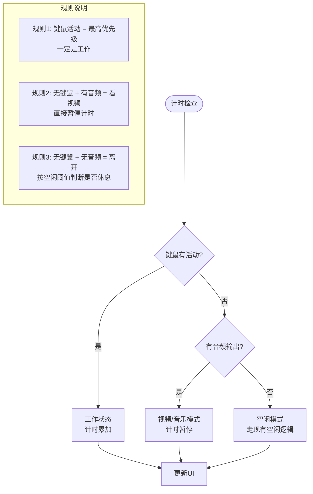
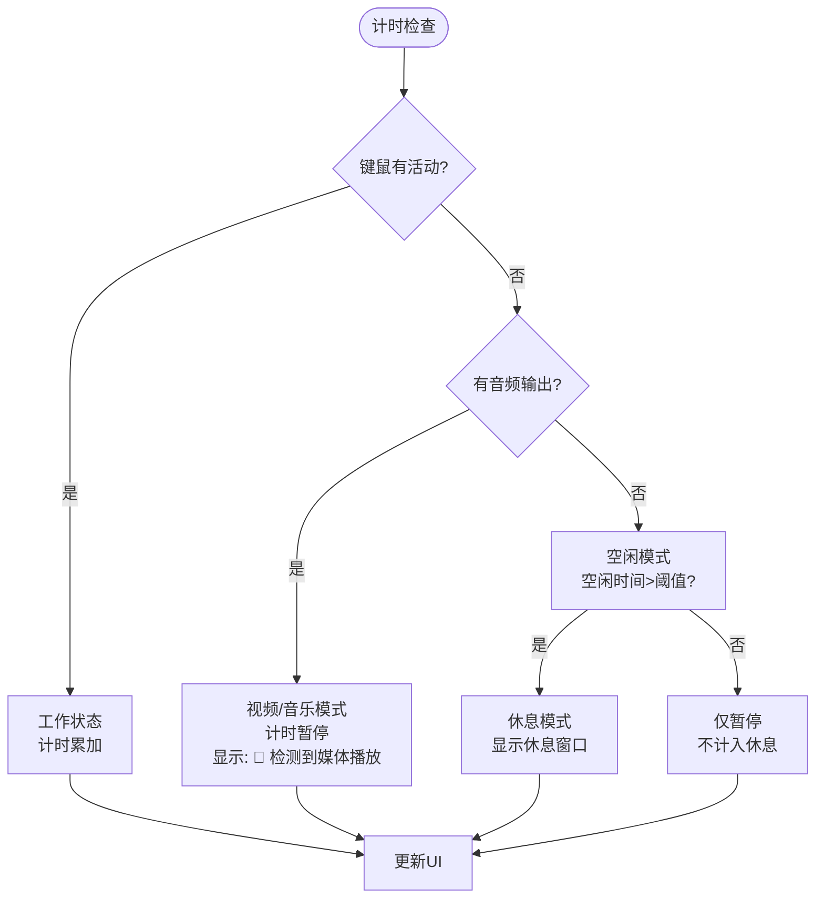

# 判断视频观看逻辑不严谨

## 概述
重新设计视频/休息判断逻辑，基于键鼠活动和音频输出的组合。

## 最终判断逻辑

## 代码修改计划

### 修改1: 实现音频输出检测
**文件:** [/Volumes/Cache/X/Sources/Model/VideoDetector.swift](vscode://file/Volumes/Cache/X/Sources/Model/VideoDetector.swift:1)
- 替换现有的复杂检测为纯音频输出检测

### 修改2: 更新 SmartReminderManager 逻辑
**文件:** [/Volumes/Cache/X/Sources/Model/SmartReminderManager.swift](vscode://file/Volumes/Cache/X/Sources/Model/SmartReminderManager.swift:275)
- 移除旧视频检测逻辑
- 实现新判断逻辑：键鼠 + 音频

## 任务总结与结论

### 修改内容

#### 1. VideoDetector.swift（完整重写）
**修改位置:** [/Volumes/Cache/X/Sources/Model/VideoDetector.swift](vscode://file/Volumes/Cache/X/Sources/Model/VideoDetector.swift:1)

- 移除了所有视频/全屏检测逻辑
- 使用 CoreAudio API 实现纯音频输出检测
- 新增 `isAudioPlaying()` 方法，检测系统默认输出设备是否有音频流

#### 2. SmartReminderManager.swift（逻辑重构）
**修改位置:** [/Volumes/Cache/X/Sources/Model/SmartReminderManager.swift](vscode://file/Volumes/Cache/X/Sources/Model/SmartReminderManager.swift:275)

- 移除了 `isInVideoMode` 状态变量
- 移除了 `extendedWorkDuration` 变量及相关逻辑
- 移除了 `pausedWorkDuration` 变量
- 重写 `handleTimerTick()` 方法，实现新的判断逻辑：
  - 有键鼠活动 → 计时累加
  - 无键鼠 + 有音频 → 暂停计时（视频/音乐模式）
  - 无键鼠 + 无音频 → 走空闲逻辑

### 最终逻辑流程

### 改进效果

1. **逻辑更清晰**: 只有3条规则，无歧义
2. **覆盖更全面**: 不依赖应用类型，支持所有播放器
3. **代码更简洁**: 移除了大量复杂的状态管理
4. **更准确**: 键鼠活动优先级最高，避免误判

## 任务耗时
- 任务开始时间：2317
- 任务结束时间：0028
- 任务总耗时：71分钟
