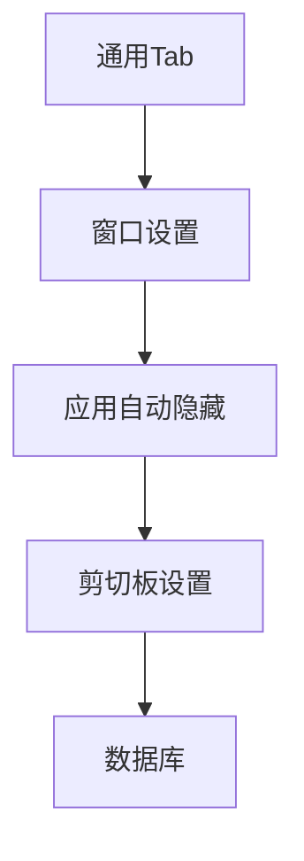
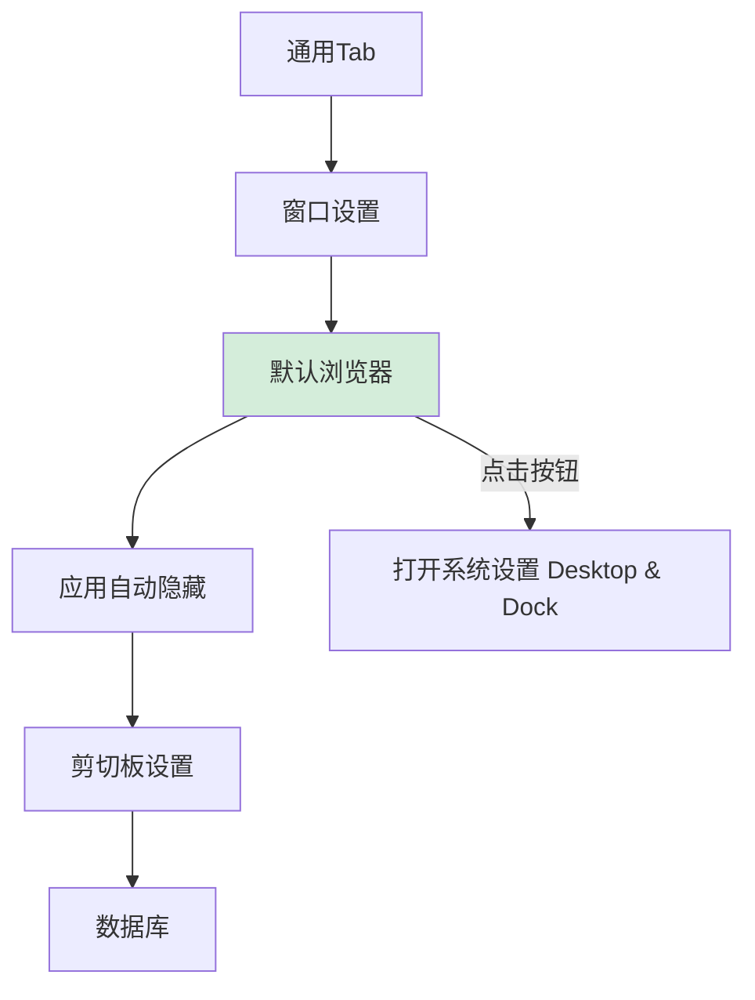

# 默认浏览器设置入口

## 概述
在全局设置通用页面的「应用自动隐藏」上方，添加「默认浏览器」设置项，点击后打开系统设置中的默认浏览器设置页。

## 当前实现

## 方案

### 方案一：添加默认浏览器设置项 ✨推荐方案

在「窗口设置」和「应用自动隐藏」之间插入一个 SettingsSection，包含一个按钮打开 macOS 系统设置的「桌面与程序坞」页面（默认浏览器选项所在位置）。

**优点：**
- 简单直接，一个按钮即可跳转
- 无需额外配置存储

**代码修改位置：**
[SettingsView.swift](vscode://file/Volumes/Cache/X/Sources/View/SettingsView.swift:204) — GeneralSettingsView body，AutoHideSettingsSection 上方

## 测试用例
1. 打开全局设置 → 通用 Tab
2. 确认「默认浏览器」出现在「窗口设置」和「应用自动隐藏」之间
3. 点击「前往设置」按钮，确认打开系统设置桌面与程序坞页面

## 任务总结与结论

在 GeneralSettingsView 中「窗口设置」和「应用自动隐藏」之间插入「默认浏览器」SettingsSection，点击按钮通过 `x-apple.systempreferences:com.apple.Desktop-Settings.extension` URL scheme 打开系统桌面与程序坞设置页面。

## 任务耗时
- 任务开始时间：23:27
- 任务结束时间：23:32
- 任务总耗时：5 分钟
