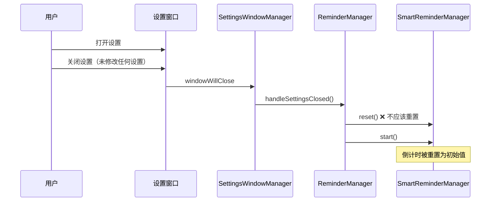
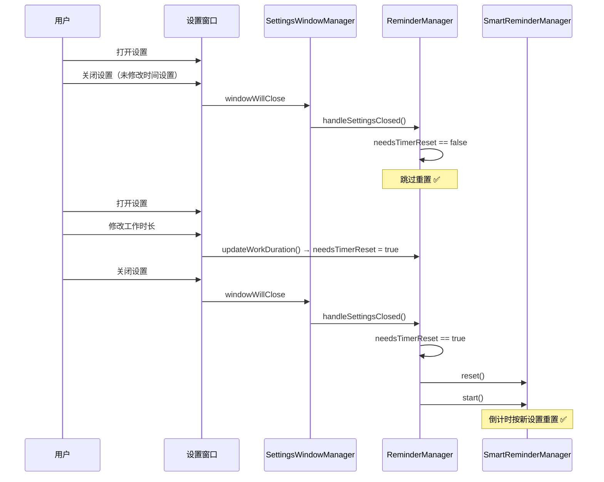
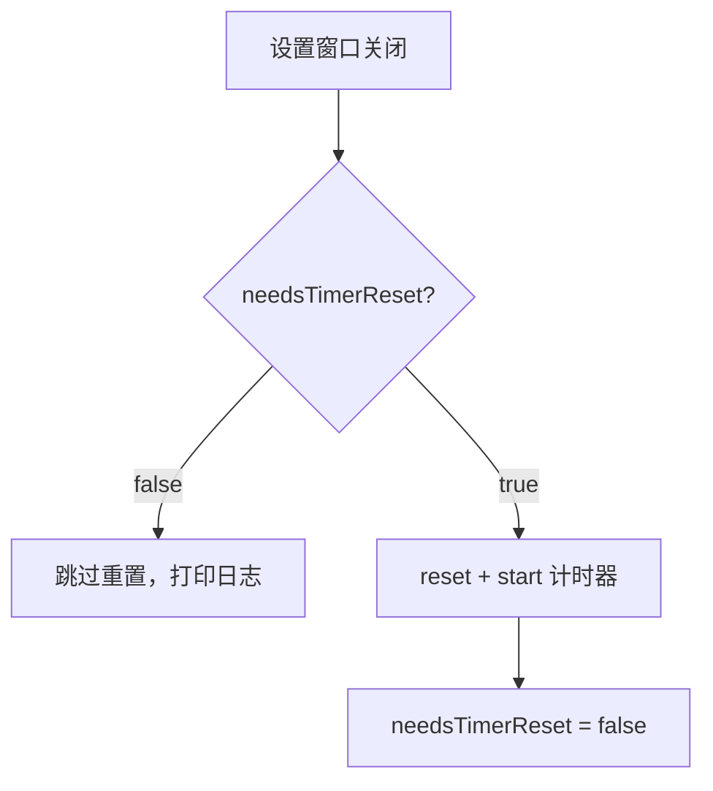

# 修复设置窗口关闭重置提醒倒计时

## 概述
打开并关闭设置窗口后，休息提醒倒计时被重置为初始值。应该只有用户修改了时间相关设置项时才重置。

## 当前实现

## 方案

### 方案一：标记是否需要重置 ✨推荐方案

添加 `needsTimerReset` 标志，仅在修改时间相关配置时设为 true。

**优点：**
- 最小改动，逻辑清晰
- 不影响修改设置后的正常重置行为

**代码修改位置：**
[ReminderConfig.swift](vscode://file/Volumes/Cache/X/Sources/Model/ReminderConfig.swift:405) — handleSettingsClosed 条件判断
[ReminderConfig.swift](vscode://file/Volumes/Cache/X/Sources/Model/ReminderConfig.swift:298) — updateWorkDuration 设置标志
[ReminderConfig.swift](vscode://file/Volumes/Cache/X/Sources/Model/ReminderConfig.swift:318) — updateRestDuration 设置标志
[ReminderConfig.swift](vscode://file/Volumes/Cache/X/Sources/Model/ReminderConfig.swift:349) — updateIdleThreshold 设置标志
[ReminderConfig.swift](vscode://file/Volumes/Cache/X/Sources/Model/ReminderConfig.swift:390) — updateRestRecognitionTime 设置标志

## 测试用例
1. 打开设置 → 不修改任何设置 → 关闭 → 确认菜单栏倒计时未重置
2. 打开设置 → 修改工作时长 → 关闭 → 确认倒计时重置
3. 打开设置 → 修改休息时长 → 关闭 → 确认倒计时重置

## 任务总结与结论

在 `ReminderConfig` 中添加 `needsTimerReset` 标志位，仅当用户修改了工作时长、休息时长、空闲阈值、休息认定时间这四个时间相关设置时才将标志设为 true。`handleSettingsClosed()` 根据标志决定是否执行 reset+start，未修改则跳过。

## 任务耗时
- 任务开始时间：23:34
- 任务结束时间：23:41
- 任务总耗时：7 分钟
