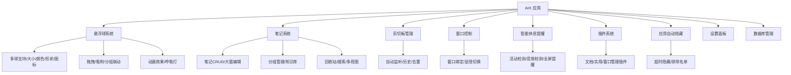
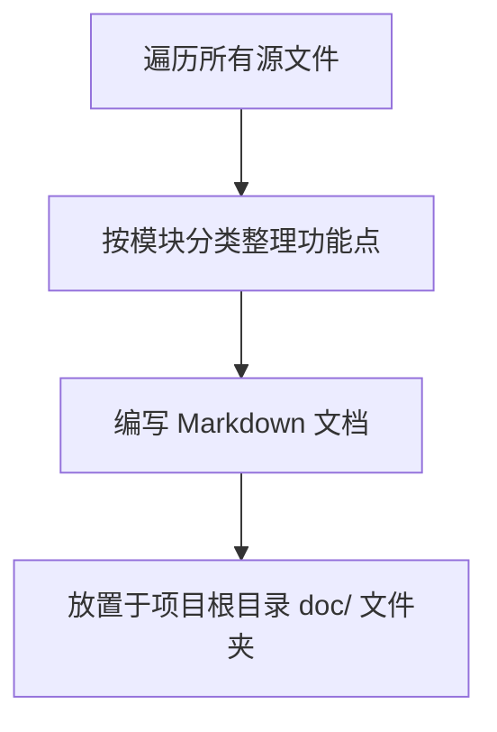

# 软件功能点全览文档

## 概述
编写一份事无巨细的文档，列举 AIX 软件拥有的所有功能点，覆盖悬浮球、笔记、剪切板、窗口控制、智能提醒、插件、设置等所有模块。

## 当前实现

## 方案

### 方案一：编写 Markdown 功能全览文档 ✨推荐方案

在 `doc/` 目录下创建功能全览文档，按模块分类，事无巨细地列举所有功能点。

**优点：**
- 结构清晰，便于查阅
- 放在 doc/ 目录，不影响代码结构

**代码修改位置：**
新建文件 `doc/AIX功能全览.md`

## 测试用例
1. 打开 `doc/AIX功能全览.md`，检查内容是否完整覆盖所有功能
2. 核对文档中的功能点是否与实际软件功能一致

## 任务总结与结论

通过遍历项目所有源文件，按 16 个功能模块系统整理了 204 个功能点，生成 `doc/AIX功能全览.md` 文档。

## 任务耗时
- 任务开始时间：00:21
- 任务结束时间：06:34
- 任务总耗时：373 分钟
