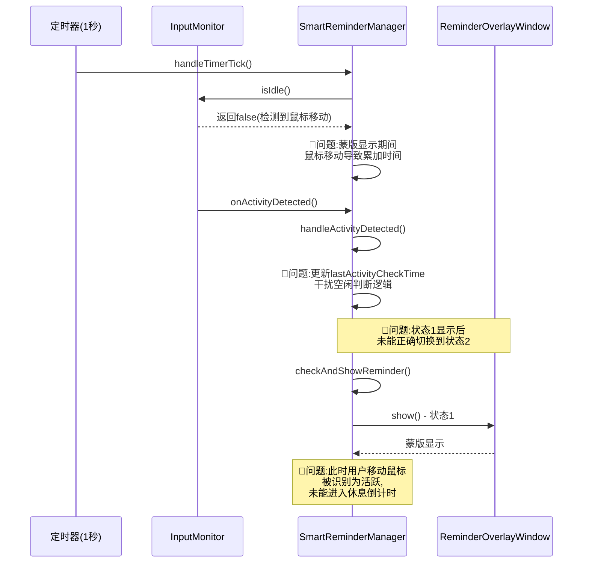
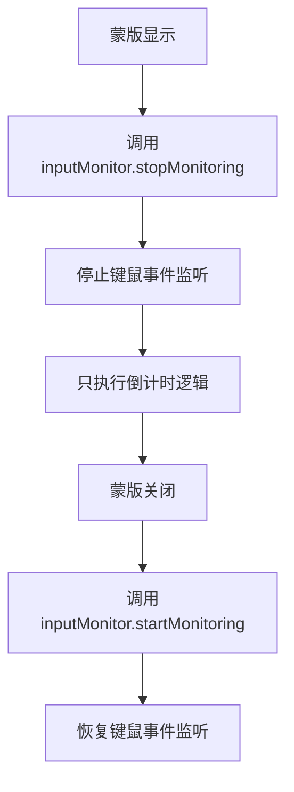
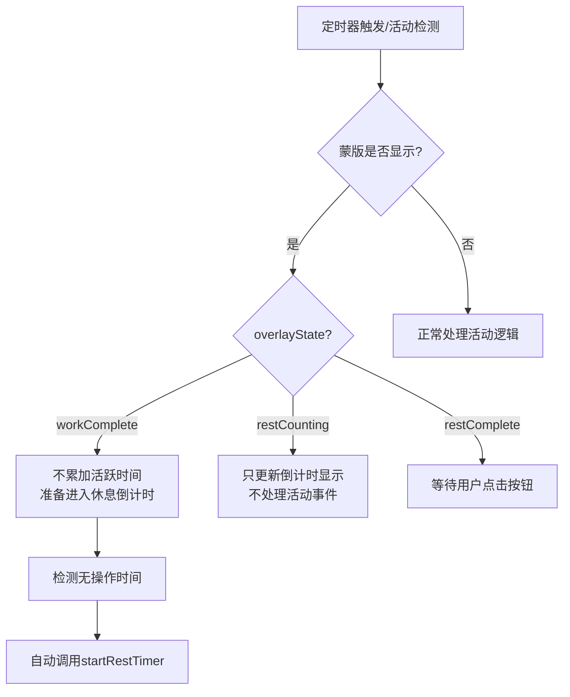
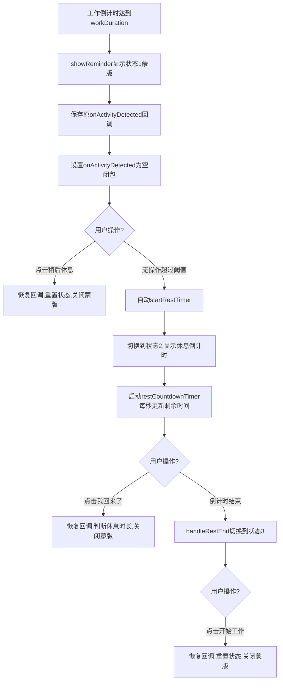
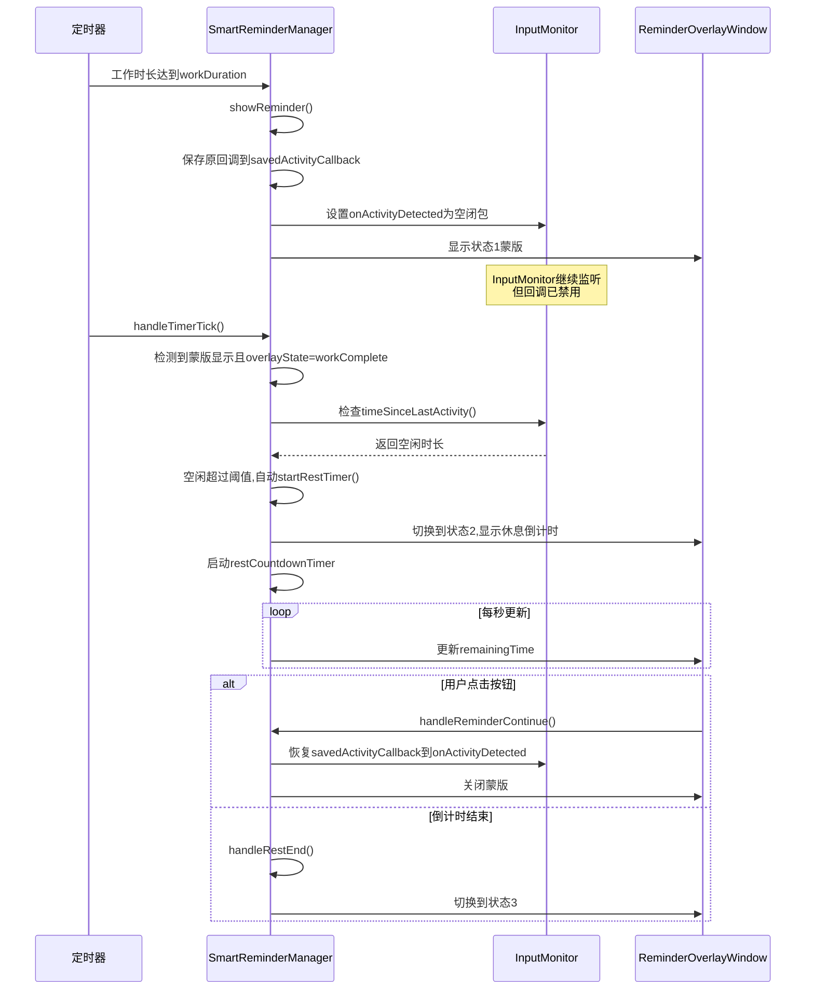

# 修复休息提醒蒙版倒计时问题

## 概述
修复智能休息提醒功能中的三个核心问题：
1. 工作倒计时结束后，应该自动显示休息蒙版（状态2），但目前没有正确显示
2. 休息蒙版显示期间，倒计时会停住不动，无法继续倒计时
3. 蒙版显示期间，依然在监听键盘和鼠标活动，导致干扰倒计时逻辑

## 当前实现

### 状态机流程图
```mermaid
stateDiagram-v2
    [*] --> 工作中: 启动监听
    工作中 --> 状态1_workComplete: 累计活跃时间达到workDuration
    状态1_workComplete --> 工作中: 点击"稍后休息"(重置为0)
    状态1_workComplete --> 状态2_restCounting: 用户无操作,自动进入休息倒计时
    状态2_restCounting --> 工作中: 点击"我回来了"(休息不足,恢复暂停值)
    状态2_restCounting --> 工作中: 点击"我回来了"(休息充足,重置为0)
    状态2_restCounting --> 状态3_restComplete: restDuration倒计时结束
    状态3_restComplete --> 工作中: 点击"开始工作"(重置为0)
    
    note right of 状态1_workComplete: 🐛问题1:显示蒙版后\n仍在监听键鼠事件
    note right of 状态2_restCounting: 🐛问题2:倒计时会停住\n🐛问题3:依然在监听键鼠
```

### 问题出现的环节


## 方案

### 方案1:在蒙版显示期间完全停止InputMonitor监听 ⚠️



**优点**：
- 从根本上阻止键鼠事件干扰
- 逻辑简单清晰

**缺点**：
- 频繁启停InputMonitor可能导致性能问题
- 重新启动监听可能需要时间,影响响应速度
- 可能丢失部分事件

**代码修改位置**：
1. [SmartReminderManager.swift](vscode://file/Volumes/Cache/X/Sources/Model/SmartReminderManager.swift:467) - showReminder方法, 在显示蒙版后停止监听
2. [SmartReminderManager.swift](vscode://file/Volumes/Cache/X/Sources/Model/SmartReminderManager.swift:615) - startRestTimer方法, 确保监听已停止
3. [SmartReminderManager.swift](vscode://file/Volumes/Cache/X/Sources/Model/SmartReminderManager.swift:554) - handleReminderContinue方法, 在关闭蒙版后重新启动监听

---

### 方案2:在handleTimerTick和handleActivityDetected中增加蒙版显示判断 🟡



**优点**：
- 不需要频繁启停InputMonitor
- InputMonitor持续监听,不丢失事件
- 可以灵活控制不同状态下的行为

**缺点**：
- 需要在多处增加判断逻辑
- 代码相对复杂一些

**代码修改位置**：
1. [SmartReminderManager.swift](vscode://file/Volumes/Cache/X/Sources/Model/SmartReminderManager.swift:251) - handleActivityDetected方法, 增加蒙版显示判断
2. [SmartReminderManager.swift](vscode://file/Volumes/Cache/X/Sources/Model/SmartReminderManager.swift:280) - handleTimerTick方法, 增加蒙版状态判断
3. [SmartReminderManager.swift](vscode://file/Volumes/Cache/X/Sources/Model/SmartReminderManager.swift:467) - checkAndShowReminder方法, 确保蒙版只显示一次

---

### 方案3:临时禁用onActivityDetected回调 + 完善状态切换逻辑 ✅ 推荐方案



**优点**：
- 不需要频繁启停InputMonitor,保持监听器运行
- InputMonitor的lastActivityTime持续更新,不影响空闲判断
- 只是暂时禁用回调,不影响事件捕获
- 蒙版关闭时立即恢复回调,响应迅速
- 逻辑清晰,易于维护

**缺点**：
- 需要保存和恢复回调引用

**代码修改位置**：
1. [SmartReminderManager.swift](vscode://file/Volumes/Cache/X/Sources/Model/SmartReminderManager.swift:23) - 增加savedActivityCallback属性
2. [SmartReminderManager.swift](vscode://file/Volumes/Cache/X/Sources/Model/SmartReminderManager.swift:467) - showReminder方法, 禁用回调
3. [SmartReminderManager.swift](vscode://file/Volumes/Cache/X/Sources/Model/SmartReminderManager.swift:615) - startRestTimer方法, 确保回调已禁用
4. [SmartReminderManager.swift](vscode://file/Volumes/Cache/X/Sources/Model/SmartReminderManager.swift:554) - handleReminderContinue方法, 恢复回调
5. [SmartReminderManager.swift](vscode://file/Volumes/Cache/X/Sources/Model/SmartReminderManager.swift:280) - handleTimerTick方法, 增加状态1到状态2的自动切换逻辑
6. [SmartReminderManager.swift](vscode://file/Volumes/Cache/X/Sources/Model/SmartReminderManager.swift:674) - showRestOverlay方法, 确保Timer不会被干扰

## 测试用例

### 测试用例1: 工作倒计时达到后自动显示休息蒙版
1. 启动应用,确保智能提醒功能已开启
2. 将工作时长设置为1分钟,休息时长设置为5分钟
3. 持续操作键盘/鼠标1分钟
4. **预期结果**: 1分钟后显示状态1蒙版(该休息一下了)
5. **不要点击按钮**,保持鼠标不动
6. **预期结果**: 等待空闲阈值时间(默认60秒)后,自动切换到状态2蒙版(休息中),并开始倒计时

### 测试用例2: 休息蒙版倒计时持续运行
1. 继续测试用例1,确保已进入状态2(休息中)
2. 在显示休息倒计时期间,随意移动鼠标
3. **预期结果**: 倒计时应该持续递减,不受鼠标移动影响
4. 观察倒计时是否从 05:00 一直递减到 00:00
5. **预期结果**: 倒计时结束后,播放提示音,切换到状态3蒙版(休息完成)

### 测试用例3: 状态1点击"稍后休息"按钮
1. 启动应用,将工作时长设置为1分钟
2. 持续操作1分钟,触发状态1蒙版
3. 点击"稍后休息"按钮
4. **预期结果**: 蒙版关闭,工作倒计时重置为0,开始新一轮计时
5. **预期结果**: 移动鼠标时,菜单栏倒计时应该正常累加

### 测试用例4: 状态2点击"我回来了"按钮(休息充足)
1. 启动应用,将工作时长设置为1分钟,休息认定时间设置为2分钟
2. 触发状态2休息倒计时
3. 等待2分钟后,点击"我回来了"按钮
4. **预期结果**: 蒙版关闭,工作倒计时重置为0,开始新一轮计时

### 测试用例5: 状态2点击"我回来了"按钮(休息不足)
1. 启动应用,将工作时长设置为1分钟,休息认定时间设置为4分钟
2. 触发状态2休息倒计时
3. 等待1分钟后,点击"我回来了"按钮
4. **预期结果**: 蒙版关闭,工作倒计时恢复到暂停前的值(约1分钟),继续累加

### 测试用例6: 状态3点击"开始工作"按钮
1. 启动应用,触发完整的休息流程(状态1→状态2→状态3)
2. 在状态3蒙版显示时,点击"开始工作"按钮
3. **预期结果**: 蒙版关闭,工作倒计时重置为0,开始新一轮计时

### 测试用例7: 蒙版显示期间键盘输入无效
1. 在状态1、状态2或状态3蒙版显示时
2. 尝试按下任意键盘按键(如Enter、Esc、Space等)
3. **预期结果**: 键盘输入被拦截,不会影响蒙版显示或倒计时

### 测试用例8: 菜单栏倒计时在蒙版显示期间不累加
1. 启动应用,观察菜单栏的工作倒计时
2. 触发状态1蒙版
3. 在蒙版显示期间,移动鼠标
4. **预期结果**: 菜单栏的工作倒计时数值保持不变,不会因为鼠标移动而增加

## 任务总结与结论

### 问题分析
本次修复针对智能休息提醒功能的三个核心问题：
1. **蒙版显示期间依然监听键鼠活动**：InputMonitor的onActivityDetected回调在蒙版显示期间依然被触发，导致handleActivityDetected()被调用，干扰了倒计时逻辑
2. **休息倒计时会停住**：因为键鼠活动干扰，restCountdownTimer的更新逻辑受到影响
3. **状态1到状态2的切换不正确**：工作倒计时达到后，应该自动进入休息倒计时，但实现不完善

### 解决方案
采用方案3（推荐方案）：**临时禁用onActivityDetected回调 + 完善状态切换逻辑**

### 实现流程图


### 关键修改点
1. **增加savedActivityCallback属性**（第23行）：保存原始回调引用
2. **showReminder()方法**（第467行）：显示蒙版时禁用回调
3. **startRestTimer()方法**（第615行）：确保回调已禁用
4. **handleReminderContinue()方法**（第554行）：关闭蒙版时恢复回调
5. **handleTimerTick()方法**（第280行）：增加蒙版显示判断，实现状态1到状态2的自动切换
6. **showRestOverlay()方法**（第674行）：优化定时器管理，确保倒计时不被中断
7. **stop()方法**（第140行）：停止时恢复回调，避免泄漏

### 核心优化
- **InputMonitor持续运行**：不需要频繁启停，lastActivityTime持续更新，空闲判断不受影响
- **回调管理机制**：通过临时禁用/恢复回调，优雅地控制活动检测的启用状态
- **状态切换完善**：在handleTimerTick()中增加对状态1蒙版的检测，实现自动切换到状态2
- **倒计时保护**：restCountdownTimer添加到RunLoop，确保不被其他事件中断

### 测试指引
请按照以上8个测试用例逐一验证，重点关注：
- 状态1到状态2的自动切换（测试用例1）
- 倒计时不受鼠标移动影响（测试用例2）
- 蒙版关闭后活动检测恢复正常（测试用例3、5）

## 任务耗时
- 任务开始时间：0912
- 任务结束时间：0928
- 任务总耗时：16 分钟
