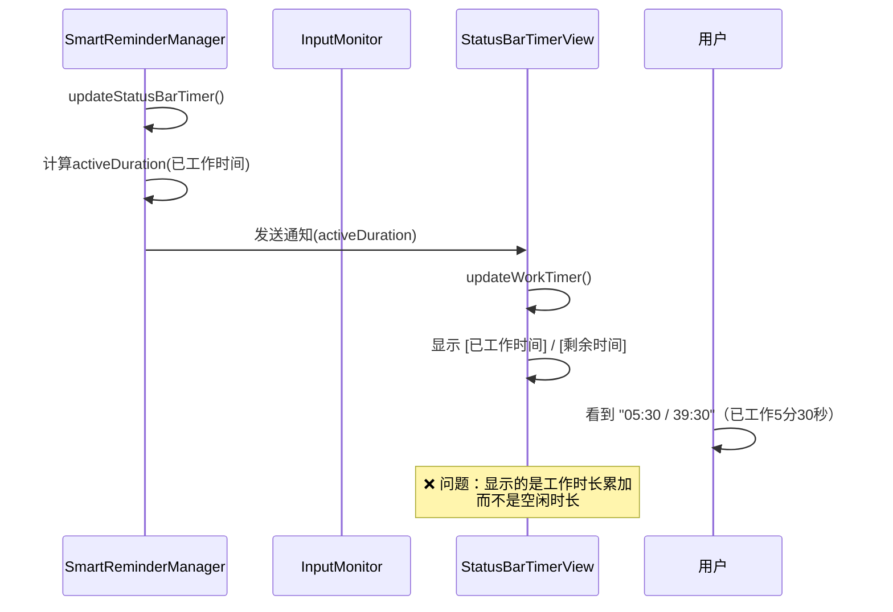
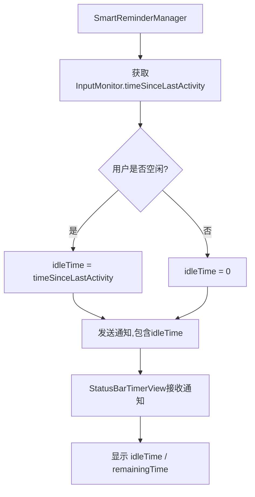
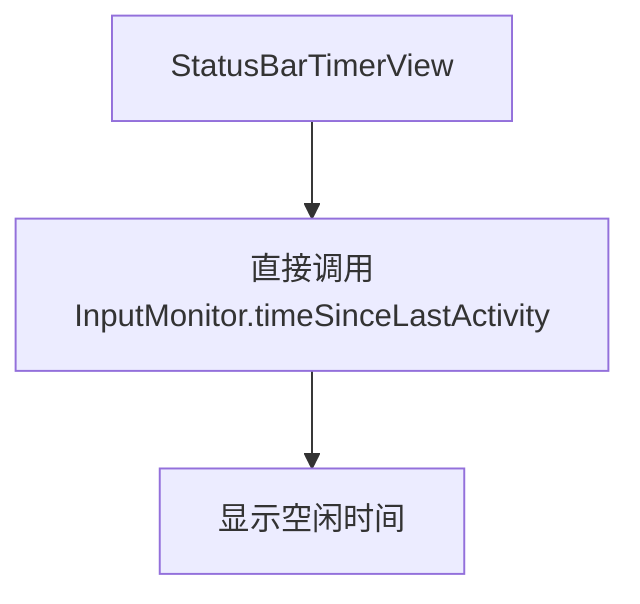
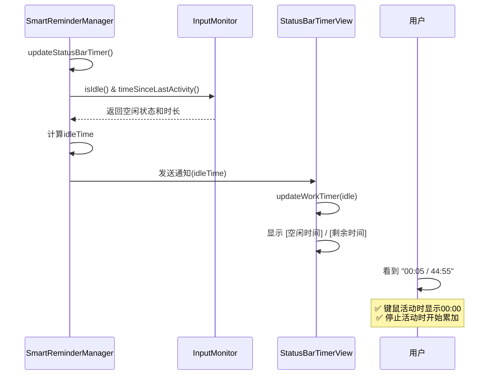

# 菜单栏显示空闲判定时间

## 概述
修改菜单栏倒计时显示逻辑，将左侧的"已工作时间"改为显示"空闲判定时间"：
- 键鼠活动时：显示 00:00
- 键鼠停止活动时：时间开始累加
- 格式保持：XX:XX / YY:YY（空闲时间 / 剩余工作时间）

## 当前实现

### 菜单栏显示流程


### 当前显示逻辑
```swift
// StatusBarTimerView.swift updateWorkTimer()
let activeMin = Int(active) / 60
let activeSec = Int(active) % 60
let timerText = String(format: "%02d:%02d / %02d:%02d",
                      activeMin, activeSec,  // ❌ 显示已工作时间
                      remainingMin, remainingSec)
```

## 方案

### 方案1: 在SmartReminderManager中计算空闲时间并通过通知传递 ✅ 推荐方案



**优点**：
- 逻辑清晰，数据来源统一（SmartReminderManager统一管理）
- StatusBarTimerView只负责显示，不需要访问InputMonitor
- 符合现有架构，改动最小

**缺点**：
- 需要修改两处代码（Manager和View）

**代码修改位置**：
1. [SmartReminderManager.swift](vscode://file/Volumes/Cache/X/Sources/Model/SmartReminderManager.swift:410) - updateStatusBarTimer方法，增加idleTime计算和通知
2. [StatusBarTimerView.swift](vscode://file/Volumes/Cache/X/Sources/View/StatusBarTimerView.swift:113) - updateWorkTimer方法，修改显示格式
3. [StatusBarTimerView.swift](vscode://file/Volumes/Cache/X/Sources/View/StatusBarTimerView.swift:192) - updateDisplay方法，修改显示格式

---

### 方案2: StatusBarTimerView直接访问InputMonitor



**优点**：
- 实时性高，不依赖通知

**缺点**：
- 打破现有架构，View直接访问Model层
- StatusBarTimerView需要持有InputMonitor引用
- 违反单一职责原则

**不推荐使用**

## 测试用例

### 测试用例1: 键鼠活动时空闲时间归零
1. 启动应用，开启智能提醒
2. 移动鼠标或敲击键盘
3. 观察菜单栏左侧时间

**预期结果**: 
- 左侧显示 00:00
- 右侧正常显示剩余工作时间
- 格式：00:00 / 44:30

### 测试用例2: 停止操作后空闲时间累加
1. 停止所有键鼠操作
2. 观察菜单栏左侧时间每秒变化

**预期结果**:
- 第1秒：00:01 / 44:59
- 第2秒：00:02 / 44:58
- ...
- 第60秒：01:00 / 44:00

### 测试用例3: 恢复活动后空闲时间归零
1. 等待空闲时间累加到 00:30
2. 移动鼠标
3. 观察菜单栏左侧时间

**预期结果**:
- 立即变为 00:00 / XX:XX
- 继续移动鼠标期间保持 00:00

### 测试用例4: 休息模式显示不变
1. 触发休息提醒
2. 观察菜单栏显示

**预期结果**:
- 显示"休息 XX:XX"格式不变
- 不受此次修改影响

### 测试用例5: 未授权状态显示
1. 未授予辅助功能权限
2. 观察菜单栏显示

**预期结果**:
- 显示"未授权"
- 不显示任何时间

## 任务总结与结论

### 实现方案
采用方案1：**在SmartReminderManager中计算空闲时间并通过通知传递**

### 实现流程


### 关键修改点
1. **SmartReminderManager.swift** (第426行) - updateStatusBarTimer方法
   - 增加idleTime计算：`inputMonitor.isIdle() ? inputMonitor.timeSinceLastActivity() : 0`
   - 在通知userInfo中添加idleTime字段

2. **StatusBarTimerView.swift** (第15行) - 增加idleTime属性
   - 新增私有属性存储空闲时间

3. **StatusBarTimerView.swift** (第113行) - updateWorkTimer方法
   - 修改方法签名，增加idle参数
   - 将显示的activeMin/activeSec改为idleMin/idleSec

4. **StatusBarTimerView.swift** (第192行) - updateDisplay方法
   - 修改工作模式显示逻辑，使用idleTime替代activeDuration

5. **StatusBarTimerView.swift** (第228行) - onSmartReminderStateChanged方法
   - 接收通知中的idleTime字段
   - 传递给updateWorkTimer方法

### 技术要点
- **空闲判断逻辑**：通过InputMonitor.isIdle()判断当前是否空闲
- **时间计算**：
  - 键鼠活动时：idleTime = 0
  - 键鼠停止时：idleTime = timeSinceLastActivity()
- **通知机制**：保持原有架构，只增加一个字段，不改变整体结构

## 任务耗时
- 任务开始时间：0931
- 任务结束时间：0942
- 任务总耗时：11 分钟
