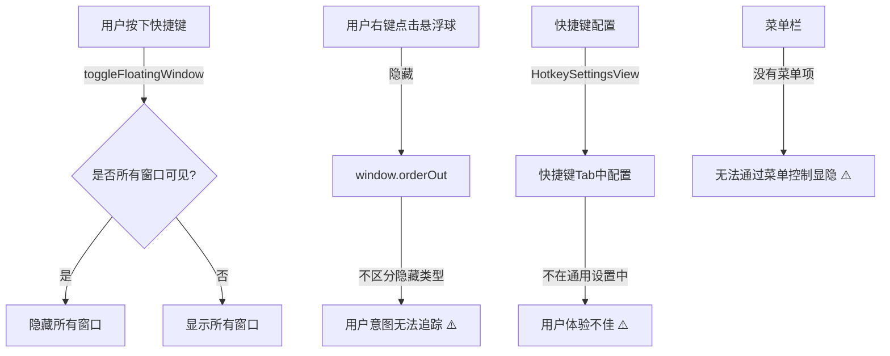

# 隐藏所有悬浮球全局快捷键

## 概述

将现有的显示/隐藏快捷键（`toggleAIXHotkey`）从快捷键 Tab 移动到通用设置页。该快捷键默认设置为 **Command+Option+H**（不会与常见应用冲突），用户可在通用设置中修改。该快捷键控制**未被用户单独隐藏的悬浮球**的显隐：点击一次隐藏它们，再点击显示。同时在菜单栏添加对应菜单项。需要添加"用户隐藏悬浮球索引"和"全局隐藏状态"标志来区分两种隐藏方式。

## 当前实现

## 方案 ⭐ 推荐方案

实现步骤如下：

### 1. 在 FloatingButtonConfig 中添加新字段
- 添加 `userHiddenButtonIndices: [Int]` 字段，记录用户主动隐藏的悬浮球索引集合
- 添加 `globalHiddenState: Bool` 字段，记录未被用户隐藏的悬浮球是否被全局隐藏（`true` 表示隐藏，`false` 表示显示）
- 在 `init(from decoder:)` 中添加向后兼容逻辑，默认值：`userHiddenButtonIndices = []`，`globalHiddenState = false`

### 2. 修改悬浮球隐藏逻辑（GlowFloatingButtonView）
- 修改 `closeSelf()` 方法，在隐藏窗口时，调用 `FloatingButtonConfigManager.recordUserHiddenButton(buttonIndex)`
- 此操作**只记录用户隐藏意图**，不改变 `globalHiddenState`

### 3. 改进全局快捷键逻辑（AppDelegate）
- 修改 `toggleFloatingWindow()` 方法，切换 `globalHiddenState`：
  - 隐藏所有不在 `userHiddenButtonIndices` 中的悬浮球，设置 `globalHiddenState = true`
  - 显示所有不在 `userHiddenButtonIndices` 中的悬浮球，设置 `globalHiddenState = false`
  - 笔记窗口随之隐藏/显示

### 4. 在菜单栏添加菜单项
- 在状态栏菜单中添加"显示/隐藏未被单独隐藏的悬浮球"菜单项
- 配合快捷键提供相同功能

### 5. 移动快捷键设置到通用设置页
- 在 `GeneralSettingsView` 中添加快捷键配置区块，包含"修改"按钮和"重置"按钮
- 从 `HotkeySettingsView` 中移除该项（或整个 Tab 删除）
- 确保能录入快捷键并全局生效
- **默认快捷键：Command+Option+H**（H for Hide），不与常见应用冲突
- **重置按钮**：恢复快捷键为默认值 Command+Option+H

**优点：**
- 充分利用现有的快捷键基础设施
- 用户隐藏状态持久化，体验更佳
- 快捷键配置位置更合理（在通用设置中）
- 逻辑清晰易维护
- 预设快捷键无需用户主动配置就可使用
- 用户可随时恢复到默认快捷键，不怕改错

**代码修改位置：**
- [FloatingButtonConfig.swift](vscode://file/Volumes/Cache/X/Sources/Model/FloatingButtonConfig.swift:24) - 添加新字段，默认快捷键为 Command+Option+H
- [FloatingButtonConfigManager.swift](vscode://file/Volumes/Cache/X/Sources/Model/FloatingButtonConfigManager.swift) - 添加保存/修改方法，添加重置方法
- [GlowFloatingButtonView.swift](vscode://file/Volumes/Cache/X/Sources/View/GlowFloatingButtonView.swift:412) - 修改 closeSelf 方法
- [AppDelegate.swift](vscode://file/Volumes/Cache/X/Sources/App/AppDelegate.swift:941) - 修改 toggleFloatingWindow 方法，注册 Command+Option+H 快捷键
- [SettingsView.swift](vscode://file/Volumes/Cache/X/Sources/View/SettingsView.swift:164) - 在 GeneralSettingsView 中添加快捷键配置、修改按钮和重置按钮，删除 HotkeySettingsView

---

## 测试用例

### 基础功能测试

1. **预设快捷键测试**
   - 首次启动应用
   - 验证 Command+Option+H 快捷键已注册
   - 验证可以通过 Command+Option+H 隐藏/显示悬浮球
   - 验证菜单栏也显示该预设快捷键

2. **快捷键设置位置测试**
   - 打开偏好设置
   - 验证「显示/隐藏 AIX」快捷键配置在「通用」Tab 中，默认值为 Command+Option+H
   - 验证不再有「快捷键」Tab 或该 Tab 中没有该项

3. **快捷键修改测试**
   - 点击"修改"按钮
   - 输入新快捷键组合（如 `Cmd+Shift+D`）
   - 关闭设置窗口
   - 验证新快捷键生效，旧快捷键不再生效

4. **快捷键重置测试**
   - 修改快捷键为自定义组合（如 `Cmd+Shift+D`）
   - 点击"重置"按钮
   - 验证快捷键恢复为 Command+Option+H
   - 验证新快捷键不再生效，恢复为 Command+Option+H

3. **菜单项功能测试**
   - 右键菜单栏状态栏图标
   - 验证存在"显示/隐藏悬浮球"或类似菜单项
   - 点击该菜单项
   - 验证功能与快捷键相同

4. **用户隐藏的悬浮球不受控制**
   - 创建 3 个悬浮球，全部可见
   - 右键悬浮球 B，选择「隐藏」
   - 验证悬浮球 B 隐藏，`userHiddenButtonIndices = [1]`，`globalHiddenState = false`
   - 按下快捷键隐藏
   - 验证悬浮球 A、C 隐藏，悬浮球 B 保持隐藏
   - 验证 `globalHiddenState = true`

5. **快捷键再次显示**
   - 在上一个测试基础上，再按一次快捷键
   - 验证悬浮球 A、C 显示，悬浮球 B 保持隐藏
   - 验证 `globalHiddenState = false`

6. **全部隐藏后的快捷键**
   - 创建 3 个悬浮球
   - 右键依次隐藏所有悬浮球（A、B、C）
   - 验证 `userHiddenButtonIndices = [0, 1, 2]`
   - 按下快捷键
   - 验证所有悬浮球保持隐藏（因为全部被设置为用户隐藏）
   - 验证 `globalHiddenState` 不变

7. **从菜单栏恢复悬浮球**
   - 右键隐藏悬浮球 B，验证 `userHiddenButtonIndices = [1]`
   - 右键菜单栏 → 悬浮球操作 → 按钮 2 → 恢复悬浮球
   - 验证悬浮球 B 显示
   - 验证 `userHiddenButtonIndices` 中移除了索引 1
   - 验证 `globalHiddenState` 的值不变

8. **复杂场景：部分用户隐藏，全局隐藏**
   - 创建 4 个悬浮球
   - 右键隐藏悬浮球 2 和 4（`userHiddenButtonIndices = [1, 3]`）
   - 按快捷键隐藏全局（`globalHiddenState = true`）
   - 验证悬浮球 1、3 隐藏，悬浮球 2、4 保持隐藏
   - 按快捷键显示全局（`globalHiddenState = false`）
   - 验证悬浮球 1、3 显示，悬浮球 2、4 保持隐藏

9. **快捷键与笔记窗口**
   - 创建 2 个悬浮球
   - 点击悬浮球 A 打开笔记面板
   - 验证其他悬浮球隐藏，笔记面板显示
   - 按快捷键隐藏全局
   - 验证笔记面板隐藏
   - 按快捷键显示全局
   - 验证笔记面板显示（因为之前是打开的）

## 代码修改概览

### FloatingButtonConfig.swift
- 在配置结构中添加 `userHiddenButtonIndices: [Int]` 字段，默认值 `[]`
- 在配置结构中添加 `globalHiddenState: Bool` 字段，默认值 `false`
- 在配置结构中添加 `toggleHotkey: String` 字段，默认值 `"cmd|alt|h"`（Command+Option+H）
- 在 init 中添加这三个参数
- 在 init(from decoder:) 中添加向后兼容逻辑

### FloatingButtonConfigManager.swift
- 添加 `recordUserHiddenButton(index: Int)` 方法 - 添加索引到 `userHiddenButtonIndices`
- 添加 `removeUserHiddenButton(index: Int)` 方法 - 从 `userHiddenButtonIndices` 移除索引
- 添加 `isButtonHiddenByUser(index: Int) -> Bool` 方法 - 检查索引是否在 `userHiddenButtonIndices` 中
- 添加 `toggleGlobalHiddenState()` 方法 - 切换 `globalHiddenState`
- 添加 `setGlobalHiddenState(_ hidden: Bool)` 方法 - 设置 `globalHiddenState`
- 添加 `getGlobalHiddenState() -> Bool` 方法 - 获取 `globalHiddenState`

### GlowFloatingButtonView.swift
- 修改 `closeSelf()` 方法，调用 `FloatingButtonConfigManager.shared.recordUserHiddenButton(buttonIndex)`

### AppDelegate.swift
- 修改 `toggleFloatingWindow()` 方法，实现新的显隐逻辑
- 修改 `showFloatingButton(_ sender: NSMenuItem)` 方法，调用 `removeUserHiddenButton()`
- 修改 `createFloatingWindow(at:)` 方法，根据 `userHiddenButtonIndices` 和 `globalHiddenState` 决定是否显示悬浮球
- 在菜单栏添加"显示/隐藏悬浮球"菜单项

### SettingsView.swift
- 在 `GeneralSettingsView` 中添加快捷键配置区块
- 复用 `HotkeyRecorder` 组件
- 删除或隐藏 `HotkeySettingsView`，或从 settings tabs 中移除

## 任务总结与结论

（该部分要等代码修改完毕以后填充）

## 任务耗时

- 任务开始时间：10:02
- 任务结束时间：待完成
- 任务总耗时：待完成
