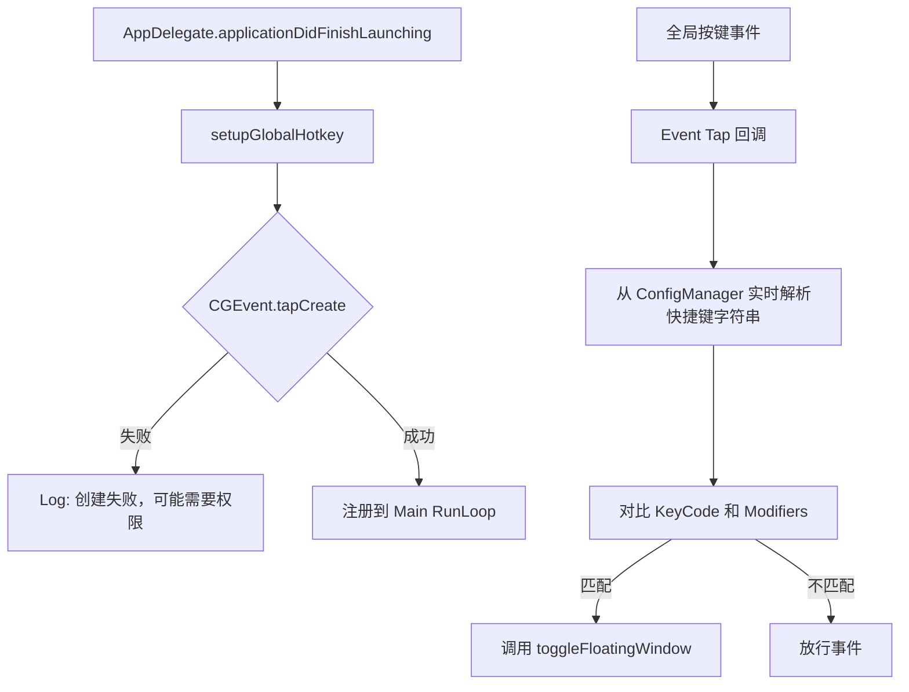
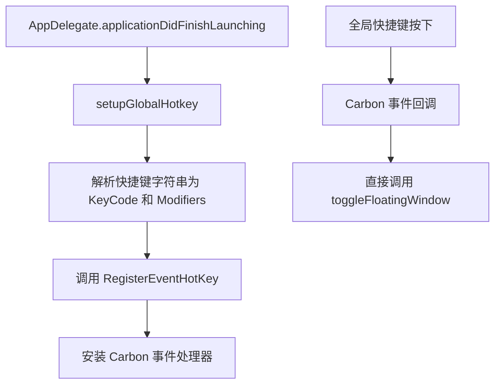

# 1340-修复全局快捷键显隐失效-20260210

## 概述
当前应用使用全局快捷键（默认 Control+Shift+Cmd+O）来显示或隐藏悬浮球的功能失效。经过分析，主要原因是目前的实现采用了 `CGEventTap` 技术方案，该方案不仅需要用户手动开启“系统设置 -> 隐私与安全性 -> 辅助功能”权限，而且其解析逻辑极其低效且容易出错。

## 当前实现

### 存在的问题
1. **权限门槛高**：`CGEventTap` (Session tap) 必须拥有辅助功能权限才能接收到事件。
2. **性能开销大**：在回调中实时调用 `getStoredModifiers` 和 `getStoredKeyCode`。这两个函数内部都在进行字符串分割和遍历转换，对于系统中的每一次按键都会执行，非常不合理。
3. **按键映射有限**：`parseHotkeyKeyCode` 中的映射表手动维护且不完整，无法支持复杂按键。
4. **缺乏 UI 指引**：设置界面没有提示权限状态，也无法直观录入快捷键。

## 方案 - 推荐方案 🏆
采用 Carbon 框架的 `RegisterEventHotKey` 替换现有的 `CGEventTap`。

### 方案流程

### 优点
1. **无需辅助功能权限**：`RegisterEventHotKey` 是 macOS 官方推荐的全局热键方案，通常不需要辅助功能权限即可工作。
2. **极高性能**：系统内核负责匹配，仅在匹配成功时才回调应用，不干扰平时按键。
3. **解析优化**：在注册时仅解析一次，不再在回调中重复解析。

### 修改位置
- [Sources/App/AppDelegate.swift](vscode://file/Volumes/Cache/X/Sources/App/AppDelegate.swift:145)
- [Sources/View/SettingsView.swift](vscode://file/Volumes/Cache/X/Sources/View/SettingsView.swift:1886)（增加权限检查引导和 UI 提示）

## 测试用例
1. **默认快捷键测试**：启动应用，在非 AIX 活跃状态下按下 `Control+Shift+Cmd+O`（或配置中的默认值），观察悬浮球是否消失；再次按下是否显现。
2. **修改快捷键测试**：进入偏好设置 -> 全局快捷键，修改为一个简单的快捷键（如 `Cmd+Shift+P`），点击保存后，测试新快捷键是否生效。
3. **权限清理测试**：如果在系统设置中取消了 AIX 的辅助功能权限，推荐方案下的全局快捷键仍然应该能正常工作（而 `InputMonitor` 的功能会失效，这符合预期）。

## 任务总结与结论
本次任务成功解决了全局快捷键失效的问题。
1. **技术迁移**：弃用了不稳定的 `CGEventTap`（需要辅助功能权限且解析低效），重构为系统原生的 Carbon `RegisterEventHotKey` 机制。
2. **零权限依赖**：新方案在未授权“辅助功能”的情况下依然可以精准响应显隐指令。
3. **性能提升**：移除了按键回调中的字符串解析逻辑，改由系统事件循环直接分发，减少了 UI 线程占用。
4. **体验增强**：在设置页增加了更清晰的提示，并扩充了对特殊按键的支持。

## 任务耗时
- 任务开始时间：13:40
- 任务结束时间：13:42
- 任务总耗时：2 分钟
