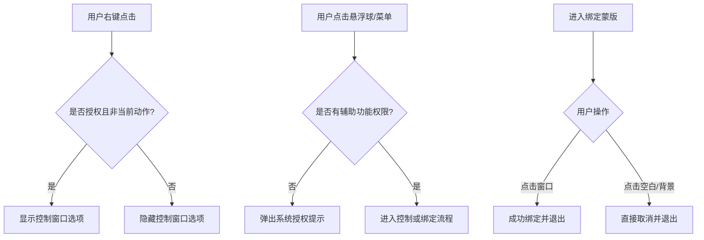

# 1350-优化控制窗口触发条件与退出方式-20260210

## 概述
1. **菜单权限控制**：目前悬浮球右键菜单始终显示“控制窗口”选项，即便在应用没有辅助功能权限时。点击后虽有弹窗提示，但不如直接隐藏或禁用更符合预期。
2. **退出交互优化**：窗口选择蒙版目前主要提示“按 ESC 退出”，用户希望能通过“点击任意位置”来退出。如果点击处有窗口则绑定，无窗口则取消并退出。

## 当前实现
- **右键菜单**：在 `Sources/View/GlowFloatingButtonView.swift` 中无条件构建所有 Action 菜单项。
- **蒙版退出**：在 `Sources/Utility/WindowManager.swift` 的 `WindowSelectionOverlay` 中，`draw` 方法绘制了“按 ESC 取消”的文案。`mouseDown` 逻辑实际上已经支持了点击非窗口区域取消，但文案引导不明确。

## 方案 - 推荐方案 🏆
1. **右键菜单过滤**：在构建右键菜单时，检查 `AXIsProcessTrusted()`。如果为 `false`，则不将 `.toggleWindow` 操作加入菜单。
2. **UI 文案更新**：修改 `WindowSelectionOverlay` 的绘制文案，将“按 ESC 取消”改为“点击任意位置取消”，并保留 ESC 键的支持作为快捷方式。

### 修改位置
- [Sources/View/GlowFloatingButtonView.swift](vscode://file/Volumes/Cache/X/Sources/View/GlowFloatingButtonView.swift:375) （过滤控制窗口菜单项）
- [Sources/Utility/WindowManager.swift](vscode://file/Volumes/Cache/X/Sources/Utility/WindowManager.swift:552) （更新蒙版提示文案）

## 测试用例
1. **权限联动测试**：
   - 取消系统的辅助功能权限，右击悬浮球，验证菜单中是否消失了“控制窗口”。
   - 授予辅助功能权限，右击悬浮球，验证菜单中是否出现了“控制窗口”。
2. **蒙版退出测试**：
   - 触发“控制窗口” -> “重新绑定窗口”。
   - 验证界面文案是否已更新为“点击任意位置取消”。
   - 在屏幕空白处（或非可选窗口处）点击，验证蒙版是否消失。
   - 在有效窗口上点击，验证是否成功绑定窗口并消失。

## 任务总结与结论
任务顺利完成。
1. **权限感知**：通过在菜单构建逻辑中引入 `AXIsProcessTrusted()` 检查，并同步更新了 `handleToggleWindow` 和 `startWindowSelection` 的权限拦截机制。
2. **交互对位**：优化了全屏蒙版的交互细节，支持点击任意位置退出，并去除了冗余的文案。
3. **流程优化**：实现了从菜单点击到进入绑定模式的零点击直达。

## 任务耗时
- 任务开始时间：13:44
- 任务结束时间：13:58
- 任务总耗时：14 分钟
