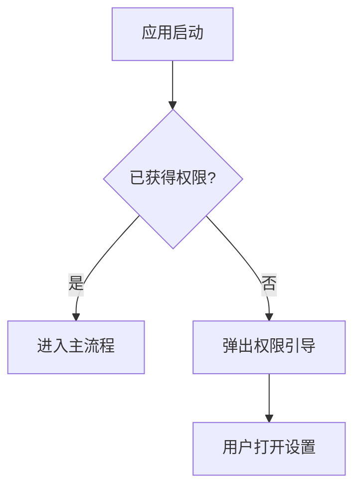

# 1358-应用启动权限检查引导-20260210

## 概述
为了确保用户能完整体验“辅助窗口控制”等核心功能，需要在应用启动时主动检查“辅助功能”权限状态。若未获得授权，则主动弹出指引弹窗，引导用户前往系统设置进行授权。

## 当前实现
- **权限检查逻辑**：在 `Sources/Utility/WindowManager.swift` 中定义了 `requestAccessibilityPermission()`，但为私有方法且仅在执行具体窗口控制操作时触发。
- **启动流程**：`AppDelegate.applicationDidFinishLaunching` 目前仅执行常规初始化，不包含主动的权限自检。

## 方案 - 推荐方案 🏆
1. **公开权限弹窗方法**：将 `WindowManager.shared.requestAccessibilityPermission()` 的访问级别由 `private` 修改为 `internal` (或通过 `checkPermissionAndPrompt()` 封装)。
2. **启动自检**：在 `AppDelegate.applicationDidFinishLaunching` 的初始化流程最后，加入权限自检逻辑。如果检测到未授予辅助功能权限，则调用弹窗。

### 修改位置
- [Sources/Utility/WindowManager.swift](vscode://file/Volumes/Cache/X/Sources/Utility/WindowManager.swift:376) （修改访问级别）
- [Sources/App/AppDelegate.swift](vscode://file/Volumes/Cache/X/Sources/App/AppDelegate.swift:150) （在启动流程中添加自检逻辑）

## 测试用例
1. **首次启动/无权限测试**：
   - 在系统设置中移除 AIX 的辅助功能权限。
   - 彻底退出并重新启动 AIX。
   - 验证是否在启动后立即弹出“需要辅助功能权限”的弹窗。
2. **有权限启动测试**：
   - 授予辅助功能权限。
   - 重新启动 AIX。
   - 验证应用静默启动，不弹出多余提醒。

## 任务总结与结论
任务顺利完成。应用现在具备了主动的健康检查能力，能够及时提醒用户配置必要的系统权限，从而保证“窗口控制”功能的可用性。

## 任务耗时
- 任务开始时间：13:58
- 任务结束时间：13:59
- 任务总耗时：1 分钟
