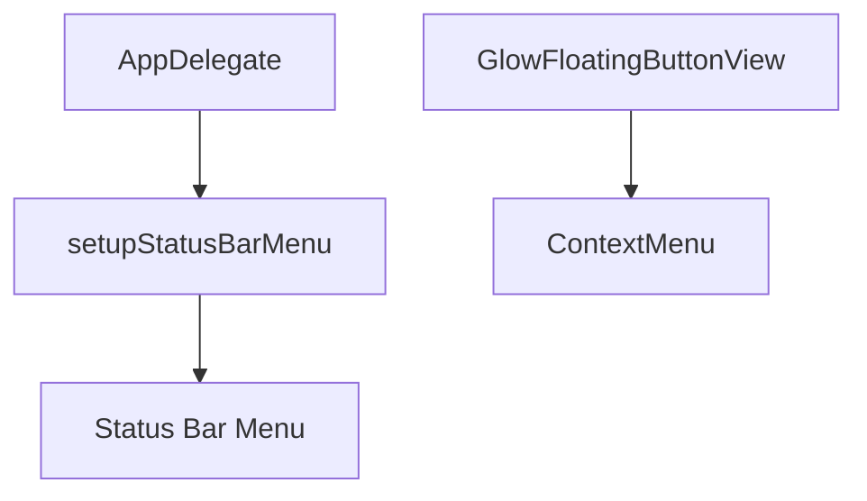
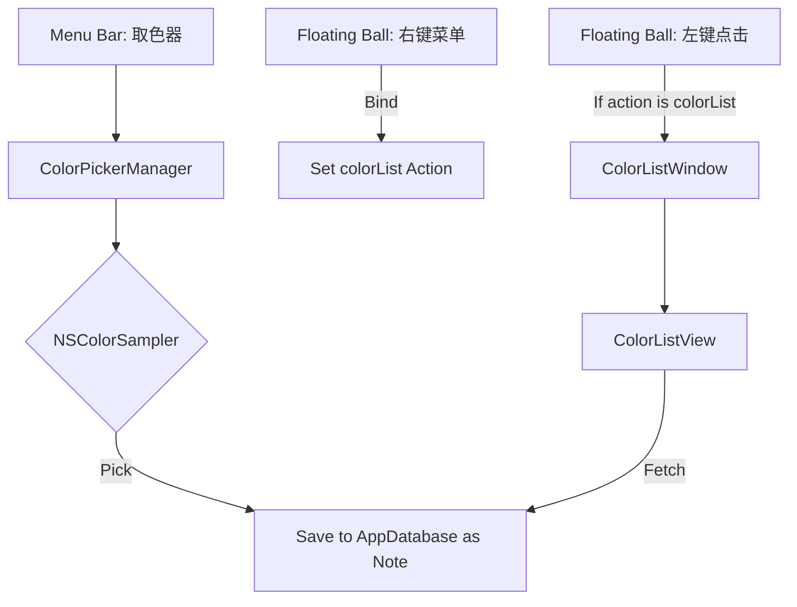

# 添加颜色拾取功能

## 概述
在菜单栏添加“颜色拾取”功能。用户可以通过菜单项进入取色模式，点击屏幕任意位置获取颜色，并自动保存到颜色数据库中。颜色历史列表可以通过悬浮球点击查看（需先在右键菜单中将悬浮球功能绑定为“颜色列表”）。

## 当前实现
目前应用没有颜色拾取功能。现有的笔记系统（NoteStore/NoteListView）已经支持基本的数据存储和列表显示。

## 方案 推荐方案 🚀
1.  **动作定义**：在 `FloatingButtonConfig.ButtonAction` 中添加 `colorList` 成员。
2.  **数据层定制**：在 `NoteGroup` 中添加一个预定义的 `colorGroupId`，所有颜色数据作为特殊的 `Note` 存储，其 `colorHex` 字段存储颜色值。
3.  **功能实现**：
    *   创建 `ColorPickerManager`，使用 `NSColorSampler` 实现屏幕取色。
    *   在 `AppDelegate` 的菜单栏添加“取色器”菜单项。
    *   在悬浮球的右键菜单中，通过 `setupStatusBarMenu` 的逻辑添加“颜色列表”绑定选项。
4.  **UI 交互**：
    *   取色成功后，自动插入一条笔记记录，内容为 Hex 值，并设置 `colorHex`。
    *   当点击绑定了“颜色列表”功能的悬浮球时，弹出 `ColorListWindow`。
    *   `ColorListView` 继承并简化 `NoteListView` 的 UI，去除分组导航、页脚等，只保留颜色块显示。
    *   **多格式支持**：点击颜色项时，弹出或展开格式选择（Hex, RGB, Swift/SwiftUI 代码等），支持一键复制。

### 优缺点
*   **优点**：
    *   符合用户习惯（工具箱类的功能放在菜单栏，常用列表通过悬浮球访问）。
    *   复用现有的悬浮球绑定逻辑和笔记显示逻辑。
*   **缺点**：
    *   需要增加一个新的 ButtonAction，涉及配置变更。

### 代码修改位置
*   [Sources/Model/FloatingButtonConfig.swift](vscode://file/Volumes/Cache/X/Sources/Model/FloatingButtonConfig.swift:10) - 添加 `colorList` 到 `ButtonAction`。
*   [Sources/Model/Note.swift](vscode://file/Volumes/Cache/X/Sources/Model/Note.swift:42) - 添加预定义的颜色分组 ID。
*   [Sources/App/AppDelegate.swift](vscode://file/Volumes/Cache/X/Sources/App/AppDelegate.swift:650) - 添加菜单项及其处理器，处理悬浮球点击逻辑。
*   [Sources/Model/NoteStore.swift](vscode://file/Volumes/Cache/X/Sources/Model/NoteStore.swift:100) - 确保支持通过 groupId 过滤。
*   创建新文件 `Sources/Model/ColorPickerManager.swift`
*   创建新文件 `Sources/View/ColorListView.swift`
*   创建新文件 `Sources/View/ColorListWindow.swift`

## 测试用例
1.  点击菜单栏图标，选择“拾取颜色”。
2.  观察鼠标指针是否变为取色器（放大镜）。
3.  点击屏幕某个位置取色。
4.  检查“颜色列表”中是否出现了对应颜色的记录。
5.  在“颜色列表”中点击 Hex 字符串，验证是否成功复制到剪切板。
6.  在“颜色列表”中删除一条颜色记录，验证数据库是否同步更新。

## 任务总结与结论
任务已全部完成。
1. **取色功能**：实现了 `ColorPickerManager`，通过 `NSColorSampler` 开启系统级取色。
2. **数据存储**：利用现有的笔记数据库，通过预定义的 `colorGroupId` 存储颜色 Hex。
3. **UI 显示**：创建了 `ColorListWindow` 和 `ColorListView` 专门展示颜色历史。
4. **交互优化**：支持点击行默认复制 Hex，提供多格式复制菜单，并根据后续反馈去除了复制按钮的下拉箭头。

## 任务耗时
- 任务开始时间：14:33
- 任务结束时间：15:00
- 任务总耗时：27 分钟
