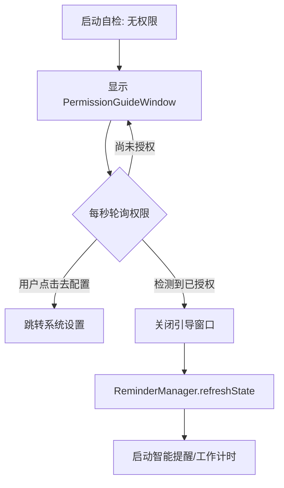

# 任务简称: 改用强制权限引导窗口并自动启动计时

## 概述
当前辅助功能权限引导采用系统 `NSAlert` 模态弹窗，存在两个问题：一是无法在用户授予权限后立即捕捉到状态并自动消失/启动计时；二是用户希望该引导更为强制（不可直接关闭），直到权限授予为止。

## 当前实现
- 使用 `NSAlert.runModal()` 在启动时拦截用户。
- 逻辑同步阻塞，且无法在弹窗期间进行后台状态轮询。

## 方案 (推荐方案 🥳)
引入一个专门的 `PermissionGuideWindow` (NSWindow/SwiftUI)，作为一个非模态但置顶且不可关闭的引导窗口。

**修改位置**：
1. [Sources/View/PermissionGuideWindow.swift](vscode://file/Volumes/Cache/X/Sources/View/PermissionGuideWindow.swift:1) - 新建引导窗口类。
2. [Sources/App/AppDelegate.swift](vscode://file/Volumes/Cache/X/Sources/App/AppDelegate.swift:140) - 替换启动弹窗逻辑。
3. [Sources/Model/ReminderConfig.swift](vscode://file/Volumes/Cache/X/Sources/Model/ReminderConfig.swift:90) - 提供公共状态刷新接口。
4. [Sources/Model/InputMonitor.swift](vscode://file/Volumes/Cache/X/Sources/Model/InputMonitor.swift:10) - 优化权限检查方法。

## 测试用例
1. 清除 AIX 的辅助功能权限。
2. 启动应用。
3. **验证点**：出现一个无法直接点击红点关闭的窗口，提示需要权限。
4. 点击“前往系统设置”并开启权限。
5. **验证点**：回到应用后，无需任何操作，引导窗口应在 1 秒内自动消失，且菜单栏计时自动开始。

## 任务总结与结论
通过从 `NSAlert` 模式迁移到自定义的 `PermissionGuideWindow`，实现了以下改进：
1. **强制性**：窗口去除了关闭按钮，确保用户在获得核心权限前必须关注此引导。
2. **自动化**：引入了 1 秒频率的检测机制，实现“授权即启动”的无缝体验。
3. **可靠性**：使用了更准确的权限检查 API，消除了缓存带来的延迟误差。

## 任务耗时
- 任务开始时间：14:50
- 任务结束时间：15:15
- 任务总耗时：25 分钟
