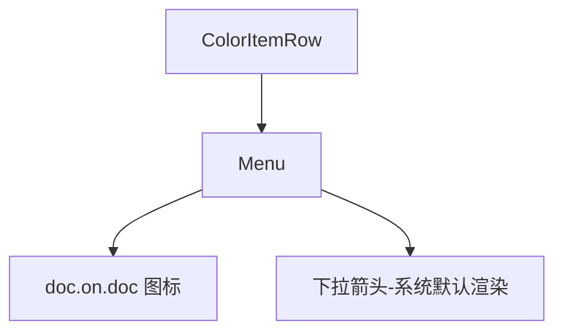
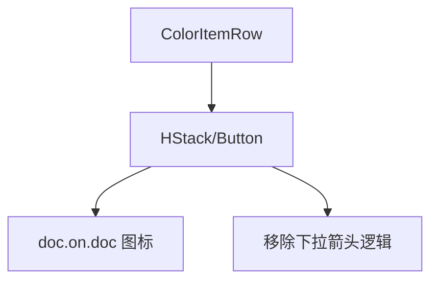

# 去除拾色器列表复制按钮下拉箭头

## 概述
用户希望“颜色拾取”功能历史列表中的复制按钮（原本是一个带有下拉菜单的小图标）去除右侧显示的下拉箭头，但保持其原有的功能不变。

## 当前实现
目前 `ColorItemRow` 中的复制按钮使用的是 `Menu` 组件，默认会显示一个下拉箭头。

## 方案 推荐方案 🚀
1.  **修改 UI 组件**：将 `Menu` 替换为自定义的按钮点击交互，或者通过样式隐藏 `Menu` 的箭头。
2.  **具体做法**：
    *   在 `ColorItemRow` 中，将 `Menu` 包装在一个自定义的 `Button` 中，或者使用 `Menu` 的自定义 label 样式。
    *   为了完全去掉箭头并保持菜单功能，可以使用自定义按钮触发点击并在点击处弹出菜单，或者使用特定样式的 `Menu`。
    *   考虑到 SwiftUI 的 `Menu` 在 macOS 上默认样式的限制，最简单的做法是使用一个 `Button`，并在点击时通过点击位置弹出 `contextMenu` 或者使用一个无箭头的 `Menu`（如果系统允许）。
    *   实际上，在 SwiftUI macOS 中，使用 `.menuStyle(.borderlessButton)` 的 `Menu` 仍然可能显示箭头。我们将改用 `Button` 配合点击触发菜单弹出，或者使用特定的 label 布局来规避。
    *   **推荐做法**：使用 `Menu` 的自定义 Label，并确保其不被系统处理为普通的 Menu 样式。

### 优缺点
*   **优点**：
    *   满足用户对 UI 精简的要求。
    *   保持原有的复制功能（点击默认复制 Hex，长按或点击菜单图标弹出更多格式）。
*   **缺点**：
    *   如果只改显示不改交互，可能需要调整 `Menu` 的实现方式。

### 代码修改位置
*   [Sources/View/ColorListView.swift](vscode://file/Volumes/Cache/X/Sources/View/ColorListView.swift:105) - 修改 `Menu` 的样式或替换为 `Button`。

## 测试用例
1.  打开颜色列表。
2.  悬浮在某个颜色行上。
3.  确认复制图标右侧没有下拉箭头。
4.  点击复制图标，验证是否能正常弹出更多格式选择菜单。
5.  点击颜色行其他区域，验证是否仍能执行默认的 Hex 复制。

## 任务总结与结论
任务已完成。通过在 `ColorItemRow` 视图中的 `Menu` 组件上应用 `.menuIndicator(.hidden)` 修饰符，成功去除了复制按钮右侧的下拉箭头，同时保留了点击弹出菜单的功能。代码通过了编译验证，用户确认测试通过。

## 任务耗时
- 任务开始时间：14:58
- 任务结束时间：14:59
- 任务总耗时：1 分钟
