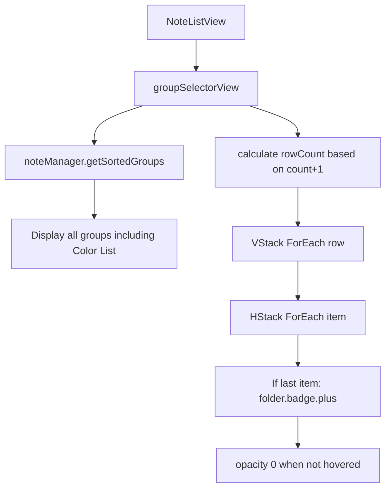
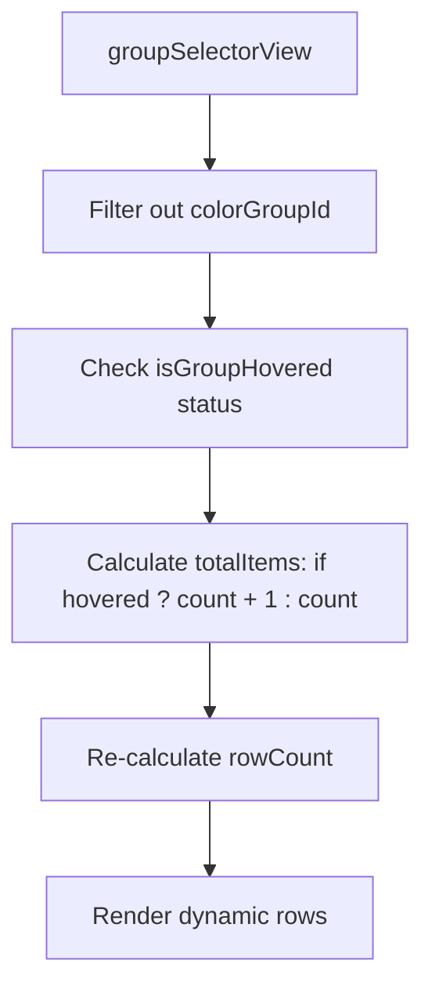

# 优化笔记分组显示与隐藏

## 概述
1. **隐藏特定分组**：目前“颜色列表”分组默认显示在笔记视图中，用户希望将其从普通笔记视图中移除（该分组仅供拾色器功能使用）。
2. **优化布局空间**：当“管理分组”按钮（`folder.badge.plus`）处于隐藏状态（即鼠标未悬停在分组区域时）且其单独占据一行时，目前会留下空白行。需要优化布局，使其在隐藏时不占据任何空间。

## 当前实现
1. **分组获取**：直接调用 `noteManager.getSortedGroups` 获取所有分组，未进行过滤。
2. **列表布局**：采用 `VStack` 包含多行 `HStack` 的方式。由于 `rowCount` 是根据“总数+1”预先计算的，当按钮隐藏且恰好是该行唯一元素时，该行 `HStack` 依然存在且由于 `VStack` 的 `spacing` 导致占据垂直空间。

## 方案 推荐方案 🚀
1. **过滤分组**：在 `groupSelectorView` 中，过滤掉 `NoteGroup.colorGroupId` 对应的分组。
2. **动态布局容器**：放弃预先计算行数的 `VStack` 布局，改用更现代且具自适应能力的布局方式，或是在计算行数时将按钮的“可视性”考虑在内。
    *   **更简单的方案**：由于 `folder.badge.plus` 按钮的显示是根据 `isGroupHovered` 状态决定的，且使用的是 `opacity` 和 `offset`，我们可以将其改为条件渲染（`if isGroupHovered`）并配合 `transition` 或特定的布局调整。
    *   **终极方案**：使用一个可以在宽度不足时自动换行的布局组件（类似 `FlowLayout` 或 `Flexbox` 效果），但在 SwiftUI 中原生支持较弱。考虑到目前是固定宽度的面板且每行固定 5 个，我们可以继续用 `VStack`，但在 `rowCount` 计算和索引处理上，如果非悬停状态且最后一个元素是按钮，则减少计算的总数。

### 优缺点
*   **优点**：
    *   彻底解决颜色列表出现在笔记中的干扰。
    *   解决界面空白行抖动和空间浪费问题。
*   **缺点**：
    *   行数动态变化可能导致下方内容跳动（可以通过动画平滑处理）。

### 代码修改位置
*   [Sources/View/NoteListView.swift](vscode://file/Volumes/Cache/X/Sources/View/NoteListView.swift:673) - 修改 `groupSelectorView` 的分组获取和布局逻辑。
*   [Sources/Model/Note.swift](vscode://file/Volumes/Cache/X/Sources/Model/Note.swift:140) - 确认 `colorGroupId` 的定义。

## 测试用例
1. **分组内容测试**：打开笔记窗口，验证分组列表中不再出现“颜色列表”。
2. **空间占用测试**：
    *   将笔记分组数量调整为 4 个（此时分组占 4 个位，加按钮共 5 个，恰好一行）。
    *   将笔记分组数量调整为 5 个（此时分组占满第一行，按钮位于第二行开头）。
    *   观察鼠标移入/移出分组区域时，下方笔记列表是否会因为按钮的显隐而正确地向上/向下收缩空间，而不是留下空白。

## 任务总结与结论
任务已成功完成：
1. **彻底隔离颜色列表**：由于颜色列表有独立的显示组件，且其数据结构虽复用了笔记，但在业务逻辑上应完全独立。现已在 `NoteManager` 初始化时去除了默认创建颜色分组的逻辑，并在 `NoteListView` 中显式过滤掉了该分组。
2. **布局空间优化**：通过将 `isGroupHovered` 状态引入 `totalItems` 和 `rowCount` 的计算逻辑，实现了“管理分组”按钮在隐藏时不计入布局，从而消除了空白行的占位问题。配合 Spring 动画，切换过程平滑无抖动。

## 任务耗时
- 任务开始时间：15:04
- 任务结束时间：15:06
- 任务总耗时：2 分钟
