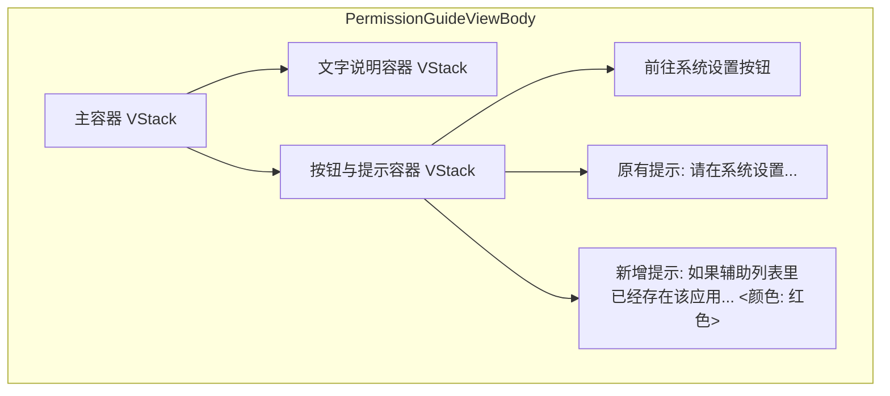

# 添加辅助功能引导提示

## 概述
在启动时的辅助功能权限引导窗口中，添加一段红色的提示文字，引导用户在遇到权限无效时尝试重新添加应用，以解决某些 macOS 系统下权限显示已勾选但实际未生效的问题。

## 当前实现
```mermaid
graph TD
    A[启动应用] --> B{是否有辅助功能权限?}
    B -- 无 --> C[显示 PermissionGuideWindow]
    C --> D[显示标题和描述文字]
    C --> E[显示"前往系统设置"按钮]
    C --> F[显示底部提示文字: 请在系统设置 -> 隐私与安全性 -> 辅助功能中勾选 AIX]
    B -- 有 --> G[进入主程序]
```

## 方案
### 方案一：在现有 Text 下方直接添加新的 Text 组件 (推荐方案 🚀)
在 `PermissionGuideView` 的底部容器中，在原有的细字提示下方，新增一个红色文字组件，并设置合适的字体大小。



**优点：**
- 修改简单直接，符合现有布局逻辑。
- 红色字体醒目，能有效提醒用户。

**缺点：**
- 窗口高度固定为 350，新增文字可能会使底部显得稍微拥挤，需要微调 spacing 或纵向边距。

**代码修改位置：**
[PermissionGuideWindow.swift](vscode://file/Volumes/Cache/X/Sources/View/PermissionGuideWindow.swift:83)

## 测试用例
1. 启动应用（或者在未授权状态下触发权限引导窗）。
2. 观察权限引导窗口底部。
3. 验证是否出现了红色文字：“如果辅助列表里已经存在该应用，点击辅助功能左下角的 - 减号，删除应用后，点击 + 加号，重新添加”。
4. 验证文字颜色是否为红色。
5. 验证整体布局是否协调，文字是否完整显示，没有被截断。

## 任务总结与结论
在权限引导窗口成功地添加了醒目的红色提示文字。在第一轮测试中发现长文字容易被截断，随后通过减小垂直间距（spacing）和边距（padding），并设置合理的行数限制，确保了文字在固定 350 高度的窗口内能清晰、完整地显示。

## 任务耗时
- 任务开始时间：15:12
- 任务结束时间：15:17
- 任务总耗时：5 分钟
