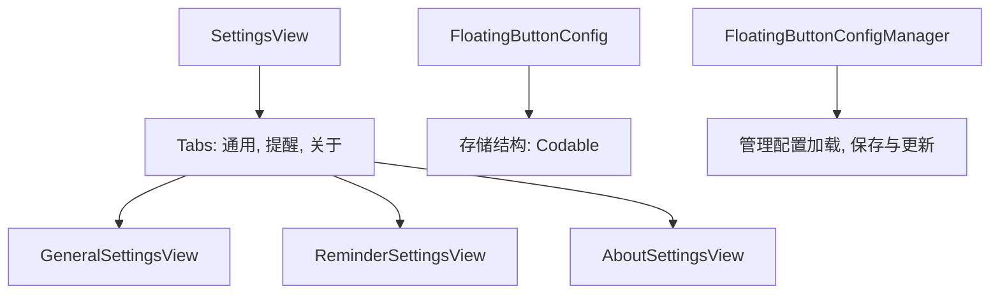
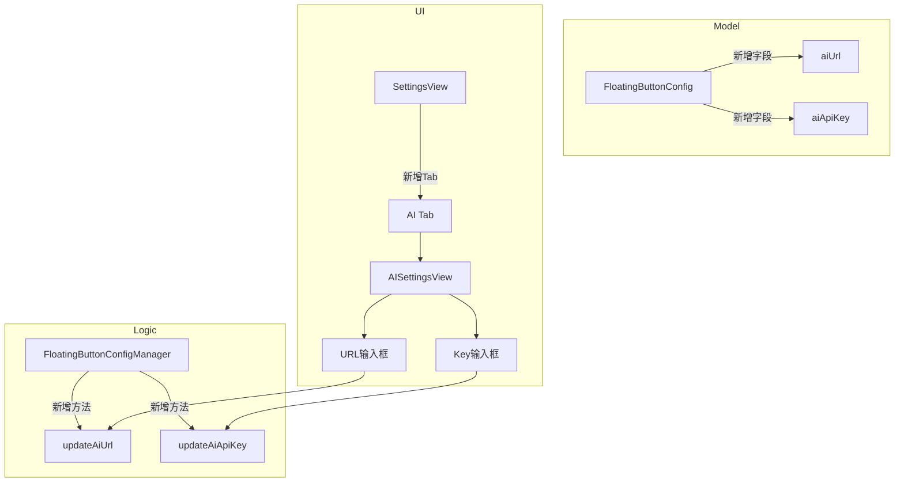

# 添加AI配置页面

## 概述
在偏好设置中增加 "AI" 选项卡，允许用户配置 OpenAI 兼容接口的 API URL 和 API Key，为后续 AI 功能提供基础。

## 当前实现

## 方案
### 方案一：在现有配置体系中集成 AI 设置 (推荐方案 🚀)
1. **扩展模型层**：在 `FloatingButtonConfig` 中增加 `aiUrl` 和 `aiApiKey`。
2. **扩展管理层**：在 `FloatingButtonConfigManager` 中增加 `updateAiUrl` 和 `updateAiApiKey` 方法。
3. **扩展 UI 层**：
    - `SettingsView` 的 `tabs` 数组中增加 "AI" 项。
    - `SettingsView` 的 `switch` 逻辑中增加 `AISettingsView`。
    - 新建 `AISettingsView` 结构体，提供文本输入框。

**优点：**
- 保持了现有设置系统的统一性。
- 配置持久化直接通过现有的 `AppDatabase` 处理，无需额外工作。

**缺点：**
- `FloatingButtonConfig` 正在变得越来越大。

**代码修改位置：**
1. [FloatingButtonConfig.swift](vscode://file/Volumes/Cache/X/Sources/Model/FloatingButtonConfig.swift:30) (结构体定义)
2. [FloatingButtonConfig.swift](vscode://file/Volumes/Cache/X/Sources/Model/FloatingButtonConfig.swift:50) (初始化方法)
3. [FloatingButtonConfig.swift](vscode://file/Volumes/Cache/X/Sources/Model/FloatingButtonConfig.swift:130) (解码方法)
4. [FloatingButtonConfig.swift](vscode://file/Volumes/Cache/X/Sources/Model/FloatingButtonConfig.swift:650) (Manager 新增方法)
5. [SettingsView.swift](vscode://file/Volumes/Cache/X/Sources/View/SettingsView.swift:15) (Tabs 定义)
6. [SettingsView.swift](vscode://file/Volumes/Cache/X/Sources/View/SettingsView.swift:50) (Switch 逻辑)
7. [SettingsView.swift](vscode://file/Volumes/Cache/X/Sources/View/SettingsView.swift:2040) (新增 AISettingsView 结构体)

## 测试用例
1. 打开偏好设置窗口。
2. 验证顶部是否出现了 "AI" 图标。
3. 点击 "AI" 图标，验证是否切换到 AI 配置页面。
4. 验证页面是否包含 "API URL" 和 "API Key" 的输入框。
5. 在输入框中输入内容，关闭并重新打开偏好设置，验证内容是否成功保存。
6. 验证在输入 API Key 时，是否使用了 SecureField (如果是 API Key 敏感信息) 或普通 TextField。

## 任务总结与结论
在偏好设置中成功集成了 AI 配置项。通过扩展现有的 `FloatingButtonConfig` 模型，实现了 OpenAI 接口地址和 API Key 的持久化存储。UI 方面使用了系统的 `TextField` 和 `SecureField`，保证了配置的简单易用与安全性。

## 任务耗时
- 任务开始时间：15:25
- 任务结束时间：15:30
- 任务总耗时：5 分钟
